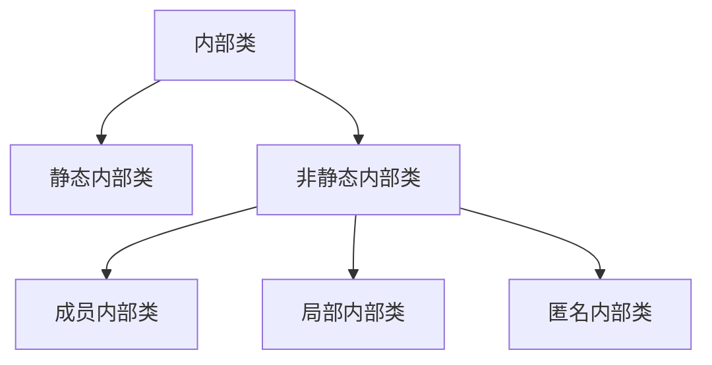

# Java 基础知识
抽象类 abstract

构造方法
- 默认会提供一个无参的构造方法
- 但是如果编写了有参的构造方法,就不会再提供无参的构造方法

## 继承
### 继承定义
- 一个类(子类)继承于另一个类(父类),可以拥有父类的属性以及方法

### 方法重写
- 当子类和父类中出现==**一模一样(返回值类型,函数名,参数列表都一样)**==的方法时,就是方法重写.
- 当父类的方法 method() 不足以满足业务需求是,可以重写父类的方法 method
- 需要注意子类重写父类的方法时,子类方法的权限一定不能小于父类被重写方法的权限

### 继承中的成员变量
- 子类中出现和父类同名


## 方法
- 根据路径获取资源
    
```properties
class.getClassLoader.getResourceAsStream("") : 默认从类路径下获取资源,path不能以 / 开头.
Class.getResourceAsStream(path) : path 不以 / 开头,默认是从此类所在的包下获取资源,以 / 开头,则是从 classpath 路径下获取资源
```

## 内部类



- 内部类作用
    - 可以实现隐藏,非内部类不能使用 private,protected 修饰,但是内部类可以
    - 内部类可以访问外部类的所有元素(private)

###  成员内部类
- ==*成员内部类里边不能有 static 修饰的变量和方法*==
- 成员内部类里边不能有 static 修饰的变量和方法,但是==**可以创建常亮.就是有 static final 修饰的常量**==
- 获取非静态内部类对象 : ==**外部类对象.new 内部类()**==
- ==*定义成员内部类*==

```java
public class OutClass {
    private String name;

    //定义成员内部类
    class MemberInnerClass{
        static final String str = "1";
        void say(){
            System.out.println("this is member innerClass");
        }
    }
}
```

- ==*创建成员内部类*==

```java
public class Test {
    public static void main(String[] args) {
        //创建成员内部类 外部类对象.new 成员内部类()
        OutClass.MemberInnerClass memberInnerClass = new OutClass().new MemberInnerClass();
        memberInnerClass.say();
    }
}
```

### 静态内部类
- 静态内部类不能访问外部类的非静态成员.
- 获取静态内部类对象 : ==**new 外部类.静态内部类()**==
- ==*定义静态内部类*==

    ```java
    public class OutClass {
        private String name;
        //创建静态内部类
        static class StaticInnerClass{
            private String name;
            void say(){
                System.out.println("this is statci innerClass");
            }
        }
    ```

- ==*创建静态内部类对象*==

    ```java
    public class Test {
        public static void main(String[] args) {
            //获取静态内部类对象
            OutClass.StaticInnerClass innerClass = new OutClass.StaticInnerClass();
            innerClass.say();
        }
    }
    ```

- 局部内部类
    - 在方法体内的内部类就是局部内部类,只有在方法的作用域下才能使用,退出作用于就无法引用
    - 局部内部类可以访问外部类的所有成员,也可以访问方法的局部变量,这个变量必须是 final 的(java 1.8 以后可以不是 final 的了)