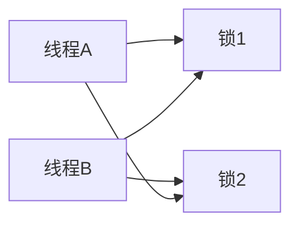

# 多线程

## 线程状态

```properties
NEW : 线程创建了但是还没有启动,还没有调 start
RUNNABLE : 已经在 JVM 内执行了
BLOCKED : 等待一个锁
WAITING : 等待另一个线程
TIMED_WAITING : 限时等待,就像 sleep(1000)
TERMINATED : 线程退出了
```
## 死锁和活锁
### 1. 死锁
- 指两个或者多个线程在执行过程中,因为抢占资源而互相等待的现象
- 比如线程 A,B,A 持有锁 1,B 持有锁 2,但是 A 需要拿到锁 2 才能继续往下运行,B 需要拿到锁 1 才能往下运行,而他们又不都释放已持有的资源,就造成了死锁



    
- 死锁形成的4 种条件
    - 一个资源一次只能被一个线程占用,如果有其他线程想要请求资源,必须等待现有者释放资源
    - 一个线程在他现有的资源未使用完之前,不能被剥夺
    - 一个线程因请求资源而阻塞时,对已持有的资源保持不放.
    - 若干线程形成一种头尾相接的循环等待资源关系

    
### 2. 活锁
- 指事务 1 可以使用资源,但是他让其他事务先使用,事务 2 也可以使用资源,但是他也让其他事务先使用,于是两者就一直处于谦让状态,都无法使用资源
- 比如 A,B 连个人,都要出门.他们都到了门后,A 让 B 先出,B 让 A 先出,然后他们就都谦让对方,都在门口呆着


## 线程池
- 为了解决频繁创建和销毁线程带来的性能消耗.
- 通过线程池做到线程的复用,不需要频繁的创建和销毁线程.
- 让线程一直存在于线程池当中, 然后线程从任务队列取得任务来执行.
- 可以通过适当的调节线程池的线程数量,也就是当请求数达到某个阀值时,就让后边的请求进入等待状态,直到获得一个线程来处理资源,以防止资源不足

### 1. 线程池的种类

```properties
ThreadPoolExecutor : 定长的线程池,有核心线程,核心线程就是最大线程,没有非核心线程
CachedThreadPool : 可缓存的线程,没有核心线程,非核心线程为无限大,需要执行任务时就创建线程来执行任务,没有需要时就回收线程.适用于耗时少,任务量大的场景
SingleThreadExecutor : 只有一条线程执行任务,适用于有顺序的任务场景
secudleThreadPool : 适用于周期性执行任务的线程池.按照某种特定计划执行线程中的任务,有核心线程和非核心线程,非核心线程无限多.适用于执行周期性的任务.
```