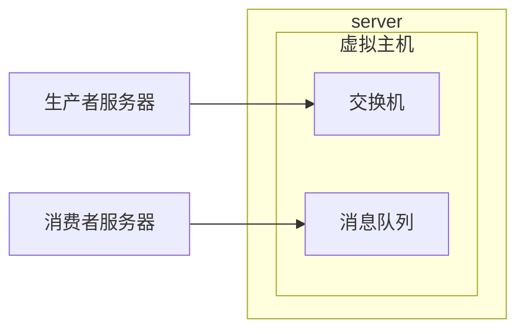
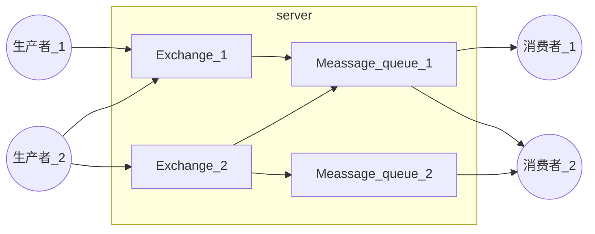
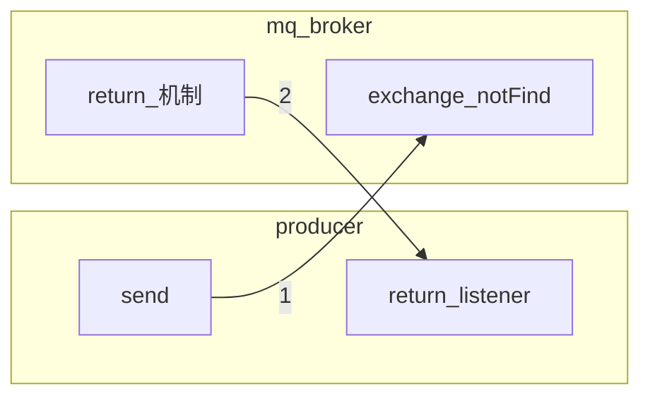
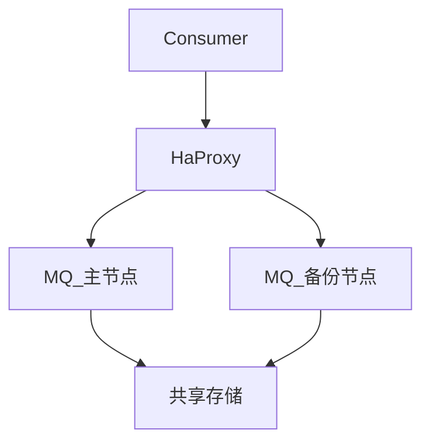
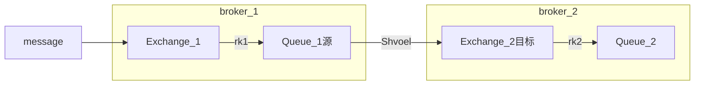
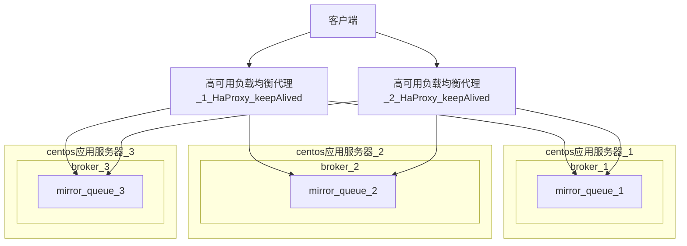
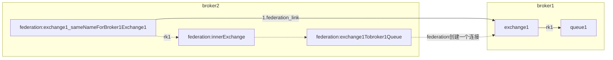

# RabbitMQ - 消息中间件

-----
### 前言
注意事项:
1. 如果对 RabbitMQ 不熟悉.在代码演练过程中出现问题,可以去管控台删除 Queue 和 Exchange.

### 1. **AMPQ**
#### 1.1 AMQP 简介
- ==高级消息队列协议==,是具有现代特征的二进制协议,提供统一消息服务的==**应用层**==标准高级消息队列协议,是应用存协议的一个开放标准,为面向消息的中间件设计.
- 简单的说,AMQP 就是一个规范,按照这个规范就行了
- 主要特征是==面向消息,队列,路由(包括点对点和发布/订阅),可靠性,安全==.AMQP 协议更多的运用在企业系统内,对==数据一致性,稳定性和可靠性要求很高的场景,对性能和吞吐量的要求还在其次==.

#### 1.2 AMQP 核心概念
- Server : 又称 Broker,接收客户端的连接,实现 AMQP 实体服务,
- connection : 连接,应用程序与Broker的网络连接,
- ==**channel**== : 网络信道,客户端和 RabbitMQ所有的操作都需要创建连接,然后使用 channel 进行,channer是进行消息读写的通道,客户端可建立多个 channel,每个 channel 代表一个**==会话任务==**.
- Message : 消息,服务器和应用之间传递的数据.由 ==properties==和==Body==组成,properties 可以对信息进行修饰,比如消息的优先级,延迟等高级特征,Body 就是消息体内容.
- Virtual host : 虚拟主机,主要进行逻辑隔离,最上层的消息路由.一个 Virtual host 里边可以有若干个 Exchange 和 Queue,同一个Virtual host里边不能有相同名称的 Exchange 和 Queue.
- Exchange : 交换机,用于接收消息,生产者将消息投递到交换机上.根据路由键转发到消息到==**绑定(Binding)**==的概念.
- Binding : 交换机和消息队列之间的虚拟连接,或者说关系,binding 中可以包含==路由 key(routing key)==
- routing key : 一个路由规则,路由 key,虚拟机可以用它来确定 如何路由一个特性消息.
- Queue : 也称 Message Queue,消息队列,保存消息并将它们转发给消费者.
- AMQP 模型
    



- ==生产者直接将消息投递到交换机,要经过 server 和虚拟主机两层==
- ==消费者监听消息队列.消息队列有消息,它就拿出来消费就行了==
- 交换机和消息队列是有一个Binding的关系

--------
### 2. RabbitMQ 简介
#### 2.1 RabbitMQ 相关概念介绍
- RabbitMQ消息队列中间件 : 是一个开源的消息队列和队列服务器,用来通过普通协议在完全不同的应用之间共享数据,就是说可以跨平台,跨语言的机制.也叫做==消息队列==,基于==AMQP==协议来实现.
- RabbitMQ 就像快递公司,寄快递的人(生产者)把快递(信息)给快递员后,填写快递单:要发往的城市,和诚信下的某个小区.城市和小区有个绑定关系,然后快递到了后,把快递放到快递柜,收件人(消费者)用微信关注了快递柜的公众号,然后消费快递

#### 2.2 RabbitMQ 的优点
- 开源,性能优秀,稳定性保障;
- 提供可靠性消息投递模式(==**confirm**==),返回模(==**return**==);
- 与 ==**SpringAMQP**== 完美整合,API 丰富
- 保证数据不丢失的前提下做到高可靠性,可用性

#### 2.3 RabbitMQ 高性能的原因 : 
- 用 Erlang 语言开发
- Erlang 有着和原生 Socket 一样的延迟.

#### 2.4 RabbitMQ架构


- 生产者将消息投递到交换机,然后交换机将消息路由绑定到消息队列,由消息队列发送给消费者,生产者和消费者是解耦关系.

#### 2.5RabbitMQ 消息是怎样流转的
- 生产者生产一个 message,将 message 发送到 Exchange 上,Exchange 可以和多个 message Queue 建立绑定关系.然后在发消息的时候,要指定两个非常关键的点:一个是==要发送到哪个 Exchange==,另一个就是==发消息的时候要带上 routing key==,然后通过 Exchange 和 message Queue建立一个绑定关系,然后通过 routing key 将消息路由到指定的一个 message Queue 上,然后消费者监听 message Queue 就行了.

--------
### 3. RabbitMQ 安装与快速启动
#### 3.1 安装
- 妈了鸡的,折腾了9个小时扒教程也没装上,最后看官方文档==**4条命令**==装上了!!!以后要养成看官方文档的习惯!
- RabbitMQ 是用 Erlang 语言看法的,所以在安装RabbitMQ 前,要先安装 Erlang

##### 3.1.1 官方 Package Cloud RPM 方式安装
1. rpm方式安装会自动创建层级目录和基本的环境变量配置等
1. 分别执行以下两条脚本,使用这种方式,会自动根据版本关系安装最新版的 rpm.

```shell
# rabbmit
curl -s https://packagecloud.io/install/repositories/rabbitmq/rabbitmq-server/script.rpm.sh | sudo bash
# erlang
curl -s https://packagecloud.io/install/repositories/rabbitmq/erlang/script.rpm.sh | sudo bash
```    
1. 开始安装 erlang 和 rabbitmq server

```shell
yum -y install erlang
yum -y install rabbitmq-server
```

#### 3.2 快速启动
##### 3.2.1 将 rabbitmq 加入环境变量
    
```shell
[root@ssh_1 sbin]# vim /etc/profile
# 在环境变量中加入以下内容,路径以实际路径为准.
# rabbitMQ
export PATH=$PATH:/usr/lib/rabbitmq/lib/rabbitmq_server-3.7.13/sbin
```
##### 3.2.2 修改配置文件==rabbit.app== 
    
```shell
[root@ssh_1 ~]# vim /usr/lib/rabbitmq/lib/rabbitmq_server-3.7.13/ebin/rabbit.app
 
&& 修改 loopback_users 配置项  
env,[
    {loopback_users, [<<"guest">>]}, &&用户设置,需要改为 : loopback_users, [guest],否则将无法登陆.guest可用于管控台登录.
    ]
``` 

##### 3.2.3 启动服务
- 参照 ==**[4.3.1](#4.3.1)**==

##### 3.2.4 停止服务
- 参照 ==**[4.3.2](#4.3.2)**==
    
------
### 4. RabbitMQ 详细配置以及命令说明
#### 4.1 脚本说明
##### 4.1.1 ==**rabbitmq-server**== 启动/停止服务

```json
rabbitmq-server : 针对 server 本身的一些操作.启停服务

```

##### 4.1.2 ==**rabbitmqctl**== 控制
###### 4.1.2.1 说明
1. 控制相关,增加一个 Exchange,增加一个 Message Queue,都可以用这个命令.
2. 包括以后搭建集群使用集群都是这个脚本.
3. 用户的创建,删除,修改等
4. 也可以启动停止服务

###### 4.1.2.1 基本用法

```shell
## 启动服务
[root@ssh_1 ebin]# rabbitmqctl start_app 
## 停止服务
[root@ssh_1 ebin]# rabbitmqctl stop_app 
##  查看节点状态
[root@ssh_1 ebin]# rabbitmqctl status 
```

###### 4.1.2.2 针对用户

```shell
##  添加用户
[root@ssh_1 ebin]# rabbitmqctl add_user username passwoed
##  修改用户密码
[root@ssh_1 ebin]# rabbitmqctl change_password username newpassword 
##  列出所有用户
[root@ssh_1 ebin]# rabbitmqctl list_users 
##  删除用户
[root@ssh_1 ebin]# rabbitmqctl delete_user username 
##  列出用户权限
[root@ssh_1 ebin]# rabbitmqctl list_user_permissions username 
##   设置用户权限
[root@ssh_1 ebin]# rabbitmqctl set_permissions -p vhostpath username "*" "*" "*"
##   清除用户权限
[root@ssh_1 ebin]# rabbitmqctl clear_permissions -p vhostpath username
```

###### 4.1.2.3 针对组件 虚拟主机,交换机等

```shell
##  创建虚拟主机
[root@ssh_1 ebin]# rabbitmqctl add_vhost vhostpath
##  列出所有虚拟主机 
[root@ssh_1 ebin]# rabbitmqctl list_vhosts
## 列出虚拟主机上所有权限
[root@ssh_1 ebin]# rabbitmqctl list_permissions -p vhostpath
##  删除虚拟主机
[root@ssh_1 ebin]# rabbitmqctl delete_vhost vhostpath
```
###### 4.1.2.4 针对 Queue

```shell
##  查看所有队列信息
[root@ssh_1 ebin]# rabbitmqctl list_queues
##  清除队列里的信息
[root@ssh_1 ebin]# rabbitmqctl -p vhostpath purge_queue blue
```

##### 4.1.3 ==**rabbitmq-plugins**== 插件管理
###### 4.1.3.1 脚本作用
```json
&& rabbitmq-plugins : 安装 RabbitMQ 插件,使用插件都是这个脚本.
```
###### 4.1.3.2 查看提供的默认插件
- 命令 : ==**rabbitmq-plugins list**==

```shell
## 查看默认提供的插件
[root@ssh_1 ~]# rabbitmq-plugins list
Listing plugins with pattern ".*" ...
 Configured: E = explicitly enabled; e = implicitly enabled
 | Status: * = running on rabbit@ssh_1
 |/
[  ] rabbitmq_amqp1_0                  3.7.13
[  ] rabbitmq_auth_backend_cache       3.7.13
[  ] rabbitmq_auth_backend_http        3.7.13
[  ] rabbitmq_auth_backend_ldap        3.7.13
[  ] rabbitmq_auth_mechanism_ssl       3.7.13
[  ] rabbitmq_consistent_hash_exchange 3.7.13
[  ] rabbitmq_event_exchange           3.7.13
[  ] rabbitmq_federation               3.7.13
[  ] rabbitmq_federation_management    3.7.13
[  ] rabbitmq_jms_topic_exchange       3.7.13
[  ] rabbitmq_management               3.7.13   ##管理台,可视化
[  ] rabbitmq_management_agent         3.7.13
[  ] rabbitmq_mqtt                     3.7.13
[  ] rabbitmq_peer_discovery_aws       3.7.13
[  ] rabbitmq_peer_discovery_common    3.7.13
[  ] rabbitmq_peer_discovery_consul    3.7.13
[  ] rabbitmq_peer_discovery_etcd      3.7.13
[  ] rabbitmq_peer_discovery_k8s       3.7.13
[  ] rabbitmq_random_exchange          3.7.13
[  ] rabbitmq_recent_history_exchange  3.7.13
[  ] rabbitmq_sharding                 3.7.13
[  ] rabbitmq_shovel                   3.7.13
[  ] rabbitmq_shovel_management        3.7.13
[  ] rabbitmq_stomp                    3.7.13
[  ] rabbitmq_top                      3.7.13
[  ] rabbitmq_tracing                  3.7.13
[  ] rabbitmq_trust_store              3.7.13
[  ] rabbitmq_web_dispatch             3.7.13
[  ] rabbitmq_web_mqtt                 3.7.13
[  ] rabbitmq_web_mqtt_examples        3.7.13
[  ] rabbitmq_web_stomp                3.7.13
[  ] rabbitmq_web_stomp_examples       3.7.13
```
###### 4.1.3.3 启用插件

```shell
[root@ssh_1 ~]# rabbitmq-plugins enable xxxx
```


#### 4.2. 各种配置


#### 4.3. 相关命令
<span id = "4.3.1"></span>
##### 4.3.1 后台启动
- 命令 : ==**rabbitmq-server start &**==

```shell
## &:表示后台启动,出现以下内容说明启动成功
## 以下内容中有关于日志的信息,命名规范:rabbit@主机名.log
## 修改主机名是: vim /etc/hostname
[root@ssh_1 ~]# rabbitmq-server start &
[1] 22879
[root@ssh_1 ~]#
  ##  ##
  ##  ##      RabbitMQ 3.7.13. Copyright (C) 2007-2019 Pivotal Software, Inc.
  ##########  Licensed under the MPL.  See http://www.rabbitmq.com/
  ######  ##                 日志信息,命名规范:rabbit@主机名.log
  ##########  Logs: /var/log/rabbitmq/rabbit@ssh_1.log
                    /var/log/rabbitmq/rabbit@ssh_1_upgrade.log

              Starting broker...
 completed with 0 plugins.
```
- 验证 : ==**lsof -i:端口号**==

```shell
&& 出现以下内容,验证成功
[root@ssh_1 ~]# lsof -i:5672
COMMAND    PID     USER   FD   TYPE DEVICE SIZE/OFF NODE NAME
beam.smp 23048 rabbitmq   75u  IPv6 463847      0t0  TCP *:amqp (LISTEN)
```
<span id = "4.3.2"></span>
##### 4.3.2 停止服务
- 命令 : ==**rabbitmqctl stop_app**== 

```shell
[root@ssh_1 ~]# rabbitmqctl stop_app
Stopping rabbit application on node rabbit@ssh_1 ...
```

##### 4.4.3 插件相关
###### 4.4.3.1 查看默认提供的插件 

```shell
[root@ssh_1 ~]# rabbitmq-plugins list
```
   
###### 4.4.3.2 管控台,可视化效果 **==rabbitmq_management==**
-  管控台作用
    - 可视化查看 RabbitMQ 信息以及运行情况.

- 安装
        
    ```shell
    ## 启用 rabbitmq_management
    [root@ssh_1 ~]# rabbitmq-plugins enable rabbitmq_management
    Enabling plugins on node rabbit@ssh_1:
    rabbitmq_management
    The following plugins have been configured:
      rabbitmq_management
      rabbitmq_management_agent
      rabbitmq_web_dispatch
    Applying plugin configuration to rabbit@ssh_1...
    Plugin configuration unchanged.

    ```
- 验证

    ```shell
    ## 1. 15672 是管控台默认端口号
    页面输入地址 : http://10.211.55.9:15672/
    ## 2. 登录名和密码都输 guest,此配置是在 rabbit.app 内 env 标签下的 loopback_users配置项
    ```

###### 4.4.3.3 延迟插件
- 延迟插件的作用:
    - 比如消息的延迟推送,定时任务的执行,一些消息重试策略的配合使用等

1. 下载插件 [官方插件网址](http://www.rabbitmq.com/community-plugins.html)

        下载rabbitmq_delayed_message_exchange对应版本
        解压后是一个 .ez 文件
2. 把下载好的文件放到集群中每个节点的指定目录


    ```shell
    /usr/lib/rabbitmq/lib/rabbitmq_server-3.6.5/plugins
    ```
1. 此时使用 rabbitmq-plugins list 命令已经可以看到此插件,启用插件

    ```shell
    rabbitmq-plugins list
    ```
    
1. exchange 的类型就多了一种

```shell
exchange 类型 : x-delayed-message
虽然有了x-delayed-message类型,但是exchange的扩展参数必须要有一个参数,指定 exchangeType,例如 topic
```
    
------
### 5. 急速入门,组件介绍以及功能模块
#### 5.1 急速入门-消息生产与消费
##### 5.1.1 生产与消费模型简述
1. ConnectionFactory : 获取连接工厂
2. Connection : 获取一个连接
3. ==**Channel**== : 通过连接创建一个 Channel,数据通信信道,可发送和接收消息 
4. Queue : 具体的消息存储队列
5. Producer & Consumer : 生产者消费者

##### 5.1.2 创建工程
1. 创建一个 Empty Project 工程
2. 添加新的 springboot module
3. 使用 springboot 默认配置,启动依赖都不添加(web也不添加)

##### 5.1.3 代码实现
**生产者**
```java
/**
 * 生产者要做两件事: 生产消息  发送消息
 */
public class Producer {

    public static void main(String[] args) throws Exception {
        //创建连接工厂
        ConnectionFactory connectionFactory = new ConnectionFactory();

        //配置工厂 IP 端口 虚拟主机
        connectionFactory.setHost("10.211.55.10");
        connectionFactory.setPort(5672);
        connectionFactory.setVirtualHost("/");

        //通过连接工厂创建连接
        Connection connection = connectionFactory.newConnection();
        /**
         * 通过连接创建 channel, 通信信道
         *      JMS规定生产者要创建Procuder,消费者要创建一个 Consumer,通过 procuder和 consumer 来进行生产和消费
         *      RabbitMQ 规定生产者可以不用创建 procuder,可以直接通过 channel 来发送消息.
         *      但是 RabbitMQ 的消费者就必须创建一个 consumer 来消费消息
         */
        Channel channel = connection.createChannel();

        String msg = "hello rabbitmq!";
        //routing key
        String routingKey = "amqp-default";
        /**
         * 通过 channel 发送数据
         *      参数:
         *          s : 指定Exchange
         *          s1 : 指定routing key
         *          basicProperties : 消息的附加属性
         *          最后一个是消息的内容
         *
         */
        for (int i = 0; i < 5; i++) {
            channel.basicPublish("",routingKey,null,msg.getBytes());
            System.out.println("生产者生产消息 : " + msg);
        }

        //一定要关闭连接,从小到大关闭
        channel.close();
        connection.close();
    }
}
```
**消费者**

```java
/**
 * 消费者
 */
public class Consumer {

    public static void main(String[] args) throws Exception {

        //1. 创建连接工厂
        ConnectionFactory connectionFactory = new ConnectionFactory();
        connectionFactory.setHost("10.211.55.10");
        connectionFactory.setPort(5672);
        connectionFactory.setVirtualHost("/");  //   "/"是RabbitMQ 默认的一个虚拟主机

        //2. 通过连接工厂创建一个连接
        Connection connection = connectionFactory.newConnection();

        //3. 通过连接创建一个 channel
        Channel channel = connection.createChannel();


        /**
         * 4. 通过 channel声明一个队列  queueDeclare
         *      第一个参数queue : 队列名称
         *
         *      第二个参数durable : 是否持久化,如果 true,代表持久化,服务即使重启,队列也不会消失
         *
         *      第三个参数exclusive : 是否独占,如果 true,则这个队列只有这一个 channel 可以连接,也就是说只有一个连接可以连接,其他的都不可以连接.
         *          比如顺序消费,比如说一共10条有序的消息,需要发给一个消费者去顺序的执行,但是一个集群模式,肯定是负载均衡的,这个集群有3个
         *          节点: A,B,C .A,B ,C 分别消费3条,但是如果不是独占的,就无法保证它们消费的数据有按顺序的,所有就用独占方式.
         *
         *      第四个参数autoDelete : 自动删除,队列如果与其他相关的Exchange(交换机)没有一个绑定关系,脱离了Exchange,那这个队列就会自动删除.
         *
         *      第五个参数arguments : 扩展参数
         */
        String queueName = "amqp-default";  //队列名称
        channel.queueDeclare(queueName,true,false,false,null);

        /**
         * 5. 创建 consumer 消费者对象
         *  JMS规定生产者要创建Procuder,消费者要创建一个 Consumer,通过 procuder和 consumer 来进行生产和消费
         *  RabbitMQ 规定生产者可以不用创建 procuder,可以直接通过 channel 来发送消息.
         *  但是 RabbitMQ 的消费者就必须创建一个 consumer 来消费消息 --- QueueingConsumer
         *
         *  参数 : 标识这个消费者要建立在哪个连接之上消费消息,就是一个 [ channel ]
         */
        QueueingConsumer queueingConsumer = new QueueingConsumer(channel);

        /**
         * 6. 设置 channel
         *      queue : 队列名称,指定要消费哪个队列的消息,就是监听哪个队列
         *
         *      autoAck : 是否自动接收. ack : 假设 broker 有一条信息发送到了 consumer 端,consumer会马上回送给 broker一条 ack 消息,告诉 broker.
         *          这条信息我收到了. 如果 ack 为 true,则会自动签收.
         *          RabbitMQ 有两种签收方式 : 自动签收和手动签收.真正的工作环境中,基本上 [ 不会使用自动签收 ].因为如果要做消费端限流,一定要设置为 false.
         *
         *      callback : 具体的消费者对象
         */
        channel.basicConsume(queueName,true,queueingConsumer);

        /**
         * 7. 获取消息
         *      Delivery : rabbitmq 消息的对象,把消息,channel,producer 进行了 Java 级别的封装
         *          delivery = QueueingConsumer.nextDelivery(),这个对象里包含了消息的信息.比如Body, Exchange:是哪个 Exchange 过来的,routing key等
         *              envlope = delivery.getEnvelope() :
         *              deliveryTag = envlope.getDeliveryTag() : 做消息唯一性处理的时候会用到 deliveryTag. 进行 [手工签收 (手工 ack)] 的时候也会用到deliveryTag
         *
         *  nextDelivery() : 获取下一条消息
         *      无参 : 只要没有消息过来,就一直阻塞
         *      有参 : 参数为超时时间,消费者启动之后,会阻塞 超时时间 的一段时间,超时后如果还没有消息就会放行.
         */
        while (true){
            Delivery delivery = queueingConsumer.nextDelivery();
            String msg = new String(delivery.getBody());   //获取消息内容
            Envelope envelope = delivery.getEnvelope();     //获取 envlope, 这个对象可以获取 routingKey,exchange,deliveryTag 等信息,其中 [ deliveryTag ] 等信息可以做消息唯一性处理等
            long deliveryTag = envelope.getDeliveryTag();
            String routingKey = envelope.getRoutingKey();
            String exchange = envelope.getExchange();
            System.out.println("消费端获取到消息 : " + msg);
            System.out.println("Exchange 为 : " + exchange);
            System.out.println("routingKey 为 : " + routingKey);
        }
    }
}

```
**运行步骤**
- 如果先启动生产者的话,再启动消费者,消费者马上就可以收到信息
- 如果先启动消费者的话,要等启动生产者之后才能收到消息

**拓展说明**
- 在 RabbitMQ 中,生产者要发送消息,要指定两个点: 一个是 Exchange,说明要发送到哪个 Exchange,另一个是 routing key.
- 注意以上代码中,代码上,生产者并没有指定 Exchange,只指定了 routing key.
- 但是特别注意: 生产者在第27行指定了 ==routingkey== 为 : ==amqp-default==.
- 但是特别注意: 消费者在第36行指定了 ==queueName== 为 : ==amqp-default==.
- 但是结果为 : 消费者接受到了信息!!!
- 原因 : RabbitMQ 规定,如果消费者如果没有指定 Exchange,那么会默认指定第一个 Exchange -- : ==AMQP default==,AMQP default的 binding 是: ==The default exchange is implicitly bound to every queue, with a routing key equal to the queue name. It is not possible to explicitly bind to, or unbind from the default exchange. It also cannot be deleted.==按照 routingKey 判断RabbitMQ 上有没有和这个 routingKey完全相同的名称的 Exchange,如果有就把消息投递过去,如果没有就会删除.

#### 5.2 Binding 绑定
- Exchange 和 Exchange,Exchange 和 Queue 之间的一个连接关系
- Binding 中可以包含 routingKey 或者参数

#### 5.3 Queue 消息队列
- 消息队列,实际存储消息数据
- 属性
    - durability : 是否持久化
    - auto delete : 是否自动删除,当Queue没有和任何 Exchange 相关联的时候,这个 Queue 也会被自动删除

#### 5.4 Message
- 服务器和应用程序之间传送的数据.
- 本质上就是一段数据,有 properties 和 body 组成.
- 属性
    - delivery
    - headers
    - content_type : 
    - content_encoding : 编码集
    - priority : 消息优先级,0--9,依次增大
    - ==correlation_id== : 消息的唯一的id.ack,消息的路由可能会用到这个属性
    - reply_to : 指定消息失败了可以返回哪个队列
    - expiration : 消息的存活时间,超过时间后,如果没有被消费者消费的话,就会自动消失
    - message_id : 消息 ID
    
    ==**代码演示**==
    ==生产者==
    ```Java
    Map<String,Object> heads = new HashMap<>(); //定义自定义属性
    heads.put("arg_1","111");
    heads.put("arg_2","222");

    //定义附加属性,在生产者发送消息的时候,作为方法的参数设置进去
    AMQP.BasicProperties basicProperties = new AMQP.BasicProperties().builder()
            .deliveryMode(2) //常用的模式  1:非持久化投递,消息投送到服务器之后,如果没有被消费者消费的话,服务器重启后消息就不存在了
                                            // 2:持久化投递,消息投送到服务器之后,服务器重启后,消息依然存在
            .contentEncoding("UTF-8")
            .expiration("5000")  //过期时间,毫秒,如果过了过期时间没有被消费的话, 会自动被移除
            .headers(heads)     //如果现有的属性已经满足不了需求,可以使用此方法添加自定义属性
            .build();   //完成构建

    for (int i = 0; i < 5; i++) {
        /**
         * 通过 channel 发送数据
         *      参数:
         *          s : 指定Exchange
         *          s1 : 指定routing key
         *          basicProperties : 消息的附加属性
         *          最后一个是消息的内容
         *
         */
        channel.basicPublish("",routingKey,basicProperties,msg.getBytes());
        System.out.println("生产者生产消息 : " + msg);
    }
    ```
    ==消费者==
    
    ```Java
    Delivery delivery = queueingConsumer.nextDelivery();
    String msg = new String(delivery.getBody());   //获取消息内容
    AMQP.BasicProperties properties = delivery.getProperties(); //获取附加属性
    System.out.println(properties.getContentEncoding());    //获取编码
    Map<String, Object> headers = properties.getHeaders();  //获取 headers
    System.out.println(headers.get("arg_1"));   //获取 headers 内的自动以属性
    System.out.println(headers.get("arg_2"));   //获取 headers 内的自动以属性
    System.out.println("=========");
    ```

#### 5.5 Exchange (交换机)
##### 5.5.1 Exchange 介绍
- 接收消息,并根据路由键转发消息到所绑定的消息队列
- RabbitMQ 消息流转概述: 生产者将消息发送到 指定的Exchange,并通过 routingKey 将消息路由到指定的队列.然后消费遮进行消费

##### 5.5.2 Exchange 的属性
1. durability : 是否需要持久化,如果为 true为持久化
2. type : Exchange 的类型
3. name : Exchange 的名称
4. Auto Delete : 当最后一个绑定到 Exchange 的 Queue 删除后,就会自动的删除这个 Exchange,或者说当这个 Exchange 上绑定的 Queue 都删除后,这个 Exchange 就会被自动删除,同理, Queue 也有 auto delete 属性,当Queue没有和任何 Exchange 相关联的时候,这个 Queue 也会被自动删除
5. internal : 当前 Exchange 是否用于 RabbitMQ 内部使用,默认为 false.
6. arguments : 扩展参数,用于扩展 AMQP 协议自制定化使用


##### 5.5.3 Exchange 的类型
###### 5.5.3.1 direct
- ==**直连通过 routingKey 进行匹配**==.
- 所有发送到 direct Exchange 的消息都会被转发到 routingKey中指定的 Queue
- 也就是说如果发送的消息的 Exchange 类型是 direct Exchange 时,消息会转发到 routingkey 指定的 Queue,这个 Queue 就是消费者代码里边建立的一个绑定关系,通过这个 routingKey 将 Exchange 和 Queue 进行绑定-- : ==channel.queueBind(queueName,exchangeName,rouingKey)==
- ==**注意**== : direct Exchange 模式可以使用 RabbitMQ 自带的 Exchange : ==amqp defaule==,所以不需要 Exchange 进行任何绑定操作,消息传递时,routingkey 必须和 Queue 名称完全匹配才会被 Queue 接收,否则消息会被抛弃
- 代码演示:
==**生产者**==
```Java
    // 2. 创建连接
    Connection connection = connectionFactory.newConnection();

    // 3. 创建 channel
    Channel channel = connection.createChannel();

    // 4. 声明消息要发送到的 Exchange 的名称,routingKEy
    String exchangeName = "direct_exchange";    //要和消费者内声明 Exchange 时指定的名称完全相同
    String routingKey = "direct_routingKey";    //要和消费者内Exchange 和 Queue 绑定是指定的 routingKey完全相同

    // 5. 通过 channel 发送信息
    String msg = "direct exchangge,通过 routingKey 将exchange 和 Queue 绑定";

    // 6. 发送消息
    for (int i = 0; i < 5; i++) {
        channel.basicPublish(exchangeName,routingKey,null,msg.getBytes());
        System.out.println(" producer end msg : " + msg);
    }
```
==**消费者**==

    ```Java
    // 2. 创建连接
    Connection connection = connectionFactory.newConnection();
    
    // 3. 创建 channel
    Channel channel = connection.createChannel();
    
    String exchangeName = "direct_exchange";    //Exchange 名称
    String routingkEy = "direct_routingKey";    
    String queueName = "direct_queue";  
    String exchanggeType = "direct";    //Exchange type

    // 4. 声明一个Exchange
    // 参数列表 : ExchangeName,ExchangeType,是否持久化,是否独占,是否自动删除,扩展参数      
    channel.exchangeDeclare(exchangeName,exchanggeType,true,false,false,null);
    
    // 5. 声明一个 Queue
    // 参数列表 : queueName,是否持久化,是否独占,是否自动删除,扩展参数
    channel.queueDeclare(queueName,false,false,false,null);
    
    // 6. 将 Exchange 和 Queue 通过 routingKEy 绑定关系
    channel.queueBind(queueName,exchangeName,routingkEy);
    
    // 7. 创建消费者
    QueueingConsumer queueingConsumer = new QueueingConsumer(channel);
    
    // 8.设置 channel
    // 参数列表 : 要监听的队列, 是否自动接收, 具体的消费者
    channel.basicConsume(queueName,true,queueingConsumer);
    
    // 9. 接收信息
    while (true) {
        Delivery delivery = queueingConsumer.nextDelivery();
        String msg = new String(delivery.getBody());
        Envelope envelope = delivery.getEnvelope();
        String exchange = envelope.getExchange();
        String routingKey = envelope.getRoutingKey();
        System.out.println("exchange : " + exchange);
        System.out.println("routingKey : " + routingKey);
        System.out.println("msg : " + msg);
        System.out.println("======================================");
    }
    ```
- ==**代码运行说明**==
    - 生产者将信息发送到名称为 exchangeName 的 Exchange,以及指定名称的 routingKey
    - 消费者声明 Exchange, 指定 exchangeName 和 Exchange type. 
    - 消费者声明 Queue, 指定 Queue 名称 
    - 消费者将消费者声明的 Exchange 和 Queue 通过 routingKey 绑定,routingKey 和消费者指定的一样,代码第16行
    - 创建消费者对象,设置要监听的队列以及其他参数,代码第21行
    - 然后就可以收到生产者生产的消息了.

###### 5.5.3.2 **topic**
- ==**通过 routingKey 进行模糊匹配**==.
- topic 类型的 Exchange 可以通过生产者发送消息时指定的 routingKey 和消费者列进行 queueBind时的 routingKey 进行模糊匹配,如果匹配上,就可以进行消息传递.
- 比如 : 生产者指定的 routingKey = topic.routing, 消费者进行queueBind 时指定的 routingKey = topic.#,那么就可以进行消息传递.具体的匹配规则请看下边.
- ==**注意**== : 可以通过通配符进行模糊匹配
    - # : 井号可以匹配一个或者多个词,比如 : log.# 可以匹配到 log.info,log.info.oa等
    - * : 星号只能匹配一个词.比如 : log.* 只能匹配打到 log.info,而不能匹配到 log.info.oa,因为点后边有多个词
    - 代码演示
    ==**生产者**==
    
    ```Java
    //分别创建三个 routingKey
    String exchangeName = "topic_exchange";
    String routingKey_1 = "topic_routingKey.save";
    String routingKey_2 = "topic_routingKey.update";
    String routingKey_3 = "topic_routingKey.update.delete";
    //设置信息
    String msg_1 = "topic exchanege! [ topic_routingKey.save ]";
    tring msg_2 = "topic exchanege! [ topic_routingKey.update ]";
    String msg_3 = "topic exchanege! [ topic_routingKey.update.delete ]";

    channel.basicPublish(exchangeName, routingKey_1, null, msg_1.getBytes());
    System.out.println("producer send message : " + msg_1);

    channel.basicPublish(exchangeName, routingKey_2, null, msg_2.getBytes());
    System.out.println("producer send message : " + msg_2);

    channel.basicPublish(exchangeName, routingKey_3, null, msg_3.getBytes());
    System.out.println("producer send message : " + msg_3);
    ```
    ==**消费者**==
    
    ```Java
    Channel channel = connection.createChannel();

    String exchangeName = "topic_exchange";
    String exchangeType = "topic";
    //String routingKey = "topic_routingKey.#"; //可以匹配到多个
    String routingKey = "topic_routingKey.*";   //只能匹配到一个
    String queueName = "topic_queueName";

    channel.exchangeDeclare(exchangeName,exchangeType, true, false, false, null);
    channel.queueDeclare(queueName, false, false, false, null);
    //将 Exchange 和 Queue 按照 routingKey 进行绑定.然后根据这个 routingKey 和生产者指定的 routingKey进行模糊匹配,匹配上了就发送到这个 Queue 上
    channel.queueBind(queueName, exchangeName, routingKey);
    //当时如果前面运行过 .# ,然后再次运行 * 的话,Queue 就会有两个绑定键,一个 # 和一个 * ,所以要进行解绑,要么在管控台解绑,要么使用以下代码进行解绑
    //channel.queueUnbind(queueName, exchangeName, routingKey_1); //解绑,将使用 routingKey_1 为路由键的 Exchange 和 Queue 解绑.

    QueueingConsumer queueingConsumer = new QueueingConsumer(channel);
    channel.basicConsume(queueName,true,queueingConsumer);

    while (true) {
        Delivery delivery = queueingConsumer.nextDelivery();
        String msg = new String(delivery.getBody());
        Envelope envelope = delivery.getEnvelope();
        String exchange = envelope.getExchange();
        String routingKey_2 = envelope.getRoutingKey();
        System.out.println("exchange : " + exchange);
        System.out.println("routingKey : " + routingKey_2);
        System.out.println("msg : " + msg);
        System.out.println("======================================");
    }
    ```
- ==**代码运行说明**==
    - 生产者分别指定三个 routingKey ,分别发送三条信息
    - 消费者使用 .# 和 .* 两种 routingKey 进行绑定.
    - topic 模式,发送的信息会转发到指定的 Exchange 上,并且按照 routingKey 和 Queue 绑定的 routingKey 进行模糊匹配,匹配上就转发.
    - .# : 可以配置多个
    - .* : 只能匹配一个

###### 5.5.3.3 ==**fanout**==
- ==**不通过 routingKey 进行匹配,发送到指定的 Exchange 绑定的所有的 Queue 上**==.
- 不处理任何的 routingKey.设不设置 routingKey都一样,只是将 Exchange 和 Queue 相绑定而已
- 发送到 Exchange 上的消息都会转发到与该交换机绑定的队列上
- ==**性能是最好的**==


###### 5.5.3.4 headers
- 通过消息头进行路由.
- 不常用,暂不做深入了解

#### 5.6 Virtual host (虚拟主机)
- 虚拟地址,用于进行逻辑隔离,最上层的消息路由.类似 rides 的16个默认的 db
- 一个 Virtual host 可以有多个 Exchange 和 Queue
- 同一个 Virtual host 里边不能有想不通名称的 Exchange 和 Queue


------
### 6. 高级特性
#### 6.1 消息如何保证 100% 的投递成功
##### 6.1.1 什么是生产端的可靠性投递
1. ==保障消息能成功的发出=  =补偿
2. ==保障 RabbitMQ 节点的成功接收==
3. ==发送端要收到 RabbitMQ 成功接收消息的确认应答==
4. ==完善的消息进行补偿机制==
    - 做到前三步之外的应急措施,比如RabbitMQ 向发送端发送确认应答的时候,突然断网等意外的处理

##### 6.1.2 互联网大厂的解决方案
###### 6.1.2.1 ==消息落库,对消息状态进行打标==
==概述==:
    - 发送消息的时候存储到数据库,并设置状态,比如发送出去后,设置为已发送 1, 收到确认应答后设置为 2.
    - 针对没有确认应答的消息状态,做一个轮训操作,去抓取一直处于没有确认的消息信息,做一个循环的发送,一直到成功接收确认应答位置,当然这个操作需要做一个临界值,比如5次.

==详解==:
1. 在业务准备完毕的情况下,业务数据落库,将信息数据落库,并制定状态:已发送 0,已成功 1,失败 2,临界值 5分钟.
2. 在第一步成功的前提下:业务数据落库成功,信息数据落库成功,这两个操作都成功的前提下,制定第二步: 发送消息.
3. broker 确认响应,就是数据接收到了,并且返回成功了,就执行第4步
4. 改变数据状态为已成功.
5. 分布式定时任务处理未成功的数据.
    - 假如在第三部的实时,broker 确实接收到了数据,也响应数据了,但是在响应的过程中发生了异常,比如网络闪断,那么这条数据的状态就永远是未成功了,这时候就要有一个分布式定时任务,抓取失败的数据或者超出临界值,而且没有成功的数据,然后执行第6步: 重新投递
    - 分布式定时任务 : 之所以要用分布式定时任务,是为了保证同一时间只有一个任务抓取这条数据.
    - 临界值 : 第一步设置的临界值,比如5分钟,就是超过5分钟但是还未成功的时候,抓取数据
6. 重新投递.指定2--3,如果成功就执行第4步.如果失败就可以使用补偿机制处理这条失败的数据.
7. 重新投递也不能无限制的执行下去,要设置临界值,比如5次,在超出5次还没有成功的情况下,可以设置补偿机制,处理这个失败的数据.

==这种方式在高并发的场景下是否合适==


###### 6.1.2.2 ==消息的延迟投递,做二次确认,回调检查 (互联网大厂的核心解决方案)==
- 相较于第一种方式, 主要是减少了一次数据信息落库的操作!

==详解==
1. 业务数据落库成功后,生产者发送两条信息,一条数据是本次消息信息的发送,一条是延迟的==二次发送做检查==用,比如延迟5分钟.
2. 第一条数据发送到 RabbitMQ后
3. 消费者监听生产者发送的消息,然后消费这条数据.
4. 消费成功后,消费者也会发送一条消息数据到 RabbitMQ,这条数据队列的监听者是一个 callback 服服务,
5. callback 收到消息数据后,如果是成功的,就对这条数据做落库处理.如果生产者发送给他的消息说是处理失败或者是一直没返回,或者是 callback 落库的时候处理问题,那么执行方式在第6步,因为5分钟之后生产者发送的延迟的二次发送做检查的数据信息就到了 callback
6. 这时第一步发送的第二条数据: 延迟的二次发送的检查数据 发送到了 RabbitMQ.这条数据队列的监听者也是 callback,callback 收到消息后开始做数据检查,如果成功的话就完事了,比如在数据库没查到这条业务的数据或者是查到后发现是消费者消费失败的数据,那么就进行第7步.
7. 发送一条信息到生产者,说这条数据处理失败了,要重新发送,那么生产者就再次从第一部开始进行.

#### 6.2 幂等性概念详解
##### 6.2.1 幂等性概念介绍
- 官方说法是 : 操作无数波和操作一波效果一毛一样!很官方的说法
- 举个例子 : 下订单的付钱的时候,肯定只能支付成功一次,不能支付多次.这就是实现了幂等.比如可以在支付前拿到一个 token,然后支付的时候带上这个 token,如果在 Redis 中查到了这个 token,就说明还没支付,否则就是支付过了.
- 再举个例子 : 应收账款有个应收账款编号,是唯一的.在应收账款录入的时候,如果在系统里查到这个编号,就说明已经录入过,如果则说明还没录入
- 举个例子 : 访问一个页面,提交的时候生成一个 token,存储在 Redis 中,如果做多次提交,在 Redis 上查到了这个 token,就说明已经提交过了,就不能再提交了.

##### 6.2.1 业界主流的幂等性操作
1. 唯一Id + 指纹码机制,利用数据库主键去重
    - 就是通过 id+指纹码去数据库查询,如果没有就 insert,否则就不让 insert
    - 好处 : 实现简单
    - 坏处 : 高并发下有数据路库写入的瓶颈
    - 结局方案 : 跟进 ID 进行分库分表进行算法路由
2. 利用 Redis 的原子性去实现
    -  需要考虑的问题 : 是否需要对这条数据进行落库
    
#### 6.3 如何避免消息的重复消费(幂等性概念的实战运用)
解决方案: ==消费端实现幂等性,就意味着消息永远不会消费多次,即使受到了多条一样的信息==

#### 6.4 RabbitMQ 的两种投递消息机制 (==confirm== 和 ==return==)
##### 6.4.1 RabbitMQ 投递机制 : ==confirm== 确认机制 
###### 6.4.1.1 概述
- confirm 消息确认是指生产者投递消息后,如果 broker 接收到消息,就会给生产者一个应答.
- 生产者进行接收应答,用来确定这条信息是否正常的发送到 broker,这种方式是消息的可靠性投递的核心保障.

```mermaid
graph LR;
subgraph producer
    send
    condfrm_listener
end
subgraph MQ_Broker
send --send message-->MQ_Broker
MQ_Broker -- brokerConfirm --> condfrm_listener
```
- 图解: producer(生产者) 发送消息(send message)给 MQ Broker, MQ Broker 接收消息之后, 回送响应给 producer,producer 中有confirm listener 监听去监听应答.是一个异步的操作.

###### 6.4.1.2 如何实现 confirm 确认消息 (confirm 是在生产端实现的,消费端正常编写)
1. 在 channel 上开启确认模式 : channel.confirmSelect();
2. 在 channel 上添加监听 : channel.addConfirmListener,用来监听成功和失败的返回结果,然后根据具体的结果对消息进行重新发送,或者记录日志等处理

###### 6.4.1.3 代码实现
==生产者==

```Java
/**
 * 生产者
 */
@SuppressWarnings("all")
public class Producer {

    public static void main(String[] args) throws Exception {

    ConnectionFactory connectionFactory = new ConnectionFactory();
    connectionFactory.setHost("10.211.55.10");
    connectionFactory.setPort(5672);
    connectionFactory.setVirtualHost("/");

    Connection connection = connectionFactory.newConnection();

    Channel channel = connection.createChannel();

    //指定消息投递模式 : 确认模式
    channel.confirmSelect();

    String exchangeName = "test_confirm_exchange";
    String routingKey = "routingKey.confirm";

    String msg = "confirm test!";
    channel.basicPublish(exchangeName, routingKey,null, msg.getBytes());

    //添加一个确认监听,实现ConfirmListener接口,重写两个方法
    channel.addConfirmListener(new ConfirmListener() {
            
        //投递成功了执行此方法
        @Override
        public void handleAck(long l, boolean b) throws IOException {
            System.out.println("=============  ack  =============");
        }

        //投递失败执行此方法
        @Override
        public void handleNack(long l, boolean b) throws IOException {
            System.out.println("============= nack  =============");
        }
    });
}
```

==消费者==

```java
/**
 * 生产者
 */
@SuppressWarnings("all")
public class Consumer {

    public static void main(String[] args) throws Exception {

        ConnectionFactory connectionFactory = new ConnectionFactory();
        connectionFactory.setHost("10.211.55.10");
        connectionFactory.setPort(5672);
        connectionFactory.setVirtualHost("/");
    
        Connection connection = connectionFactory.newConnection();
    
        Channel channel = connection.createChannel();
    
        String exchangeName = "test_confirm_exchange";
        String routingKey = "routingKey.#";
        String queueName = "test_connfitm_queue";
    
        channel.exchangeDeclare(exchangeName, "topic", true, false, null);
        channel.queueDeclare(queueName,false, false, false, null);
        channel.queueBind(queueName, exchangeName, routingKey);
    
        QueueingConsumer queueingConsumer = new QueueingConsumer(channel);
        channel.basicConsume(queueName, true, queueingConsumer);
    
        while (true) {
            Delivery delivery = queueingConsumer.nextDelivery();
            System.out.println(new String(delivery.getBody()));
        }
    }
}
```

##### 6.4.2 RabbitMQ 投递机制 : ==return== 消息机制
###### 6.4.2.1 return 消息机制概述
- Return listener 用于处理一些无法路由的消息
- 正常情况下,生产者通过指定一个 Exchange 和一个 routingKey ,把消息投递到一个队列中去,消费者只需要监听这个队列进行消息消费
- 但是某些情况下,如果在发送消息是,指定的 ==Exchange 不存在或者指定的 routingKey 路由不到指定的队列==,这个时候我们需要监听这些不可达的消息,就要用 Return Listener



- 图解 : ==producer 指定一个 Exchange 和一个 routingKey发送消息,但是这个 Exchange 在mq 中不存在或者 routingKey 路由不到队列,mq 提供一种 return 机制将这条不可达消息return 给 producer,producer 中有一个 return listener接收这些 mq return 会的数据,然后再做后续操作==

###### 6.4.2.2 如何实现 return 消息机制  (return 是在生产端实现的,消费端正常编写)
1. ==Mandatory== : 在生产者 channel.basicPublish()方法中的参数,如果为 true,则监听器会接收路由可不达信息,如果为 false,那么 broker 会自动删除不可达信息
2. 生产者添加一个 return listener : channel.addReturnListener()

###### 6.4.2.3 代码实现
==生产者==
```Java
/**
 * 生产者
 */
@SuppressWarnings("all")
public class Producer {

    public static void main(String[] args) throws Exception {

        ConnectionFactory connectionFactory = new ConnectionFactory();
        connectionFactory.setHost("10.211.55.10");
        connectionFactory.setPort(5672);
        connectionFactory.setVirtualHost("/");

        Connection connection = connectionFactory.newConnection();

        Channel channel = connection.createChannel();

        String exchangeName = "test_return_exchange";
        String routingKey = "routingKey.return";
        String routingKeyError = "routingKey_1.return";

        String msg = "return test!";
        //设置 mandatory 为 true,在 Exchange 不存在或者 routingKey 路由不到队列的情况下,会监听路由不到的信息
        channel.basicPublish(exchangeName, routingKeyError, true, null,msg.getBytes());

        // 添加 return listener,重写 handleReturn 方法
        channel.addReturnListener(new ReturnListener() {
            @Override
            public void handleReturn(int replyCode, String replyText, String exchange,String routingKey,
                                     AMQP.BasicProperties properties, byte[] body) throws IOException {
                System.out.println("================= handle return ==================");
                System.out.println("replyCode : " + replyCode);
                System.out.println("replyText : " + replyText);
                System.out.println("exchange : " + exchange);
                System.out.println("routingKey : " + routingKey);
                System.out.println("properties : " + properties);
                System.out.println("body : " + new String(body));
            }
        });
    }
}
```

==消费者==
```Java
/**
 * 消费者
 */
@SuppressWarnings("all")
public class Consumer {

    public static void main(String[] args) throws Exception {

        ConnectionFactory connectionFactory = new ConnectionFactory();
        connectionFactory.setHost("10.211.55.10");
        connectionFactory.setPort(5672);
        connectionFactory.setVirtualHost("/");

        Connection connection = connectionFactory.newConnection();

        Channel channel = connection.createChannel();

        String exchangeName = "test_return_exchange";
        String routingKey = "routingKey.#";
        String queueName = "test_return_queue";
        channel.exchangeDeclare(exchangeName, "topic", true, false, false, null);
        channel.queueDeclare(queueName, false, false, false, null);
        channel.queueBind(queueName, exchangeName, routingKey);

        QueueingConsumer queueingConsumer = new QueueingConsumer(channel);

        channel.basicConsume(queueName, true, queueingConsumer);

        while (true) {
            Delivery delivery = queueingConsumer.nextDelivery();
            System.out.println(new String(delivery.getBody()));
        }
    }
}
```

#### 6.5 如何自定义消费者(实际项目中使用的方式)
- 在没有学习自定义消费者之前,写的代码都是在 Consumer 内写一个 while 循环来接收参数,比较 low.自定义消费者是在项目中使用的方式

##### 6.5.1 怎么实现自定义消费者 
1. 自己的定义一个 MyConsumer ,并继承类 DefaultConsumer类.设置一个参数的构造方法 myConsumer(Channel channel),  并重写方法 : handleDelivery().
2. 消费者类内channel.basicConsumer(queueName ,exchangename, new MyConsumer(channel))
3. 生产者还是正常写

##### 6.5.2 代码实现
==消费者==
```Java

/**
 * 消费者
 */
@SuppressWarnings("all")
public class Customer {

    public static void main(String[] args) throws Exception {

        //创建连接工厂
        ConnectionFactory connectionFactory = new ConnectionFactory();

        //配置工厂 IP 端口 虚拟主机
        connectionFactory.setHost("10.211.55.10");
        connectionFactory.setPort(5672);
        connectionFactory.setVirtualHost("/");

        //通过连接工厂创建连接
        Connection connection = connectionFactory.newConnection();

        Channel channel = connection.createChannel();

        String exchangeName = "customConsumer_exchange";
        String routingKey = "customConsumer.#";
        String queueName = "customConsumer_queue";

        channel.exchangeDeclare(exchangeName, "topic", true, false, null);
        channel.queueDeclare(queueName, true, false, false, null);
        channel.queueBind(queueName, exchangeName, routingKey);

        //使用自定义消费者
        channel.basicConsume(queueName, true, new MyConsumer(channel));

    }
}
```

==MyConsumer==

```java
/**
 * MyConsumer类,在消费者中 basicConsue()中指定使用哪个消费者来消费指定的消息队列的消息
 */

public class MyConsumer extends DefaultConsumer {

    public MyConsumer(Channel channel) {
        super(channel);
    }

    @Override
    public void handleDelivery(String consumerTag, Envelope envelope, AMQP.BasicProperties properties, byte[] body) throws IOException {
        System.err.println("========== handle delivery start ==========");
        System.err.println("consumerTag " + consumerTag);
        System.err.println("envelope " + envelope);
        System.err.println("properties " + properties);
        System.err.println("body " + new String(body));
        System.err.println("========== handle delivery end ==========");
    }
}
```
==生产者==

```Java

/**
 * 生产者
 */
@SuppressWarnings("all")
public class Producer {

    public static void main(String[] args) throws Exception {

        //创建连接工厂
        ConnectionFactory connectionFactory = new ConnectionFactory();

        //配置工厂 IP 端口 虚拟主机
        connectionFactory.setHost("10.211.55.10");
        connectionFactory.setPort(5672);
        connectionFactory.setVirtualHost("/");

        //通过连接工厂创建连接
        Connection connection = connectionFactory.newConnection();

        Channel channel = connection.createChannel();

        channel.confirmSelect();

        String exchangeName = "customConsumer_exchange";
        String routingKey = "customConsumer.test";
        String msg = "custom Consumer test!";
        for (int i = 0; i < 5; i++) {
            channel.basicPublish(exchangeName, routingKey, null, msg.getBytes());
            System.out.println("producer send message : " + msg);
        }

        channel.addConfirmListener(new ConfirmListener() {
            @Override
            public void handleAck(long deliveryTag, boolean multiple) throws IOException {
                System.out.println("============ ack ============");
            }

            @Override
            public void handleNack(long deliveryTag, boolean multiple) throws IOException {
                System.out.println("============ no ack ============");
            }
        });
    }
}
```

#### 6.6 消息的 ACK 和 重回队列
##### 6.6.1 ACK 概念 (消费者的操作)
- ack : ==消费者中== : channel.basicConsume(queueame, 设置 ack, 队列对象)
- ack 方式 : 手工 ACK 和 自动 ACK
- 手工 ACK 有两种方式 : 确认和 NACK
    - 确认 : 消费者确认消息收到,成功处理
    - nack : 消费者表示处理失败,然后 broker 会把失败的消息重新发送
- 手工 ACK 两种方式的使用场景:
    - 消费端消费消息的时候,如果因为业务异常,可以进行日志的记录,然后进行补偿,比如说因为业务异常,做nack操作,失败了,会重新发送,失败两三次之后,可以直接做 ack 确认操作,记录日志,然后后续进行一些补偿策略.
    - 如果因为服务器宕机等严重问题,消费者消费消息到一半了,但是这时候服务器宕机了,那 mq 既收不到 ack 也收不到 nack,这种情况 broker 也会重新发送信息.我们就可以进行手工 ack 操作,就是说异常的时候,消费处理一半的时候,会重新发送消息,在下次服务重启的时候把消息重新消费就行了.
- 手工 ack 对应的两个方法 : 
    - nack : channel.basicNack(long deliveryTag, boolean multiple, boolean requeue)
        - requeue : 是否重回队列
    - ack : channel.basicAck(long deliveryTag, boolean multiple)

##### 6.6.2 消费端的重回队列
- 重回队列是对于 ==nack== 而言的.basicConsume(queueName, 设置为 false, queue队列)
- 对没有处理成功的消息做重回列操作,把这个消息回退给 broker,,将这条失败的消息添加到队列的尾端,让 broker 重新发.
- ==但是一般实际应用中,都会设置为 false,不开启重回队列==
- channel.basicNack(long deliveryTag, boolean multiple, boolean requeue)
    - equeue : 是否重回队列

##### 6.6.3 怎么实现手工 ACK 的两种方式和 重回队列
1. 生产者正常编写
2. 消费者设置为非自动启动, 就是使用手工 ACK 方式
3. 在定义的消费者类中分别使用 : basicAck() 和 basicNack()方法

##### 6.6.4 代码实现
==生产者==

```java
/**
 * 生产者
 */
@SuppressWarnings("all")
public class Producer {

    public static void main(String[] args) throws Exception {

        //创建连接工厂
        ConnectionFactory connectionFactory = new ConnectionFactory();

        //配置工厂 IP 端口 虚拟主机
        connectionFactory.setHost("10.211.55.10");
        connectionFactory.setPort(5672);
        connectionFactory.setVirtualHost("/");

        //通过连接工厂创建连接body
        Connection connection = connectionFactory.newConnection();

        Channel channel = connection.createChannel();

        String exchangeName = "ack_exchange";
        String routingKey = "ack.test";

        for (int i = 0; i < 5; i++) {
            String msg = "ack test! " + i;
            Map<String,Object> heads = new HashMap<>();
            heads.put("num", i);

            AMQP.BasicProperties basicProperties = new AMQP.BasicProperties().builder()
                    .deliveryMode(2) //常用的模式  1:非持久化投递,消息投送到服务器之后,如果没有被消费者消费的话,服务器重启后消息就不存在了
                    // 2:持久化投递,消息投送到服务器之后,服务器重启后,消息依然存在
                    .contentEncoding("UTF-8")
                    .expiration("5000")  //过期时间,毫秒,如果过了过期时间没有被消费的话, 会自动被移除
                    .headers(heads)     //如果现有的属性已经满足不了需求,可以使用此方法添加自定义属性
                    .build();   //完成构建

            channel.basicPublish(exchangeName,routingKey,basicProperties, msg.getBytes());

        }
    }
}
```
==消费者==

```java
/**
 * 消费者
 */
@SuppressWarnings("all")
public class Consumer {

    public static void main(String[] args) throws Exception {

        //创建连接工厂
        ConnectionFactory connectionFactory = new ConnectionFactory();

        //配置工厂 IP 端口 虚拟主机
        connectionFactory.setHost("10.211.55.10");
        connectionFactory.setPort(5672);
        connectionFactory.setVirtualHost("/");

        //通过连接工厂创建连接
        Connection connection = connectionFactory.newConnection();

        Channel channel = connection.createChannel();

        String exchangeName = "ack_exchange";
        String routingKey = "ack.test";
        String queueName = "ack_queue";

        channel.exchangeDeclare(exchangeName, "topic", true, false, false, null);
        channel.queueDeclare(queueName, false, false, false, null);
        channel.queueBind(queueName, exchangeName, routingKey);

        // 设置点 1 : 设置为 非自动接收就是使用 [ 手工 ACK ]
        channel.basicConsume(queueName, false, new MyConsumer_ack(channel));
    }
}
```
==MyConsumer==

```java
public class MyConsumer_ack extends DefaultConsumer {

    private Channel channel;

    public MyConsumer_ack(Channel channel) {
        super(channel);
        this.channel = channel;
    }

    @Override
    public void handleDelivery(String consumerTag, Envelope envelope, AMQP.BasicProperties properties, byte[] body) throws IOException {

        System.out.println("============= consumer message =============");

        try {
            Thread.sleep(1000);
        } catch (Exception e) {
            e.printStackTrace();
        }
        int num = (Integer)properties.getHeaders().get("num");
        // 分别设置 ack 和 nack 的操作
        if( num == 0) {
            /**
             * 当消息内的属性 num 为 1 时,进行 nack,就是说把这条数据作为失败失败
             *   第二个参数 : 是否批量处理
             *  最后一个参数 : 是否重回队列
             *      true : 重回队列,会将失败的消息返回给broker,
             *      false : 不重回队列
             */
            channel.basicNack(envelope.getDeliveryTag(), false, true);
            System.out.println(new String(body));
            System.out.println(num);

        } else {
            //ack 操作
            channel.basicAck(envelope.getDeliveryTag(), false);
            System.out.println(new String(body));
        }
    }
}
```


#### 6.7 消息的限流 (消费端的限流)
##### 6.7.1 什么是消费端的限流
- 场景 1 : 假设一个场景,首先 RabbitMQ 服务器上有上万条未处理的信息,随便发开一个客户端,这些消息就会瞬间全部推送过来,但是单个的客户端根本无法同时处理这么多数据!
- 场景 2 : 比如单个生产者一分钟能生产100条数据,一个消费者一分钟只能消费60条数据.
- 生产端不能做限流的原因是: 比如实际业务需求,生产端就是有这么多的数据,所以就不能再生产端做限流
- 所以为了处理这种情况,RabbitMQ 提供了 qos(服务质量保证)功能

##### 6.7.2 qos (服务质量保证)
- qos : 在==非自动签收==的前提下,在==一定数量的消息==未被确认前,不进行消费新的消息.
- 一定数量的消息 : 是在消费端设置的,通过 channel.basicQos().
- 非自动签收 : 是否自动签收是在消费端进行 ==basicConsume== 的时候设置的.==channel.basicConsume(队列名称, 是否自动签收,具体的消费者对象)== : 这句话的意思是 : 设置具体的消费者对象要监听的队列,并设置是否自动签收

##### 6.7.3 qos 是怎么实现的 (qos 在消费者中实现,生产者正常编写)
- ==**注意**== : 以下配置只有在 [ 非自动签收 ] 下才有效,如果 autoAck = true,则不会生效
 
- ==消费者中==

```Java
/**
* channel.basicQos 设置 qos
*  prefetchSize : 消息限制的大小,一般设置为 0 
*  prefetchCount : 生产者一次最多给消费者发送多少条消息,一般设置为 1 条,就是说在生产者一次只能消费者发送1条消息,在消费者确认后,在发送下一条
*  global : 限流策略的级别, 两种级别 : channel,consumer,一般在 consumer 级别使用
*            true : channel 级别
*            false : consumer 级别
*/
channel.basicQos(int prefetchSize, int prefetchCount, boolean global)


//指定消费者 consumer 要监听的队列 queueName, 并设置为非自动签收
channel.basicConsume(queueName,false,consumer);

/**
*  channel.basicAck 设置 ack, 主动的给broker 一个ack
*       void basicAck(long deliveryTag, boolean multiple)
*                deliveryTag
*                multiple : 是否批量接收
*  如果不做此操作,就不会主动的 broker 应答,就会认为这条信息还没消费完,就不会发送下一条数据
*
*/
channel.basicAck(envelope.getDeliveryTag(), false);
```

##### 6.7.4 代码实现
==生产者==
```java
/**
 * 生产者
 *  生产者不做任何设置,都在消费端来做
 */
@SuppressWarnings("all")
public class Producer {

    public static void main(String[] args) throws Exception {

        //创建连接工厂
        ConnectionFactory connectionFactory = new ConnectionFactory();

        //配置工厂 IP 端口 虚拟主机
        connectionFactory.setHost("10.211.55.10");
        connectionFactory.setPort(5672);
        connectionFactory.setVirtualHost("/");

        //通过连接工厂创建连接
        Connection connection = connectionFactory.newConnection();

        Channel channel = connection.createChannel();

        channel.confirmSelect();

        String exchangeName = "qos_exchange";
        String routingKey = "qos.test";
        String msg = "qos test!";

        for (int i = 0; i < 5; i++) {
            channel.basicPublish(exchangeName, routingKey, null, msg.getBytes());
            System.out.println("producer send message : " + msg);
        }

        channel.addConfirmListener(new ConfirmListener() {
            @Override
            public void handleAck(long deliveryTag, boolean multiple) throws IOException {
                System.out.println("============ ack ============");
            }

            @Override
            public void handleNack(long deliveryTag, boolean multiple) throws IOException {
                System.out.println("============ no ack ============");
            }
        });
    }
}
```
==消费者==

```java
/**
 * 消费者
 */

@SuppressWarnings("all")
public class Consumer {

    public static void main(String[] args) throws Exception {

        //创建连接工厂
        ConnectionFactory connectionFactory = new ConnectionFactory();

        //配置工厂 IP 端口 虚拟主机
        connectionFactory.setHost("10.211.55.10");
        connectionFactory.setPort(5672);
        connectionFactory.setVirtualHost("/");

        //通过连接工厂创建连接
        Connection connection = connectionFactory.newConnection();

        Channel channel = connection.createChannel();

        String exchangeName = "qos_exchange";
        String routingKey = "qos.#";
        String queueName = "qos_queue";

        channel.exchangeDeclare(exchangeName, "topic", true, false, false, null);
        channel.queueDeclare(queueName, true, false, false, null);
        channel.queueBind(queueName, exchangeName, routingKey);

        /**
         * QOS重要步骤 : 设置 qos
         *  prefetchSize : 消息限制的大小,一般设置为 0
         *  prefetchCount : 生产者一次最多给消费者发送多少条消息,一般设置为 1 条,就是说在生产者一次只能消费者发送1条消息,在消费者确认后,在发送下一条
         *  global : 限流策略的级别, 两种级别 : channel,consumer,一般在 consumer 级别使用
         *            true : channel 级别
         *            false : consumer 级别
         */
        channel.basicQos(0, 1, false);

        //QOS重要步骤 : 指定消费者 consumer 要监听的队列 queueName, 并设置为非自动签收
        channel.basicConsume(queueName, false, new MyConsumer_qos(channel));
    }
}
```
==MyConsumer_qos==

```java
public class MyConsumer_qos extends DefaultConsumer {

    //定义成员变量 channel,因为下边要做 basicAck
    private Channel channel;

    public MyConsumer_qos(Channel channel) {
        super(channel);
        this.channel = channel;
    }

    @Override
    public void handleDelivery(String consumerTag, Envelope envelope, AMQP.BasicProperties properties, byte[] body) throws IOException {
        System.out.println("========== handle delivery ==========");
        System.out.println("consumerTag : " + consumerTag);
        System.out.println("envelope : " + envelope);
        System.out.println("properties : " + properties);
        System.out.println("body : " + new String(body));

        /**
         *  QOS重要步骤 : 主动的给broker 一个ack
         *       void basicAck(long deliveryTag, boolean multiple)
         *                deliveryTag
         *                multiple : 是否批量接收
         *  如果不做此操作,就不会主动的 broker 应答,就会认为这条信息还没消费完,就不会发送下一条数据
         *
         */
        channel.basicAck(envelope.getDeliveryTag(), false);
    }
}
```

#### 6.8 TTL : 消息(消息的生存周期和时间)
##### 6.8.1 TTL 概念
- TTL : time to live , 生存时间
- 指定生存时间的两种方式:
    - 可以在消息发送的时候设置生存时间 ==**expiration**== : ==basicPublish()==中在扩展参数中设置.毫秒
    - 可以在创建队列的时候指定过期时间,从消息到达队列的时间开始算起,超过时间这条消息就会自动从队列删除, ==queueDeclare()==的扩展参数中设置,毫秒


#### 6.9 死信队列
##### 6.9.1 概述介绍
- 当一个消息变成死信之后,它能被重新发送到另一个 Exchange 中,这个 Exchange 叫做 DLX,与 DLX 绑定的队列叫做死信队列.
- DLX : dead letter exchange, 死信交换器,也是一个正常的 Exchange,和一般的 Exchange 没什么却别,正常的声明就行了.它能在任何的队列上被绑定,实际上就是设置某个队列的属性.当 RabbitMQ 上有死信时,就会自动将这条死信发送到设置的Exchange中去,进而被路由到一个队列. 
- 死信 : 一条信息可能因为一些情况导致这个消息没有消费者去消费,就变成了死信

##### 6.9.2 RabbitMQ 中消息变为死信的情况
1. 消息被拒绝(basicReject,basicNack),并且 requeue = false(不重回队列)的时候.
2. 消息 TTL 过期.
3. 队列达到最大长度.超过最大长度的信息会成为死信

##### 6.9.3 死信队列设置
1. 首先声明一个 Exchange ,设置一个 Queue,并进行绑定.==这一对不是死信队列的东西==,就是正常的 Exchange 和 Queue,例如:
    - exchange_1, queue_1
2. 在正常的 queue_1 的展参数 (map)arguments 上添加一个参数 : 
    - arguments.put("==x-dead-letter-exchange==", "具体的DLX的名称,比如 : dlx.exchange").
3. 声明==DLX== 和 ==死信队列==,其中 DLX 的名称就是上一步中设置的扩展参数中的具体的名称
    - Exchange : dlx.exchange 
    - Queue : dlx.queue
    - RoutingKey : #   #就是说任何routingKEy都可以绑定到这个队列上.
4. 将 dlx.exchange 和 dlx.queue 进行绑定,routingKey 为 : #
5. 这样在消息过期,失败,达到队列最大长度之后,都可以路由到死信队列

##### 6.9.4 代码演示

==生产者==
```java
**
 * 生产者
 */
@SuppressWarnings("all")
public class Producer {

    public static void main(String[] args) throws Exception {

        ConnectionFactory connectionFactory = new ConnectionFactory();
        connectionFactory.setHost("10.211.55.10");
        connectionFactory.setPort(5672);
        connectionFactory.setVirtualHost("/");

        Connection connection = connectionFactory.newConnection();

        Channel channel = connection.createChannel();

        //指定消息投递模式 : 确认模式
        channel.confirmSelect();

        String exchangeName = "dlx_exchange_default";
        String routingKey = "routingKey.delx";

        String msg = "dlx test!";

        //设置过期时间,让发送的这条信息在到达指定时间后变为死信
        AMQP.BasicProperties basicProperties = new AMQP.BasicProperties().builder()
                .expiration("5000")
                .build();
        channel.basicPublish(exchangeName, routingKey, basicProperties, msg.getBytes());
    }
}
```
==消费者==

```java
/**
 * 消费者
 */
@SuppressWarnings("all")
public class Consumer {
    public static void main(String[] args) throws Exception {

        ConnectionFactory connectionFactory = new ConnectionFactory();
        connectionFactory.setHost("10.211.55.10");
        connectionFactory.setPort(5672);
        connectionFactory.setVirtualHost("/");

        Connection connection = connectionFactory.newConnection();

        Channel channel = connection.createChannel();

        //指定死信队列的 Exchange 和 Queue,正常声明正常绑定,和正常的 Exchange 和 Queue 没有任何区别,只是作为死信队列使用
        String dlxExchangeName = "dlx_exchange";
        String dlxRoutingKey = "#";
        String dlxQueueName = "dlx_queue";
        channel.exchangeDeclare(dlxExchangeName, "topic", true, false, false, null);
        channel.queueDeclare(dlxQueueName, true, false, false, null);
        channel.queueBind(dlxQueueName, dlxExchangeName, dlxRoutingKey);


        //指定正常的 Exchange 和 Queue,正常的绑定,只是在 Queue 的扩展参数中指定 DLX
        String exchangeName = "dlx_exchange_default";
        String routingKey = "routingKey.#";
        String queueName = "dlx_queue_default";
        channel.exchangeDeclare(exchangeName, "topic", true, false, null);

        //在正常的 Queue 的扩展参数中指定 死信交换器
        Map<String, Object> arguments = new HashMap<>();
        arguments.put("x-dead-letter-exchange", "dlx_exchange");    //dlx.change 是声明的作为DLX 的队列的名称
        channel.queueDeclare(queueName,false, false, false, arguments);
        channel.queueBind(queueName, exchangeName, routingKey);

        QueueingConsumer queueingConsumer = new QueueingConsumer(channel);
        channel.basicConsume(queueName, true, queueingConsumer);

        while (true) {
            Delivery delivery = queueingConsumer.nextDelivery();
            System.out.println(new String(delivery.getBody()));
        }
    }
}
```
- ==**验证方式**==
    - 先启动消费者,然后观察管控图,创建的 Exchange 和 Queue 是否都存在.
    - 先关闭消费者,再运行生产者,查看普通的 Queue 内是否有一条数据,然后过一定的时间后,普通的 Queue 的数据是不是没有了,而 del_queue内却又了一条数据

### 7. Spring 整合 RabbitMQ
#### 7.1 RabbitMQ 整合 Spring AMQP
##### 7.1.1 AMQP 里核心的组件
###### 7.1.1.1 RabbitAdmin
###### 7.1.1.2. SpringAMQP 声明
###### 7.1.1.3. RabbitTemplate : 消息末班
###### 7.1.1.4. ==SimpleMessageListenerContainer== : 简单消息监听容器
###### 7.1.1.5. MessageListenerAdapter : 消息监听适配器
###### 7.1.1.6. MessageConverter : 消息转换器


### 8. 构建 RabbitMQ 集群
#### 8.1 RabbitMQ 集群架构模式 -- 主备模式 Warren
##### 8.1.1 Warren 模式概述
- 主节点提读写功能,备节点不提供任何读写功能,只是作为备份
- 备节点在主节点存在问题或者宕机的时候,备节点能够自动的切换,变成主节点,原来的主节点重启后,在集群中变为备几点

==架构模型==

- 图解 :
    - Haproxy 是一个 TPC 级别的监控,监控指定的集群
    - 可以通过一些设置达到主备模式


##### 8.1.2 HaProxy 配置
- listen 集群名称   : 要监听的集群的名称
- bind 0.0.0.0:5672    :配置 TCP模式
- mode TCP   : 简单轮询
- balance roundrobin   : 主节点
- server 主机名 ip:port check inter 5000 rise 2 fall 2 : 设置主机名.IP, 端口,每5秒钟对 mq 集群进行健康检查,2次正确证明服务器可用,2次失败证明服务器不可用
- server 主机名 ip:port backup check inter 5000 rise 2 fall 2 :备节点

#### 8.2 RabbitMQ 集群架构模式 : 远程模式
##### 8.2.1 概念介绍
- Shovel : 远距离通信和复制,能在不同的数据中间之间传递信息

==**架构模型**==


- 图解:
    - 有两个Broker:  brkoer_1 和 broker_2;
    - brkoer_1 中有 Exchange_1 和 Queue_1, 两者通过路由键 rk1 进行绑定;
    - brkoer_2 中有 Exchange_2 和 Queue_2, 两者通过路由键 rk2 进行绑定;
    - 在Queue_1 和 Exchange_2 之间有 Shovel.
    - 当 message 发送到 Exchange_1 的时候,消息会通过上图的方式最后存储在 Queue_2 中.
    - 其中 Queue_1 是==**源端**==, Exchange_2 是==**目的端**==

##### 8.2.2 Shovel 配置
1. 首先要开启插件
    - amqp_client
    - rabbitmq_shovel

1. 创建 rabbitmq.config 文件,路径为 : /etx/rabbitmq/rabbitmq.config
2. 添加相关配置
    - sources 源
        - broker [ amqp://username:user@ip:端口 (如果是集群的话就用 brokers:"amqp:...","amqp:...",....) ]
        - declarations [ 声明 Exchange,Queue,bind等 ]
            - queue.declare
            - exchange.declare
            - queue.bind
    - destinations 目的
3. 源服务器要和目的服务器使用一样的配置

#### 8.3 镜像模式 
##### 8.3.1 镜像模式概述
- 镜像模式可以保证数据100%不丢失,使用 HaProxy 做为负载均衡,使用 keepAlived

##### 8.3.2 镜像队
- 镜像队列是为了保证 RabbitMQ 数据的高可靠性解决方案
- 主要是为了实现数据的同步
- 一般2,3个节点就可以实现数据同步,但是对于100%数据可靠性就需要3个节点

==**架构模型**==


==**图解**==
- 三台 broker 中的 broker_1 作为主服务器
- 三个 mirror_queue 的数据是同步的,完全相同的
- 当有数据过来的时候先到主服务器 broker_1,然后 broker_1将数据同步到其他两台应用服务器上
- 要做负载均衡,做 keepAlived 是为了其中一个 HaProxy 挂掉后,两一个 HaProxy可以继续提供服务

##### 8.3.3 HaProxy
-HaProxy 是一个 可提供负载均衡以及基于 TCP 和 HTTP 应用的代理软件

##### 8.3.4 KeepAlived
- 解决单点故障问题,当其中一个节点出现问题的时候,可以保证程序的正常运行
- ==**原理**== : KeepAlived可以实现故障切换转移,在KeepAlived正常工作是,master节点 会不断的向 backup 节点发送(==多播的方式==)心跳消息,用来告诉 backup 节点自己还活着,当 master 节点发生故障时,无法发送心跳消息,backup 节点也就无法继续监测来自 master 节点的心跳了,于是 backup 节点调用自身的接管程序,接管 master 节点的 IP 资源和服务,当 master 恢复时,backup 节点会释放 master 故障时接管的 IP 资源和服务,恢复到原来的备用角色
- 在此处,keepalived 是位 haproxy 服务的,就是监控haproxy,所以需要状态 haproxy 服务器上

##### 8.3.5 集群镜像模式搭建
###### 8.3.5.1 搭建准备
- 5台虚拟机---一台 master,两台 slave,两台 HaProy keepAlived

###### 8.3.5.2 搭建集群
1. 停止 RabbitMQ 服务 : rabbitmqctl stop, 然后查看是否停止成功: lsof -i:5672,如果没有返回内容,则说明停止成功
        
    ```shell
    ##停止服务
    [root@ssh_1 ~]# rabbitmqctl stop
    ##查看是否停止成功
    [root@ssh_1 ~]# lsof -i:5672
    [root@ssh_1 ~]#
    ```

1. 文件同步,将master 节点内的 /var/lib/rabbitmq 目录下的 ==.erlang.cookie== 文件拷贝到两台 slave 上.

    ```shell
    ##进入 /var/lib/rabbitmq/ 目录
    [root@ssh_1 ~]# cd /var/lib/rabbitmq/
    ##查看文件
    [root@ssh_1 rabbitmq]# ls -ia
       805132 .  100663400 ..     805135 .erlang.cookie   34252157 mnesia
    ##将 .erlang.cookie 拷贝到两台 slave 上
    [root@ssh_1 rabbitmq]# scp .erlang.cookie 10.211.55.12:/var/lib/rabbitmq/
    [root@ssh_1 rabbitmq]# scp .erlang.cookie 10.211.55.13:/var/lib/rabbitmq/
    [root@ssh_1 rabbitmq]#
    ```
2. 分别启动3个节点

    ```shell
    ## 以 detached 的方式启动服务,这是组成集群的一个启动方式
    [root@ssh_1 rabbitmq]# rabbitmq-server -detached
    Warning: PID file not written; -detached was passed.
    ## 查看是否启动成功
    [root@ssh_1 rabbitmq]# lsof -i:5672
    COMMAND   PID     USER   FD   TYPE DEVICE SIZE/OFF NODE NAME
    beam.smp 7302 rabbitmq   52u  IPv6  45302      0t0  TCP *:amqp (LISTEN)
    ```
3. 将两个 slave 加入到 master 节点中

    ```shell
    ## 在其中一个 slave 中执行,另一个节点照做
    ## 需要先保证可通过主机名可以 ping 到,就是通过 /etc/hosts 内的配置的映射
    [root@ssh_3 ~]# vim /etc/hosts
    ## 需要配置映射
    10.211.55.10 ssh_1
    10.211.55.12 ssh_2
    10.211.55.13 ssh_3

    ## 停止服务
    [root@ssh_2 ~]# rabbitmqctl stop_app
    Stopping node rabbit@ssh_2 ...
    ## 将 slave ssh_2 添加到 master ssh_1  添加节点
    [root@ssh_2 ~]# rabbitmqctl join_cluster rabbit@ssh_1
    Clustering node rabbit@ssh_2 with rabbit@ssh_1 ...
    
    ## 如果要移除节点的话,可以使用以下命令
    rabbitmqctl forget_cluster_node rabbit@主机名
    ```
    
1. 设置集群名称
    
    ```shell
    ## 在任意节点执行就行  设置集群名称
    [root@ssh_3 ~]# rabbitmqctl set_cluster_name rabbitmq_cluster
    Setting cluster name to rabbitmq_cluster ...
    ```

1. 查看集群状态
    
    ```shell
    [root@ssh_1 rabbitmq]# rabbitmqctl cluster_status
    Cluster status of node rabbit@ssh_1 ...
    [{nodes,[{disc,[rabbit@ssh_1,rabbit@ssh_2,rabbit@ssh_3]}]},
     {running_nodes,[rabbit@ssh_2,rabbit@ssh_3,rabbit@ssh_1]},
     {cluster_name,<<"rabbitmq_cluster">>},
     {partitions,[]},
     {alarms,[{rabbit@ssh_2,[]},{rabbit@ssh_3,[]},{rabbit@ssh_1,[]}]}]
    [root@ssh_1 rabbitmq]#
    ```
    
1. 验证是否搭建成功
    - 随意登录一个节点的管控台,查看 overview 页签,可以看到集群的各个节点的信息

1. 配置镜像队列 设置镜像队列策略
    - 在任意一个节点执行以下命令,设置镜像队列策略,目的是将所有队列设置为镜像队列,即队列会被复制到各个节点,各个节点状态一致,RabbitMQ 高可用集群就搭建好了.
    
    ```shell
    ## 
    [root@ssh_1 rabbitmq]# rabbitmqctl set_policy ha-all "^" ' {"ha-mode":"all"}'
    Setting policy "ha-all" for pattern "^" to " {\"ha-mode\":\"all\"}" with priority "0" ...
     ```

###### 8.3.5.3  集群负载均衡基础组件 HaProxy 搭建
1. 解压 haProxy

    ```shell
    ## tarDir 为 haproxy 安装包所在路径
    [root@ssh_4 tarDir]# tar -xvf haproxy-1.6.5.tar.gz
    ```
2. 进入解压目录进行编译以及安装  make 和 make install
    
    ```shell
    ## 进入解压包
    [root@ssh_5 tarDir]# cd haproxy-1.6.5/
    ## 执行编译
    [root@ssh_4 haproxy-1.6.5]# make TARGET=linux31 PREFIX=/usr/local/opt/soft/haproxy
    ## 执行安装
    [root@ssh_4 haproxy-1.6.5]# make install PREFIX=/usr/local/opt/soft/haproxy
    install -d "/usr/local/opt/soft/haproxy/sbin"
install haproxy  "/usr/local/opt/soft/haproxy/sbin"
install -d "/usr/local/opt/soft/haproxy/share/man"/man1
install -m 644 doc/haproxy.1 "/usr/local/opt/soft/haproxy/share/man"/man1
install -d "/usr/local/opt/soft/haproxy/doc/haproxy"
for x in configuration management architecture cookie-options lua proxy-protocol linux-syn-cookies network-namespaces close-options intro; do \
	install -m 644 doc/$x.txt "/usr/local/opt/soft/haproxy/doc/haproxy" ; \
done
    ```
3. 创建文件夹 : haproxy 目录为 : /etc/haproxy,并赋权
    
    ```shell
    [root@ssh_4 ~]# mkdir /etc/haproxy
    [root@ssh_4 ~]# groupadd -r -g 149 haproxy
    [root@ssh_4 ~]# useradd -g haproxy -r -s /sbin/nologin -u 149 haproxy
    ```
    
1. 创建配置文件 haproxy.cfg, 创建目录为 : /etc/haproxy/下

    ```shell
    [root@ssh_4 ~]# cd /etc/haproxy/
    [root@ssh_4 ~]# touch /etc/haproxy/haproxy.cfg
    ```
2. 修改配置文件 haproxy.cfg, 配置 HaProxy
    
    ```shell
    #logging options
    global
        log 127.0.0.1 local0 info
        maxconn 5120
        chroot /usr/local/opt/soft/haproxy
        uid 99
        gid 99
        daemon
        quiet
        nbproc 20
        pidfile /var/run/haproxy.pid
    defaults
        log global
        #使用4层代理模式，”mode http”为7层代理模式
        mode tcp
        #if you set mode to tcp,then you nust change tcplog into httplog
        option tcplog
        option dontlognull
        retries 3
        option redispatch
        maxconn 2000
        contimeout 5s
        ##客户端空闲超时时间为 60秒 则HA 发起重连机制
        clitimeout 60s
        ##服务器端链接超时时间为 15秒 则HA 发起重连机制
        srvtimeout 15s
        #front-end IP for consumers and producters
    listen rabbitmq_cluster
        bind 0.0.0.0:5672
        #配置TCP模式
        mode tcp
        #balance url_param userid
        #balance url_param session_id check_post 64
        #balance hdr(User-Agent)
        #balance hdr(host)
        #balance hdr(Host) use_domain_only
        #balance rdp-cookie
        #balance leastconn
        #balance source //ip
        #简单的轮询
        balance roundrobin
            #rabbitmq集群节点配置 #inter 每隔五秒对mq集群做健康检查， 2次正确证明服务器可用，2次失败证明服务器不可用，并且配置主备机制
            server ssh_1 10.211.55.10:5672 check inter 5000 rise 2 fall 2
            server ssh_2 10.211.55.12:5672 check inter 5000 rise 2 fall 2
            server ssh_3 10.211.55.13:5672 check inter 5000 rise 2 fall 2
    #配置haproxy web监控，查看统计信息
    listen stats
        bind 10.211.55.14:8100  # haproxy 服务器管理台, IP就是当前服务的 IP
        mode http
        option httplog
        stats enable
        #设置haproxy监控地址为http://localhost:8100/rabbitmq-stats
        stats uri /rabbitmq-stats
        stats refresh 5s    #haproxy 服务器管理台刷新时间
    ```
3. 另一台 HaProxy做相同配置
    - 配置文件需要修改haproxy 服务器管理台IP 为当前服务器 IP
4. 分别启动两台 HaProxy

    ```shell
    ## 使用指定的配置文件启动 haproxy
    [root@ssh_4 haproxy]# /usr/local/opt/soft/haproxy/sbin/haproxy -f /etc/haproxy/haproxy.cfg
    ## 查看 haproxy 进程状态
    root@ssh_4 haproxy]# ps -ef | grep haproxy
    nobody   29999     1  0 14:20 ?        00:00:00 /usr/local/opt/soft/haproxy/sbin/haproxy -f /etc/haproxy/haproxy.cfg
    nobody   30000     1  0 14:20 ?        00:00:00 /usr/local/opt/soft/haproxy/sbin/haproxy -f /etc/haproxy/haproxy.cfg
    nobody   30001     1  0 14:20 ?        00:00:00 /usr/local/opt/soft/haproxy/sbin/haproxy -f /etc/haproxy/haproxy.cfg
    nobody   30002     1  0 14:20 ?        00:00:00 /usr/local/opt/soft/haproxy/sbin/haproxy -f /etc/haproxy/haproxy.cfg
    nobody   30003     1  0 14:20 ?        00:00:00 /usr/local/opt/soft/haproxy/sbin/haproxy -f /etc/haproxy/haproxy.cfg
    nobody   30004     1  0 14:20 ?        00:00:00 /usr/local/opt/soft/haproxy/sbin/haproxy -f /etc/haproxy/haproxy.cfg
    nobody   30005     1  0 14:20 ?        00:00:00 /usr/local/opt/soft/haproxy/sbin/haproxy -f /etc/haproxy/haproxy.cfg
    nobody   30006     1  0 14:20 ?        00:00:00 /usr/local/opt/soft/haproxy/sbin/haproxy -f /etc/haproxy/haproxy.cfg
    nobody   30007     1  0 14:20 ?        00:00:00 /usr/local/opt/soft/haproxy/sbin/haproxy -f /etc/haproxy/haproxy.cfg
    nobody   30008     1  0 14:20 ?        00:00:00 /usr/local/opt/soft/haproxy/sbin/haproxy -f /etc/haproxy/haproxy.cfg
    nobody   30009     1  0 14:20 ?        00:00:00 /usr/local/opt/soft/haproxy/sbin/haproxy -f /etc/haproxy/haproxy.cfg
    nobody   30010     1  0 14:20 ?        00:00:00 /usr/local/opt/soft/haproxy/sbin/haproxy -f /etc/haproxy/haproxy.cfg
    nobody   30011     1  0 14:20 ?        00:00:00 /usr/local/opt/soft/haproxy/sbin/haproxy -f /etc/haproxy/haproxy.cfg
    nobody   30012     1  0 14:20 ?        00:00:00 /usr/local/opt/soft/haproxy/sbin/haproxy -f /etc/haproxy/haproxy.cfg
    nobody   30013     1  0 14:20 ?        00:00:00 /usr/local/opt/soft/haproxy/sbin/haproxy -f /etc/haproxy/haproxy.cfg
    nobody   30014     1  0 14:20 ?        00:00:00 /usr/local/opt/soft/haproxy/sbin/haproxy -f /etc/haproxy/haproxy.cfg
    nobody   30015     1  0 14:20 ?        00:00:00 /usr/local/opt/soft/haproxy/sbin/haproxy -f /etc/haproxy/haproxy.cfg
    nobody   30016     1  0 14:20 ?        00:00:00 /usr/local/opt/soft/haproxy/sbin/haproxy -f /etc/haproxy/haproxy.cfg
    nobody   30017     1  0 14:20 ?        00:00:00 /usr/local/opt/soft/haproxy/sbin/haproxy -f /etc/haproxy/haproxy.cfg
    nobody   30018     1  0 14:20 ?        00:00:00 /usr/local/opt/soft/haproxy/sbin/haproxy -f /etc/haproxy/haproxy.cfg
    root     30151 16542  0 14:20 pts/1    00:00:00 grep --color=auto haproxy
    ```
5. 查看 HaProxy 管控台

    ```json
    && 通过管控查看负载均衡的节点
    http://10.211.55.14:8100/rabbitmq-stats         //地址在 haproxy.cf中有配置
    http://10.211.55.15:8100/rabbitmq-stats         //地址在 haproxy.cf中有配置
    && 绿色表示正常  红色表示不可用
    && bakend 备份节点
    ```

###### 8.3.5.4 搭建 KeepAlived
1. 安装所需软件包

    ```shell
    [root@ssh_4 tarDir]# yum -y install openssl openssl-devel
    ```   
2. 解压,编译,安装
    
    ```shell
    [root@ssh_4 tarDir]# cd keepalived-1.2.18/
    [root@ssh_4 keepalived-1.2.18]# ./configure --prefix=/usr/local/opt/soft/keepalived
    [root@ssh_4 keepalived-1.2.18]# make && make install
    ```
    
3. 创建文件夹 /etc/keepalived

    ```shell
    [root@ssh_4 keepalived-1.2.18]# mkdir /etc/keepalived
    ```
    
1. 复制3个文件

    ```shell
    [root@ssh_4 keepalived-1.2.18]# cp /usr/local/opt/soft/keepalived/etc/keepalived/keepalived.conf /etc/keepalived/
    [root@ssh_4 keepalived-1.2.18]# cp /usr/local/opt/soft/keepalived/etc/rc.d/init.d/keepalived /etc/init.d/
    [root@ssh_4 keepalived-1.2.18]# cp /usr/local/opt/soft/keepalived/etc/sysconfig/keepalived /etc/sysconfig/
    ```
2. 创建软连接

    ```shell
    [root@ssh_4 keepalived-1.2.18]# ln -s /usr/local/opt/soft/keepalived/sbin/keepalived /usr/sbin/
    
    ```

1. 设置开机启动(如果不设置的话,启动的时候就得手动启动)

    ```shell
    [root@ssh_4 keepalived-1.2.18]# chkconfig keepalived on
    ```
    
1. 修改 keepalived 的配置文件 keepalived.conf

    ```shell
    ! Configuration File for keepalived 
    global_defs {
       router_id ssh_4  ##标识节点的字符串，通常为hostname
    }
    vrrp_script chk_haproxy {
        script "/etc/keepalived/haproxy_check.sh"  ##执行脚本位置,需要在此路径创建检查脚本,用于心跳
        interval 2  ##检测时间间隔
        weight -20  ##如果条件成立则权重减20
    }
    vrrp_instance VI_1 {
        state MASTER  ## 主节点为MASTER，备份节点为BACKUP
        interface eth0 ## 绑定虚拟IP的网络接口（网卡），可以使用 ip addr查看,IP 所在的那个地方就是
        virtual_router_id 79  ## 虚拟路由ID号（主备节点一定要相同）
        mcast_src_ip 10.211.55.14 ## 本机ip地址
        priority 100  ##优先级配置（0-254的值）备份节点要比主节点小,主:100 小:90
        nopreempt
        advert_int 1  ## 组播信息发送间隔，俩个节点必须配置一致，默认1s
    authentication {  ## 认证匹配
            auth_type PASS  ## 认证机制,两台 keepalived 相匹配的密码
            auth_pass keeppalived   ## 认证密码
        }
        track_script {
            chk_haproxy
        }
        virtual_ipaddress {
            10.211.55.100  ## 就是 vip,虚拟ip可以指定多个,主从配置一样!!!!外部访问的是这里设置的虚拟 IP,比如master IP 是10.211.55.14,这里配置的是192.168.1.70,那么外部就可以通过192.168.1.70访问10.211.55.14.如果 master 挂掉了,keepalived 就会进行漂移:将此虚拟IP 漂移到从节点,
        }
    }
    ```

1. 创建脚本 : /etc/keepalived/haproxy_check.sh,并修改内容

    ```shell
    ## 在路径 /etc/keepalived/ 下创建 haproxy_check.sh
    [root@ssh_4 keepalived-1.2.18]# touch /etc/keepalived/haproxy_check.sh
    ## 修改脚本
    [root@ssh_4 keepalived-1.2.18]# vim /etc/keepalived/haproxy_check.sh
    ```
    
1. 编辑脚本 haproxy_check.sh 内容

    ```shell
    #!/bin/bash
    COUNT=`ps -C haproxy --no-header |wc -l`
    if [ $COUNT -eq 0 ];then   ##如果是0,就说明挂掉了,
        /usr/local/opt/soft/haproxy/sbin/haproxy -f /etc/haproxy/haproxy.cfg
        sleep 2
        if [ `ps -C haproxy --no-header |wc -l` -eq 0 ];then
            killall keepalived
        fi
    fi
    ```
2. 给脚本赋 运行权限

    ```shell
    [root@ssh_4 keepalived-1.2.18]# chmod +x /etc/keepalived/haproxy_check.sh
    ```

1. 另一台机器同样配置
    - 修改配置文件 : keepalived.conf内的配置项 : 主机名,节点类型,本机 IP,优先级

1. 验证

    ==**master**==
    ```shell
    ## 开启 master
    [root@ssh_4 ~]# service keepalived start
    Starting keepalived (via systemctl):                       [  OK  ]
    [root@ssh_4 ~]# ip addr
    1: lo: <LOOPBACK,UP,LOWER_UP> mtu 65536 qdisc noqueue state UNKNOWN group default qlen 1000
        link/loopback 00:00:00:00:00:00 brd 00:00:00:00:00:00
        inet 127.0.0.1/8 scope host lo
           valid_lft forever preferred_lft forever
        inet6 ::1/128 scope host
           valid_lft forever preferred_lft forever
    2: eth0: <BROADCAST,MULTICAST,UP,LOWER_UP> mtu 1500 qdisc pfifo_fast state UP group default qlen 1000
        link/ether 00:1c:42:07:2d:93 brd ff:ff:ff:ff:ff:ff
        inet 10.211.55.14/24 brd 10.211.55.255 scope global noprefixroute dynamic eth0
           valid_lft 1554sec preferred_lft 1554sec
        inet 10.211.55.100/32 scope global eth0
           valid_lft forever preferred_lft forever
        inet6 fdb2:2c26:f4e4:0:d5a2:332c:f355:9ca0/64 scope global noprefixroute dynamic
           valid_lft 2591822sec preferred_lft 604622sec
        inet6 fe80::d41a:a6de:73c6:70fd/64 scope link noprefixroute
           valid_lft forever preferred_lft forever
    3: virbr0: <NO-CARRIER,BROADCAST,MULTICAST,UP> mtu 1500 qdisc noqueue state DOWN group default qlen 1000
        link/ether 52:54:00:b9:2f:bb brd ff:ff:ff:ff:ff:ff
        inet 192.168.122.1/24 brd 192.168.122.255 scope global virbr0
           valid_lft forever preferred_lft forever
    4: virbr0-nic: <BROADCAST,MULTICAST> mtu 1500 qdisc pfifo_fast master virbr0 state DOWN group default qlen 1000
        link/ether 52:54:00:b9:2f:bb brd ff:ff:ff:ff:ff:ff
    ```
==**backup**==

    ```shell
    [root@ssh_5 keepalived]# service keepalived start
    Starting keepalived (via systemctl):                       [  OK  ]
    [root@ssh_5 keepalived]# ip addr
    1: lo: <LOOPBACK,UP,LOWER_UP> mtu 65536 qdisc noqueue state UNKNOWN group default qlen 1000
        link/loopback 00:00:00:00:00:00 brd 00:00:00:00:00:00
        inet 127.0.0.1/8 scope host lo
           valid_lft forever preferred_lft forever
        inet6 ::1/128 scope host
           valid_lft forever preferred_lft forever
    2: eth0: <BROADCAST,MULTICAST,UP,LOWER_UP> mtu 1500 qdisc pfifo_fast state UP group default qlen 1000
        link/ether 00:1c:42:a4:71:9a brd ff:ff:ff:ff:ff:ff
        inet 10.211.55.15/24 brd 10.211.55.255 scope global noprefixroute dynamic eth0
           valid_lft 1304sec preferred_lft 1304sec
        inet6 fdb2:2c26:f4e4:0:294b:e857:5bbc:24b/64 scope global noprefixroute dynamic
           valid_lft 2584898sec preferred_lft 597698sec
        inet6 fe80::feb7:82bd:f4e3:6f67/64 scope link noprefixroute
           valid_lft forever preferred_lft forever
        inet6 fe80::d41a:a6de:73c6:70fd/64 scope link tentative noprefixroute dadfailed
           valid_lft forever preferred_lft forever
    3: virbr0: <NO-CARRIER,BROADCAST,MULTICAST,UP> mtu 1500 qdisc noqueue state DOWN group default qlen 1000
        link/ether 52:54:00:b9:2f:bb brd ff:ff:ff:ff:ff:ff
        inet 192.168.122.1/24 brd 192.168.122.255 scope global virbr0
           valid_lft forever preferred_lft forever
    4: virbr0-nic: <BROADCAST,MULTICAST> mtu 1500 qdisc pfifo_fast master virbr0 state DOWN group default qlen 1000
        link/ether 52:54:00:b9:2f:bb brd ff:ff:ff:ff:ff:ff
    ```
    ==**高能预警**==
    - 此时主备都正常启动的话,观察结果,master 内的 eth0,有配置的虚拟 IP 的信息,而 backup 内没有.此时将 master 进行关闭的话 [==service keepalived stop==] ,那么就漂移到了 backup.如果 master 再启动,则又漂移回 master,此时 backup 恢复到没有漂移前的状态.

2. ==**至此,RabbitMQ 高可用镜像集群以搭建完毕.**==

##### 8.3.6 镜像队列集群的恢复与镜像转移
###### 8.3.6.1 RabbitMQ 镜像队列集群的恢复的解决方案和应用场景
- 前提 : 比如两个节点 A he B 组成一个镜像队列
- 场景1 : 从先停,主后停
    - A(slave) 先停机,B(master) 后停机,没有其他问题
    - 方案 : 先启动主节点 ,后启动从节点. 或者先启动从节点,过30秒再启动主节点就可以恢复镜像队列

- 场景2 : 主从同时停机
    - A(slave),B(master) 同时停机,
    - 方案 : 该场景可能是由于机房停电等原因造成的,只需要在30面之内连续启动主从节点就可以恢复镜像队列

- 场景3 : 从先停,主后停,从无法启动
    - A(slave) 先停,B(master) 后停,且 A 无法恢复
    - 先启动 master B,然后在 master B上执行命令 : ==rabbitmqctl forget_cluster_node A==,解除节点 A 和 cluster 的关系,再将新的 slave 加入B就可以恢复镜像队列

- 场景4 : 从先停,主后停,且主无法恢复
    -  A(slave) 先停,B(master)后停,且B 无法恢复
    -  此时就不能直接执行 ==rabbitmqctl forget_cluster_node A==命令了,要在后边加上==**--offline**==参数.
    -  因为B是master，所以直接启动A是不行的，当A无法启动时，也就没办法在A节点上调用rabbitmqctl forget_cluster_node B了。新版本中，forget_cluster_node支 持–offline参数，offline参数允许rabbitmqctl在离线节点上执行forget_cluster_node命令，迫使 RabbitMQ在未启动的slave节点中选择一个作为master。当在A节点执行rabbitmqctl forget_cluster_node –offline B时，RabbitMQ会mock一个节点代表A，执行forget_cluster_node命令将B剔出cluster，然后A就能正常启动了。最后 将新的slave节点加入A即可重新恢复镜像队列。

-场景5 : A(slave) 先停,B(master)后停,且 A,B 都无法启动,但是能得到A或者B 的磁盘文件
    - 这种场景只能通过回复数据的方式去尝试回复,而且不能保证100%可以恢复
    - 将 A 或 B 的数据库文件默认在 "$RABBIT_HOME/var/lib"目录中,把它拷贝到新节点对应的目录下,再将新节点的 hostname 改为 A 或者 B 的 hostname,如是A 节点的磁盘文件,则再按照场景4处理即可,如果是B 节点的文件,则按照3场景的处理,最后将新的slave 加入到新节点后完成恢复

-场景6 : A(slave) 先停,B(master)后停,且 A,B 都无法启动,且 A 和 B 的文件都得不到
    - 去他嘛了个机,爱咋咋地了

#### 8.4 多活模式 Federation
##### 8.4.1 概述
- 简单的说就是上游和下游有一个 federation 连接,上游exchange拿到一个数据后,会直接转到下游的exchange 中,然后下游的 exchange 将受到的消息路由到指定的队列进行消费.就是说同一数据,可以同时发到两个集群进行操作
- 这种模式是实现异地数据复制的主流模式,因为 shovel 配置比较复杂
- federation 使用 AMQP 协议
- ==不需要构建集群==就可以在 ==broker== 或者 ==cluster== 之间传输消息
- 连接的双方可以使用==不同的 users 和 Virtual host==
- 连接双方也可以使用==不同版本的 RabbitMQ 和 Erlang==

==**架构模型**==

federation:   federation + : 表示由Federation 创建

==**图解**==
- broker1 中有 exchange1 和 queue1,通过路由键 rk1 绑定
- broker1中的 exchange1 会和 broker2 之间建立一条单向 ==**federation link**==连接;
- federation 连接创建之后,federation 会在 broker2 中创建一个==和 broker1中 exchange1同名的交换器==,这个交换器的名称可以修改,默认是和 broker1 中的 exchange1 同名,这里改为federation:exchange1_sameNameForBroker1Exchange1;
- 同时还会在 broker2 创建一个内部交换器 ==federation:innerExchange==;
- federation:innerExchange 和 federation:exchange1_sameNameForBroker1Exchange1,这两个交换器通过 rk1 进行绑定.
- 同时还会在 broker2 上创建一个队列 : federation:exchange1Tobroker1Queue,这个队列和内部交换器federation:innerExchange绑定;
- federation会在 broker2上的队列  federation:exchange1Tobroker1Queue 与 broker1 上的 exchange1 之间建立一条 AMQP 连接来实时的消费队列 federation:exchange1Tobroker1Queue 中的消息

##### 8.3.2 多活模式的配置
1. federation : 
2. 需要依赖插件 : federation
3.

------
### 9. 资料手册
#### 9.1 端口相关
    RabbitMQ 默认端口号 : 5672
    管控台默认端口号 : 15672

#### 9.2 命令操作
##### 9.2.1 基本命令

```shell
## 查看 rabbitmq-server 是否启动
[root@ssh_1 ebin]# lsof -i:5672
COMMAND   PID     USER   FD   TYPE DEVICE SIZE/OFF NODE NAME
	⁃	beam.smp 8648 rabbitmq   75u  IPv6 523546      0t0  TCP *:amqp (LISTEN)
	

```

##### 9.2.2 高级命令 (影响整个 RabbitMQ 服务的命令)
```shell
##  移除所有数据,需要在 rabbitmqctl stop_app 之后使用
[root@ssh_1 ebin]# rabbitmqctl reset

##  查看集群状态
[root@ssh_1 ebin]# rabbitmqctl cluster_status

## 组成集群命令
## --ram : 加入节点的时候可以指定节点的存储模式,ram是内存模式的存储,disc:磁盘模式
[root@ssh_1 ebin]# rabbitmqctl join_cluster <clusternode> [--ram]

##  修改集群节点的存储模式,比如加入节点的时候忘记设置节点存储模式,可以使用此命令进行修改
[root@ssh_1 ebin]# rabbitmqctl change_cluster_node_type disc|ram

##  忘记节点(摘除节点).
##  集群的故障转移的时候很有用.
##  加入集群中的某个节点宕机了,启动不起来了,就可以使用这个命令把这个集群忘记掉
##  offline : 指支持在 RabbitMQ 服务不启动的情况下对节点进行摘除
[root@ssh_1 ebin]# rabbitmqctl forget_cluster_node [--offline]
```

#### 9.3 插件相关
##### 9.3.1 管控图
##### 9.3.2 Shovel
amqp_client
rabbitmq_shovel
    
#### 9.4 集群相关
##### 9.4.1

```json
tcp_listerners : 设置rabbimq的监听端口，默认为[5672]。
disk_free_limit : 在 cluster 的存储方式是 disc 的时候该设置有效, 磁盘的低水位线,百分比,若磁盘容量低于低水位线,就停止接收数据
vm_memory_high_watermark : 在 cluster 的存储方式是 ram 的时候该设置有效,设置内存低水位线,百分比,若低于该水位线,默认为内存量的40%,
hipe_compile 将部分rabbimq代码用High Performance Erlang compiler编译，可提升性能，该参数是实验性，若出现erlang vm segfaults，应关掉。
force_fine_statistics， 该参数属于rabbimq_management，若为true则进行精细化的统计，但会影响性能
``` 
创建如下配置文件位于：/etc/rabbitmq目录下（这个目录需要自己创建）
环境变量配置文件：rabbitmq-env.conf 
配置信息配置文件：rabbitmq.config（可以不创建和配置，修改）
rabbitmq-env.conf配置文件：
---------------------------------------关键参数配置-------------------------------------------
RABBITMQ_NODE_IP_ADDRESS=本机IP地址
RABBITMQ_NODE_PORT=5672
RABBITMQ_LOG_BASE=/var/lib/rabbitmq/log
RABBITMQ_MNESIA_BASE=/var/lib/rabbitmq/mnesia

配置参考参数如下：
RABBITMQ_NODENAME=FZTEC-240088 节点名称
RABBITMQ_NODE_IP_ADDRESS=127.0.0.1 监听IP
RABBITMQ_NODE_PORT=5672 监听端口
RABBITMQ_LOG_BASE=/data/rabbitmq/log 日志目录
RABBITMQ_PLUGINS_DIR=/data/rabbitmq/plugins 插件目录
RABBITMQ_MNESIA_BASE=/data/rabbitmq/mnesia 后端存储目录
更详细的配置参见： http://www.rabbitmq.com/configure.html#configuration-file

配置文件信息修改：
/usr/lib/rabbitmq/lib/rabbitmq_server-3.6.4/ebin/rabbit.app和rabbitmq.config配置文件配置任意一个即可，我们进行配置如下：
vim /usr/lib/rabbitmq/lib/rabbitmq_server-3.6.4/ebin/rabbit.app
-------------------------------------关键参数配置----------------------------------------


------
### 10. RabbitMQ 常见故障
#### 10.1 启动问题

```shell
## 出现下边的问题说明是 RabbitMQ 服务已启动,原因是可能:系统本来装有 RabbitMQ,并且启动了,后来又卸载了,但是没有正确的停止服务. 也可能是因为自己在启动的过程中重复启动或者是关闭服务的时候有些守护进程没有关闭
[root@ssh_1 ~]# rabbitmq-server start &
[1] 20175
[root@ssh_1 ~]# ERROR: node with name "rabbit" already running on "ssh_1"

## 解决方法
## 1.查看RabbitMQ 进程,会有多条信息,这里只列举出需要 kill 掉的三条
[root@ssh_1 ~]# ps -ef | grep rabbit 
rabbitmq 19531 19522  0 01:52 pts/1    00:00:00 /bin/sh /usr/lib/rabbitmq/bin/rabbitmq-server start
#守护进程
rabbitmq 19622     1  0 01:52 ?        00:00:00 /usr/lib64/erlang/erts-10.2.4/bin/epmd -daemon
rabbitmq 19681 19531  1 01:52 pts/1    00:00:04 /usr/lib64/erlang/erts-10.2.4/bin/beam.smp -W w -A 64 -MBas ageffcbf -MHas ageffcbf -MBlmbcs 512 -MHlmbcs 512 -MMmcs 30 -P 1048576 -t 5000000 -stbt db -zdbbl 128000 -K true -B i -- -root /usr/lib64/erlang -progname erl -- -home /var/lib/rabbitmq -- -pa /usr/lib/rabbitmq/lib/rabbitmq_server-3.7.13/ebin  -noshell -noinput -s rabbit boot -sname rabbit@ssh_1 -boot start_sasl -kernel inet_default_connect_options [{nodelay,true}] -sasl errlog_type error -sasl sasl_error_logger false -rabbit lager_log_root "/var/log/rabbitmq" -rabbit lager_default_file "/var/log/rabbitmq/rabbit@ssh_1.log" -rabbit lager_upgrade_file "/var/log/rabbitmq/rabbit@ssh_1_upgrade.log" -rabbit enabled_plugins_file "/etc/rabbitmq/enabled_plugins" -rabbit plugins_dir "/usr/lib/rabbitmq/plugins:/usr/lib/rabbitmq/lib/rabbitmq_server-3.7.13/plugins" -rabbit plugins_expand_dir "/var/lib/rabbitmq/mnesia/rabbit@ssh_1-plugins-expand" -os_mon start_cpu_sup false -os_mon start_disksup false -os_mon start_memsup false -mnesia dir "/var/lib/rabbitmq/mnesia/rabbit@ssh_1" -kernel inet_dist_listen_min 25672 -kernel inet_dist_listen_max 25672 start

## 2. 按照以下顺序 kill 掉这三条进程
[root@ssh_1 ~]# kill -9 19531  
[root@ssh_1 ~]# kill -9 19622   
[root@ssh_1 ~]# kill -9 19681

## 3. 这时再查看 RabbitMQ 进程就只有 root 一条了,现在就可以启动了!
[root@ssh_1 ~]# ps -ef | grep rabbitmq
root     22279 21363  0 02:02 pts/3    00:00:00 grep --color=auto rabbitmq
```

### 11. 总结
#### 11.1 相关知识点
- AMQP 协议
- Erlang
- 消息的流转: 类似寄快递
- rabbitmq-server, rabbitmqctl, rabbitmq-plugins
- Exchange, Virtual host, Queue, Message
- routingKey, Binding
- 幂等性 : 操作无数波和操作一波结果一样
- 消息投递的两种机制 : confirm, return
- ACK 和重回队列  basicAck basicNack
- TTL : 生存时间
- 死信队列 : DLX,和 DLX 绑定的 Queue
- 限流 : 一次投递消息太多,消费端顶不住. autoACK = false, qos服务质量保证:basicQos

#### 11.2 使用场景
- 模块解耦和异步通信


