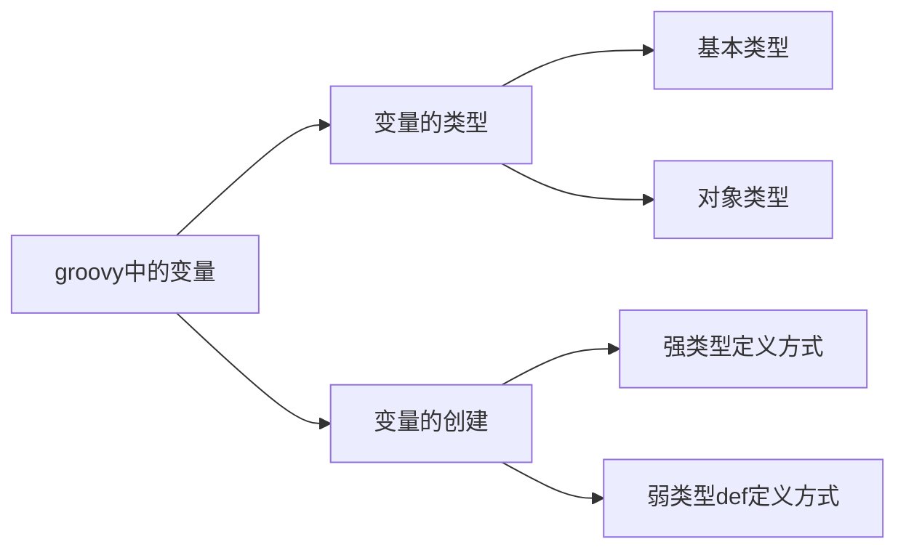
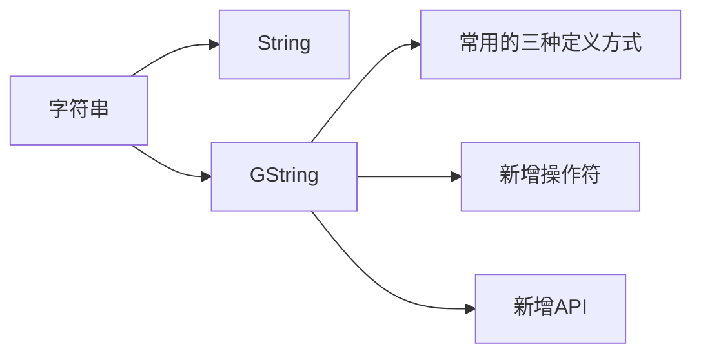
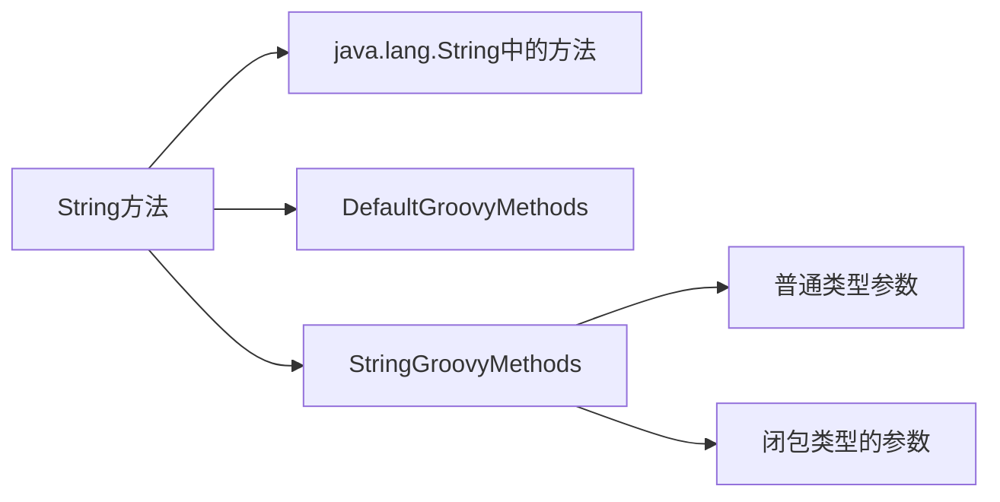
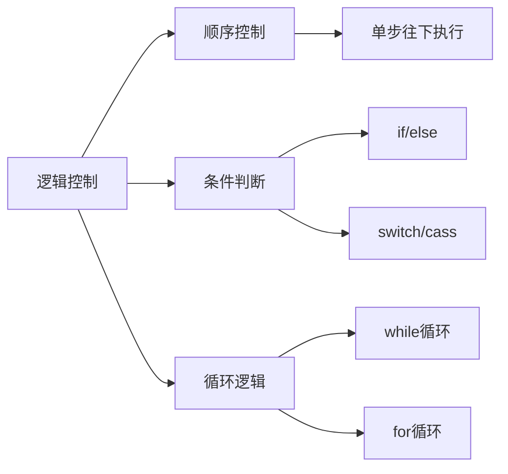
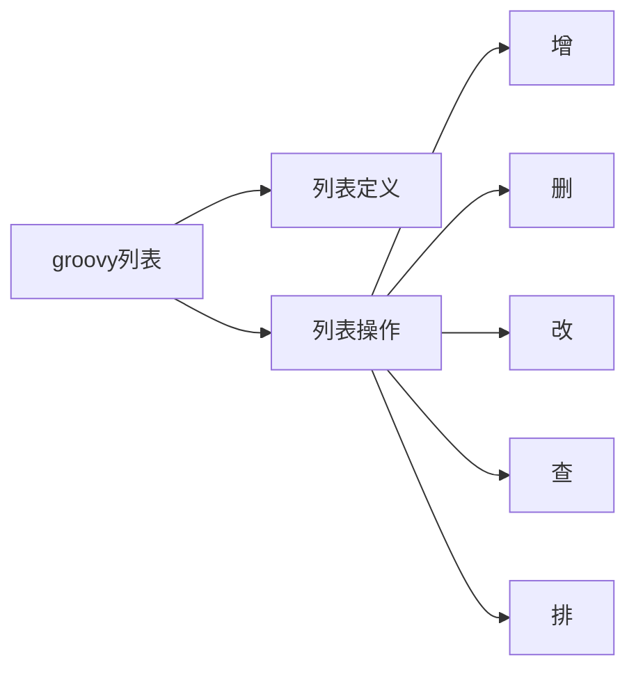
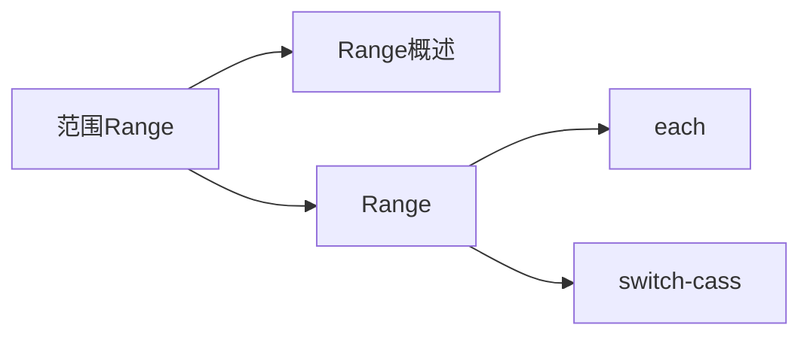
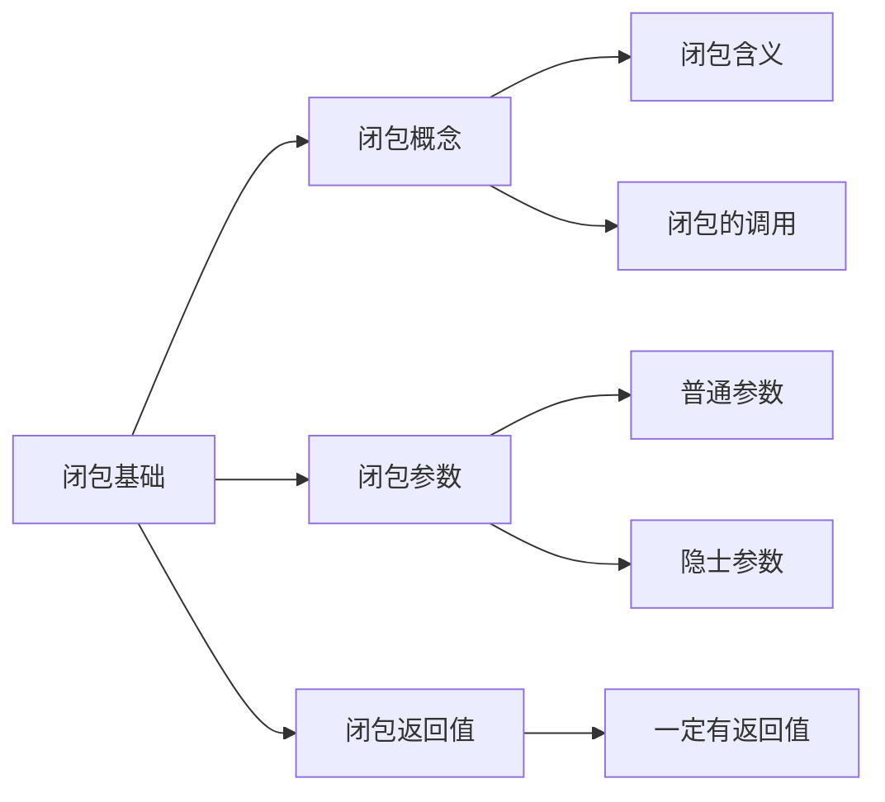
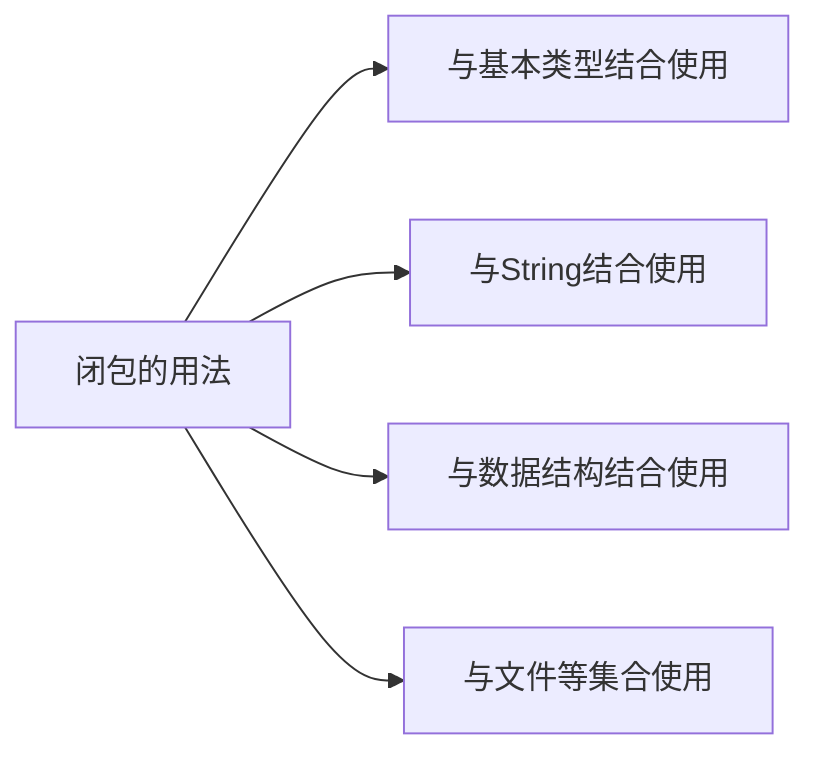
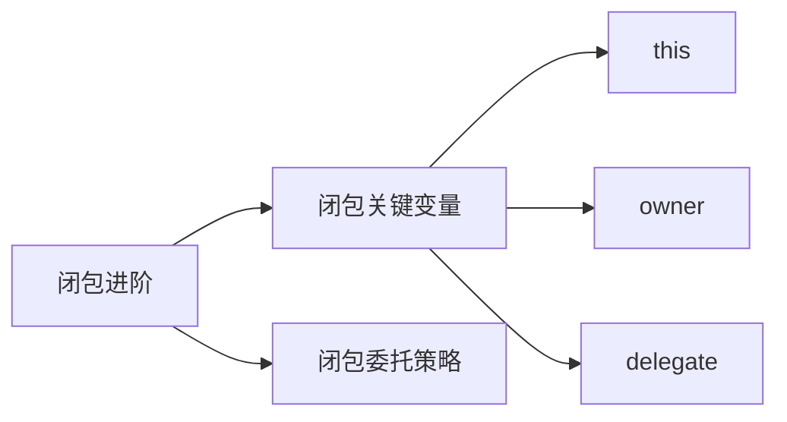
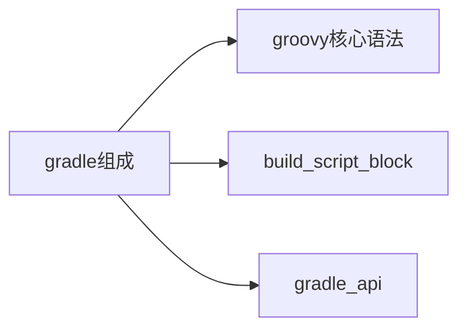

# Gradle 3.0 自动构建
- 全平台,全语言的构建工具,使用程序代理 XML 进行构建.

## 1. Groovy
### 1.1 领域特定语言 DSL 介绍(了解)
- 全称 domain specific language,专用于某个特定领域的语言.
- 比如 UML 建模语言等.
- Groovy 是 DSL 的一个分支.
- DSL 的核心思想 : 求专不求全,解决特定领域内的问题.

### 1.2.Groovy 初探(了解)
- Groovy 是 ==**基于 JVM**== 的敏捷开发语言.相当于 java 的扩展,和 java 的语法比较相似
    - Groovy 的源文件可以直接解释执行
- 结合了 Python, Ruby, smalltalk 脚本语言的许多强大特性.
- Groovy 可以与 Java 完美结合,==**可以使用 Java 所有的库**==.
- Groovy 特性
    - 语法上支持动态类型,[闭包](#info_1)等新一代特性
    - 无缝集成所有==**已经存在的 Java 类库**==.但是也做了很多修改
    - 即支持面向对象编程(作为==*编程语言*==)也支持面向过程编程(作为==*脚本语言*==).

## 2. Groovy环境搭建
### 2.1 Mac/Linux 环境搭建
[管网地址](http://www.groovy-lang.org/)
- 安装 JDK
- 下载 Groovy 并解压
    - - Groovy目录结构

    ```properties
    bin : 存放 Groovy 命令文件
        groovyc : 将 Groovy 源文件编译为字节码文件.
        groovy : 执行编译后的 Groovy 字节码文件
        groovysh : 解释执行 Groovy 脚本
    doc : 存放 Groovy API 等文档
        api : 存放文档
        document : 存放 Groovy 官方教程文档
    ```

- 创建软连接 : ln -s xxx xxx
- 配置环境变量 : 

    ```properties
    export GROOVY_HOME=/usr/local/groovy
    export PATH=$PATH:$GROOVY_HOME/bin
    ```
- 验证

    ```shell
    cydeMacBook-Pro:~ cy$ groovy -version
    Groovy Version: 2.5.6 JVM: 1.8.0_201 Vendor: Oracle Corporation OS: Mac OS X
    ```
    
### 2.2 IDEA之 Groovy 环境搭建
- 创建新工程时选择 Groovy
- 并选择本地安装的 Groovy
- 完事

### 2.3 Groovy 工程 demo
- 创建新工程时选择 Groovy
- 并选择本地安装的 Groovy
- 创建 Groovy class 文件
- ==*HelloGroovy*==

    ```groovy
    class HelloGroovy {
        public static void main(String[] args) {
            println("hello groovy!");
        }
    }
    ```
- 可以将上面代码修改为下面的代码:

```groovy
//只有一个输出语句,没有 class,没有方法,没有分号结尾.一样可以达到上面代码的效果.
println("hello groovy!")
```

### 2.4 window自理

-----
## 3. Gradle 核心语法
### 3.1 Groovy 变量


- 变量的类型
    - 基本类型
        - 变量的定义和 java 中一样.
        - 从代码结果中可以看出,基本类型会被编译器自动推断对象的类型.
    - 对象类型


- 变量的定义
    - ==**强类型定义**==方式
        - 直接定义
    - ==**弱类型 def**== 定义方式
        - ==*不需要指定变量类型,通过 def 关键字来告诉编译器这是定义一个变量.通过后边的值,让编译器自动给他设置对应的类型*==.并且可以通过重复的赋不同类型的值.就像一个 Object,可以接收任何类型的值,编译器会自动去推断此对象的类型.
    - 两种定义方式的选择
        - 如果变量只是用于自己的模块,而不会被其他开发人员或者模块引用,就自己用,就可以使用 def 类型
        - 如果其他模块或者类会使用这个变量,则需要使用强类型定义

==**代码演示**==
```groovy
println("强类型定义变量")
int a = 1
double d = 1.23
String str = "adb"
println(a.class)
println(d.class)
println(str.class)
println("会自动将基本类型转化为对象类型")

println()
println("弱类型 def 方式定义变量")
def x = 1;
def y = 1.23
def z = "abc"
println(x.class)
println(y.class)
println(z.class)

println()
println("弱类型创建对象时,重新赋另一种类型的值,编译器会自动判断类型")
x = "xxx"
println(x.class)
```


### 3.2 Groovy String 类型
#### 3.2.1 String 类型概述


- 定义方式可以使用双引号(还可以使用单引号也可以使用三引号)
- 单引号没有格式
- 双引号字符串支持字符串扩展(GString),String 和 GString 可以直接互相转换
- 三引号有格式

```groovy
//单引号
def name='a ' +
        'signle'
//没有格式,换号什么的没有作用,输出结果还是一行
println name
println name.class
println()

//双引号
def doubleName = "this is a common String"
println doubleName.class
//双引号字符串也是 可扩展字符串--GString
def sayHello = "hello : ${doubleName}"
println sayHello
println sayHello.class
//花括号内可以扩展任意的表达式
println "The num 2 and 3 equale ${2+3}"

//Stirng 和 GString 可以相互扩展
def num = "The num 1 and 2 equale ${1+2}"
result = echo(num)
String echo(String message){
   return message
}
println result


//三引号
println()
def thuplename = '''
three 
signle 
string
'''
//有格式,换行起作用
println thuplename
println thuplename.class
```

#### 3.2.2 String 方法
- ==**String方法 思维导图**==



- ==*DefaultGroovyMethods的方法都被StringGroovyMethods重写了*==

==**StringGroovyMethods方法**==

```properties
//String 方法
def str = "groovy"
/**
 * center : 字符串填充. 以字符串为中心,向两边填充
 *    numberOfChars : 填充后的长度
 *       如果此参数和原字符串长度一样或者小, 则返回元字符串
 *       如果为偶数,则前后分别平均填充.
 *       如果为奇数,则后边比前边多一个
 *    padding : 要填充的内容
 */
println str.center(9, 'qa')

/**
 * padLeft : 字符串填充. 向字符串左边填充
 *    numberOfChars : 填充后的长度
 *       如果此参数和原字符串长度一样或者小,则返回原字符串
 */
println str.padLeft(9, 'a')

//字符串比较
def str1 = "groovy"
def str2 = "hello"
println str1.compareTo(str2)  //java 方法
println str1 > str2 //Groovy 方法

//字符串索引
println str.getAt(0) //java 方法
//可直接通过传入数组下标的方式获取
println str[0]    //Groovy 方法
//输出下标 0--2 的字符
println str[0..2]  //Groovy 方法

//减法运算,从字符串中减去另一个字符串,顺序要匹配才能减去
def str3 = "hello"
def str4 = "eo"
println(str3.minus(str4))  //java 方法
println str3 - str4  //groovy 方法

//倒序
println str.reverse()

//第一个首字母大写
println str.capitalize()

def str5 = "4"
//判断是否是数字类型
println str5.isNumber()
//转换
println str5.toInteger()
```


### 3.3 Groovy 逻辑控制
- ==**逻辑控制思维导图**==



-以上各种逻辑中,除了 ==*switch/cass*== 和 ==*for循环*==之外,其他和 java 基本相同.

#### 3.3.1 条件判断-->switch/cass
- Groovy 可以传入任意类型进行匹配

```groovy
//switch/cass
def e = 1.23
def result
switch (e) {
    case 'foo' :
        result = "foo"
        break
    case [1, 2, "string"] :   //是否在列表中
        result = 'list'
        break
    case 12..30 :    //范围
        result = "range"
        break
    case BigDecimal :   //类型
        result = "decimal"
        break
    case Integer :
        result = "Integer"
        break
    default: result = "default"
}
println result
```

#### 3.3.2循环逻辑-->for循环
- Groovy for 循环相比较 java,对一些类型的操作进行了改变

```groovy
//对范围的循环
def sum  =0
for (i in 0..4){
    sum += i
}
println sum

//对 list 进行循环
sum = 0
for (i in [0,1,2,3,4]) {sum += i}
println sum

//对 map 进行遍历
sum = 0
for (i in ['one':1, 'two':2, 'three':3, 'four':4]) {
    sum += i.value
}
println sum
```

### 3.4 Groovy 列表


#### 3.4.1 groovy 列表定义

```groovy
//def list = new ArrayList()    //定义列表 java 方式
def list = [5, 3, 1, 2, 4]   //定义列表 groovy 方式
println list.class
println list.size()
println()

def arr = [1, 2, 3, 4, 5] as int[]  //groovy 定义数组,使用 as int[] 将 list 标记为数组
int[] arr2 = [1,2,3,4,5]    //强类型定义数组
```
#### 3.4.2 groovy 列表排序,查找,统计

```groovy
//排序
//Collections.sort(list)
list.sort() //和Collections.sort(list)作用一样,默认从小到达排序
println list

//自定义排序规则
//定义一个以绝对值排序的规则
def sortList = [6, -3, 5, 9, 2, -7, 4, -1]
//Comparator mc = {
//    a, b -> a == b ? 0 :
//            Math.abs(a) < Math.abs(b) ? -1 : 1
//}
//Collections.sort(sortList, mc)
//println sortList

//同上
sortList.sort{a, b -> a == b ? 0 : Math.abs(a) < Math.abs(b) ? -1 : 1}
println sortList


//列表查找
def findList = [6, -3, 5, 9, 2, -7, 4, -1]
println findList.find {return it % 2 == 0}
println findList.findAll{return it % 2 == 0}.toListString()
println findList.min()
println findList.max()
//统计 count
println findList.count{return it > 3}
```


### 3.5 Groovy 映射(map)
#### 3.5.1 map 定义
```groovy
//映射  map
def map = [
        one : '1',
        two : '2',
        three : '3'
]
println map['one']
println map.one


//添加元素
map.four = '4'
//添加一个 map
map.mapinner = [five : '5', six : '6']
println map.toMapString()
println map.getClass()  //不能直接 .class 获取类型,因为直接 .class 的话就会去 map 中查找 key 为 class 的元素


/**
 * map 需要注意的 : 
 *      key : 可以使用单引号字符串(不写引号默认是单引号)或者的常亮
 */
```

#### 3.5.2 map 常用操作
- ==*遍历 each,eachWithIndex*==

```groovy
//遍历
def students = [
        1 : [name : 'zhangsan', age : '19'],
        2 : [name : 'lisi', age : '17'],
        3 : [name : 'wangwu', age : '20'],
        4 : [name : 'zhaoliu', age : '16'],
        5 : [name : 'zhengliu', age : '18']
]
//直接遍历 entry
students.each {def student -> println "the student key : ${student.key},and value is ${student.value}"}
//直接遍历 key value
students.each {def key, def value -> println "the student key : ${key},and value is ${value}"}
//带索引的遍历, 第一个参数是 entry,第二个参数是 index
students.eachWithIndex{ def student, int index -> println "the index is : ${index}, and the student key : ${student.key},and value is ${student.value}"}
```

- ==*查找 find, findAll*==

```groovy

//查找
//find 查找满足条件的第一个
println students.find {def student -> return student.value.age.toInteger() >=18}

//findAll 查找满足条件的所有
println  students.findAll {def student -> return student.value.age.toInteger() >= 18}
```

- ==*分组 groupBy*==

```groovy
//分组
println students.groupBy {def student -> student.value.age.toInteger() >= 18 ? '成年' : '未成年'}
```

- ==*排序 sort*==

```groovy
//排序
//map 的 sort 方法,返回的是一个新的 map
println students.sort {def stu1, def stu2 -> return stu1.value.age.toInteger() > stu2.value.age.toInteger() ? 0 : stu1.value.age.toInteger() > stu2.value.age.toInteger() ? 1 : -1}.toMapString()
```

### 3.6 范围 range



#### 3.6.1 Range 定义

```groovy
def range = 1..10 //1 到 10
```

#### 3.6.2 Range 操作

```groovy
//范围 Range
def range = 1..10
println range[0]    //获取第 0 个元素
println range.contains(5)   //判断是否包含 5 
println range.from  //起始值
println range.to    //终止值
```

#### 3.6.3 Range 遍历(each),switch-cass

```groovy
/遍历
range.each { print it}
println()
for (i in range){
    print i
}
println ()
//switch - cass
println getGread(100)
def getGread(def number){
    def result
    switch (number){
        case 0..59 :
            result = '不及格'
            break
        case 60..69 :
            result = '一般'
            break
        case 70..85 :
            result = '良好'
            break
        case 86..100 :
            result = '优秀'
            break
    }
    result
}
```

## 4 ==**闭包**==(重要)
### 4.1 闭包基础



- ==**闭包: 闭包其实就是一个代码块**==
#### 4.1.1 ==*闭包的定义以及调用*==

    ```groovy
    //闭包的定义,就是一个代码块
    def cluser = {println "hello groovy"}
    cluser()    //调用方式 1
    cluser.call()   //调用方式 2
    ```

#### 4.1.2 ==*闭包参数 ->前边是参数部分, ->后边是闭包体*==

```groovy
//闭包参数, -> 前边是参数, -> 后边是闭包体
//一个参数
def cluser_1 = {String name -> println "hello ${name}"}
cluser_1.call("张三")
def name = "李四"
cluser_1(name)
    
//只有一个参数的时候,可以不用显示的定义参数列表,直接使用隐士的 it 参数
def cluser_2 = {println "hello ${it}"}
cluser_2.call("王五")
    
    
//多个参数,用逗号隔开
def cluser_3 = {
    String userName,
       int age
        ->
        println "my name is ${userName},is ${age} years old!"
}
cluser_3.call("张三",18)
```

#### 4.1.3 ==*闭包返回值,闭包一定有返回值,用 return 进行返回,如果没有使用 return 进行返回,则返回值为 null*==

```groovy
//返回值,闭包一定是有返回值的,使用 return 进行返回,如果没有 return 进行返回,则返回值为 null
    def cluser_4 = {
        String param
            ->
            return "param : ${param}"
    }
    def result_1 = cluser_4("这是个参数列表")
    println result_1
    
    
    //没有用 return 进行返回
    def cluser_5 = {
        String param
            ->
            println "param : ${param}"
    }
    def result_2 = cluser_5("这是个参数列表")
    println result_2

```

### 4.2 闭包的使用



#### 4.2.1 闭包与基本类型结合使用
- ==*upto, downto, times*== 方法

```groovy
//与基本类型配合使用
//求阶乘
println fab1(5)
def fab1(def number){
    def result = 1;
    //upto,以下代码的意思是求从 1 开始递增,到 5 的阶乘
    1.upto(number) { num -> result *= num }
    return result
}

println fab2(5)
def fab2(int number){
    def result = 1
    //downto. 以下代码的意思是求从 number 开始递减,到 1 的阶乘
    number.downto(1) { num -> result *= num }
    return result
}

//求累加
println fab3(101)
def fab3(int number){
    def result = 0
    //times,以下代码的意思是求从 0 开始,到 100 的累加和,times 方法总是从 0 开始.
    number.times {num -> result += num}
    return result
}
```

#### 4.2.2 闭包与 Stirng 结合使用
- ==*each(遍历), find(匹配一个), findAll(匹配所有),any(有一个符合条件就返回 true), erery(所有字符都满足条件才返回 true) collect(构建新字符串)*==

```groovy
/**
 * 闭包与 String 结合使用
 */
//String 遍历  each 方法
String str = 'the 2 and 3 is 5'
//each 遍历字符串,参数是一个闭包,each 的返回值还是字符串本身
//multiply 方法时将字符串扩充几倍,此处时将字符串扩充 2 倍,就是每个字符都输出 2 次
str.each {String s -> print s.multiply(2)}


//find .查找 String 中符合条件的第一个,find的闭包必须是一个boolean 类型的返回值
println str.find{String s -> s.isNumber()}

//findAll,查找 String 中符合的所有.findAll 参数是一个闭包,这个闭包的返回值必须是 boolean 类型
println str.findAll{String s -> s.isNumber()}.toListString()


//any. String 中只要有一项符合闭包中条件,就返回 true,否则返回 false,参数是一个返回值是 bllean 类型的闭包
println str.any {String s -> s.equals('z')}

//every. Stirng中每一项都符合闭包返回的条件,结果才是 true,否则为 false.
println str.every {String s -> s.isNumber()}

//将字符串的每一个元素都应用与闭包,返回一个新的字符串
println str.collect {it.toUpperCase()}
```

#### 4.2.3 闭包进阶


##### 4.2.3.1 闭包关键变量之 ==**this, owner, delegate**==

```groovy
/**
 * this owner delagate
 */
def sampleCluser = {
    println  "VariableDemo.groovy this : " + this   //定义闭包处的类, 此处为当前脚本文件类VariableDemo
    println  "VariableDemo.groovy owner : " + owner //定义闭包处的类或者对象, 此处为当前脚本文件类VariableDemo
    println  "VariableDemo.groovy delegate : " + delegate   //代表任意对象,默认的值和 owner 一样, 此处和 owner 一样,为当前脚本文件类VariableDemo
    def cluseronner = {
        println  "cluseronner.groovy this : " + this   //定义闭包处的类, 此处为当前脚本文件类VariableDemo
        println  "cluseronner.groovy owner : " + owner  //定义闭包处的类或者对象, 此处为内部闭包对象
        println  "cluseronner.groovy delegate : " + delegate   //代表任意对象,默认的值和 owner 一样, 此处和 owner 一样,为为内部闭包对象
    }.call()

}.call()

println()
class Proson{
    def sampleCluser = {
        println  "VariableDemo.groovy this : " + this   //定义闭包处的类, 此处为 Person 类
        println  "VariableDemo.groovy owner : " + owner //定义闭包处的类或者对象, 此处为 Person 类
        println  "VariableDemo.groovy delegate : " + delegate   //代表任意对象,默认的值和 owner 一样, 此处为 Person 类
    }

    def say(){
        def cluseronner = {
            println  "cluseronner.groovy this : " + this   //定义闭包处的类, 此处为 Person 类
            println  "cluseronner.groovy owner : " + owner  //定义闭包处的类或者对象, 此处为 Person 类
            println  "cluseronner.groovy delegate : " + delegate   //代表任意对象,默认的值和 owner 一样, 此处为 Person 类
        }.call()
    }
}
def p = new Proson()
p.sampleCluser.call()
p.say()
```
- 从结果看出
    - this 代表定义


##### 4.2.3.2 闭包关键变量之 ==**闭包委托策略**==

```groovy
println()
class Student{
    String name
    def pretty  = { "my name is ${name}" }

    String toString(){
        pretty.call()
    }
}

class Teacher{
    String name
}

def stu = new Student(name : "tom")
def tea = new Teacher(name : 'jim')
//改变 delegate ,指向 ter
stu.pretty.delegate = tea
//设置委托策略
stu.pretty.resolveStrategy = Closure.DELEGATE_FIRST
println stu.toString()
```


#### 4.2.3 闭包与数据结构结合使用
#### 4.2.4 闭包与文件等的结合使用

 
## 5. Groovy 面向对象
- Groovy 默认的所有类型都是 ==**publish**== 类型,类,方法,变量等

### 5.1 Groovy 中类,接口等的定义和使用
- ==**类**==创建
- groovy 中,无论是类,还是方法和对象, 默认的都是 publish 类型

    ```groovy
    //创建 groovy class
    package oop
    /**
     * 1. groovy 中默认的都是 publish 类型
     *
     */
    class Person {
        String name
        Integer age
    
        def increaseAge(Integer years){
            this.age += years
        }
    }
    
    //创建 groovy script 
    //创建变量
    def person = new Person(name: "zhangsan", age : 18)
    //person.name 这里的点默认调用的是 getXXX 方法
    println "the name is : ${person.name} and the age is ${person.age}"
    
    //调用方法
    person.increaseAge(2)
    println "the name is : ${person.name} and the age is ${person.age}"
    ```

- ==**接口**==
    - groovy 接口不允许定义非 ==**publish**== 类型的方法

    ```groovy
    //定义接口 groovy interface
    /**
     * groovy 接口不允许定义非 publish 的方法
     */
    interface Action {
        void eat()
        void drink()
        void play()
    }
    
    //实现类
    **
     * 1. groovy 中默认的都是 publish 类型
     *
     */
    class Person implements Action{
    
        String name
        Integer age
    
        def increaseAge(Integer years){
            this.age += years
        }
    
        @Override
        void eat() {
            println "接口 eat 方法"
        }
    
        @Override
        void drink() {
            println "接口 drink 方法"
        }
    
        @Override
        void play() {
            println "接口 play 方法"
        }
    }
    
    //创建 groovy script 调用
    //接口方法调用
    person.eat()
    person.drink()
    person.play()
    ```

- ==*trait*==
    - 和接口比较像,但是 trait 内的方法可以有默认的实现
    
    ```groovy
    /**
     *  Trait :
     *      和接口很相似
     *      方法可以有实现
     *      如果方法没有实现,则必须用 abstract 修饰
     */
    trait TraitAction {
        //没有方法体的方法必须用 abstract 关键字修饰
        abstract void eat()
        void paly(){
            println "i can play"
        }
    }
    ```


### 5.2 Groovy 的元编程
- 元编程 : 编写的代码执行的时期,比如有解释执行的 JS,编译执行的Java,运行时期执行的代码,比如反射.
- groovy : 运行时.(方法调用流程)
    - 调用不存在的方法
    - 如果使用 ==**metaClass**== 添加了方法,则调用这个添加的方法.如果没有添加,则执行下面
    - 如果重写了 ==**methodMissing**== 方法,会调用 methodMissing 方法,如果没有重写,则执行下面
    - 如果重写了 ==**invokeMethod**== 方法则会调用 invokeMethod 方法


#### 5.2.1 ==**invokeMethod**==
- 重写 invokeMethod 方法后,当==**要调用的方法不存的时候,会自动调用 invokeMethod 方法**==
- ==*代码演示*==

```groovy
class Person{

    String name
    Integer age

    def increaseAge(Integer years){
        this.age += years
    }

    /**
     * 重写 invokeMethod 方法
     *    当方法找不到的时候,会自动调用这个方法,由这个方法进行代替
     * @param name : 调用的方法名,就是不存在的那个方法的名称
     * @param args : 调用的方法的参数
     * @return
     */
    @Override
    def invokeMethod(String name, Object args) {
        return "the method name is : ${name} and the args is : ${args}"
    }
}

//创建 groovy script 进行调用
def person = new Person(name: "zhangsan", age : 18)
person.noMethod()   //noMethod 方法不存在,所有
```

#### 5.2.2 ==**methodMissing**==
- 重写 methodMissing 方法,当调用一个不存在的方法的时候,会自动调用 methodMissing 方法,优先级高于 invokeMehtod 方法

```groovy
 /**
     * 当方法不存在的时候,会自动调用这个方法
     * @param name
     * @param args
     * @return
     */
    //@Override 不能有@Override注解
    def methodMissing(String name, Object args){
        return "the method name : [ ${name} ] is missing!"
    }

```


#### 5.2.3 ==**metaClass**==
- metaClass 可以为类动态添加属性和方法

```groovy
//metaClass 添加属性
Person.metaClass.sex = 'man'
def person_1 = new Person(name: "zhangsan", age : 18)
println person_1.sex

//metaClass 添加方法, 闭包
Person.metaClass.nameUpperCase = {
    -> name.toUpperCase()
}
def person = new Person(name: "zhangsan", age : 18)
//调用添加的方法
println person.nameUpperCase()

//metaClass 添加静态方法
Person.metaClass.static.craetePerson ={String name, int age -> new Person(name: name, age: age)}
def person_3 = Person.craetePerson("wangwu", 20)
println person_3.name + " and " + person_3.age
```

## 6. Groovy 高级语法
### 6.1 Groovy json操作
- ==*JsonOutput*==

```groovy
def list = [new Person(name: "john", age: 18), new Person(name: "tom", age: 19)]
/**
 * JsonOutput.toJson 将对象转为 json
 */
def json =  JsonOutput.toJson(list)
println json

/**
 * JsonOutput.prettyPrint 格式化 json
 */
println JsonOutput.prettyPrint(json)

/**
 *  JsonSlurper : 将 json 转为对象
 */
def ob = new JsonSlurper().parseText(json)
println ob
```

### 6.2 Groovy 操作 xml ==**XmlSlurper**==
#### 6.2.1 Groovy 解析 xml 格式数据
- ==**xmlSlurper(解析), each(遍历), depthFirst(深度遍历), **==

```groovy

String xml = '''
    <response version-api="2.0">
        <value>
            <books id="1">
                <book id="2">
                    <title>疯狂 Java</title>
                    <author>老张</author>
                </book>
                <book id="3">
                    <title>疯狂 Groovy</title>
                    <author>老王</author>
                </book>
                <book id="4">
                    <title>疯狂 Spring</title>
                    <author>老张</author>
                </book>
            </books>
        </value>
    </response>
'''
/**
 * 开始解析此 xml 数据
 */
//创建 xmlSlurper 对象,用于解析xml
def xmlSlurper = new XmlSlurper()
//解析 xml
def response = xmlSlurper.parseText(xml)    //解析完成,此处的 response 是获取的整个 xml 的总节点
//获取节点数据 book 就是节点
println response.value.books[0].book[0].title.text()
//获取第一个 book 的 ID 属性的值,使用 @
println response.value.books[0].@id


//遍历节点
def bookNameList = []
//获取到 books 节点下的所有节点并遍历
response.value.books.each { books ->
    //遍历 所有 book 节点
    books.book.each { book ->
        def author = book.author.text()
        if(author.equals('老张')){
            bookNameList.add(book.title.text())
        }
    }
}
println bookNameList.toListString()

//相较于上边更加简便的遍历---深度遍历 depthFirst
def titles = response.depthFirst().findAll { book ->
    return book.author.text() == '老张' ? true : false
}
println titles.toListString()

```


#### 6.2.2 Groovy 创建 xml 格式数据


## 7. Gradle
### 7.1 Gradle 概念 
- Gradle 用于构建程序,构建工具,也可以看做一种编程框架



- gradle 优势
    - 灵活性 :maven,ant 构建过程中不能修改构建过程,只能按照他们的流程
    - 粒度性 : maven源代码和脚本独立,gradle 的构建时通过各种 task
    - 扩展性 :
    - 兼容性 : 兼容所有 maven,ant 的功能

#### 7.1.1 Gradle 生命周期
- 基于 IDEA gradle 工程创建
- 选择 gradle,右边选择 java
- 配置本地安装的 gradle
- 填写项目路径等
- 完事


### 7.2
## gradle 之 task


## 名词解释

- <span id="info_1"/> 闭包
 