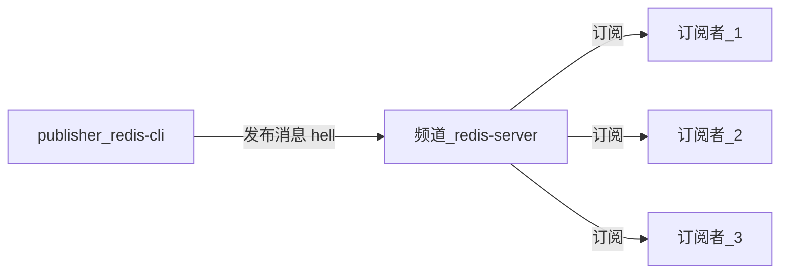

# Redis
## 1. 安装及启动
### 1. 安装
1. 下载,解压
2. 建立软连接 : ln -s xxx redis
3. 进入解压文件夹
4. 编译 : make
5. 安装 : make install

### 2. 启动
#### 1. 方式 1 -- 最简启动

```properties
启动服务器 : redis-server --port (如果不指定 port,默认是 6379 端口)
连接客户端 : redis-cli 
```

#### 方式 2 -- 动态参数启动

```properties
启动服务器 : redis-server --port (如果不指定 port,默认是 6379 端口)
连接客户端 : redis-cli --port : 指定连接哪个端口的服务器
```

#### 方式 3 -- 配置文件启动 (要用的方式)

```properties
启动方式 : redis-server xx/xx/redis.conf
配置文件配置方式 : 
    1 : 在 Redis 文件夹下创建 conf 文件夹用于存放配置文件
    2 : 复制 Redis 的默认配置文件 (redis.conf) 到 conf,并以端口进行区分,比如 redis-6380.conf
    3 : 进行配置
```


## 2. Java API 
### 1. Jedis
==**代理模式**==

```java
@Test
public void run1(){
    //创建连接  设置连接的linux服务器IP和Redis端口
    Jedis jedis = new Jedis("10.211.55.10", 6379);
    //操作Redis
    jedis.set("password","123456");
    String username = jedis.get("username");
    System.out.println(username);
    //关闭资源
    jedis.close();
}
```

==**连接池连接**==

```java
@Test
public void run2(){
    //获取连接池配置对象
    JedisPoolConfig jedisPoolConfig = new JedisPoolConfig();
    //设置最大连接数
    jedisPoolConfig.setMaxTotal(30);
    //设置最大空闲连接数
    jedisPoolConfig.setMaxIdle(10);
    //获取连接池
    JedisPool jedisPool = new JedisPool(jedisPoolConfig, "10.211.55.10", 6379);
    Jedis jedis = null;
    try {
        //获取jedis对象
        jedis = jedisPool.getResource();
        //操作Redis
        String username = jedis.get("username");
        String password = jedis.get("password");
        System.out.println(username);
        System.out.println(password);
    }catch (Exception e){
        e.printStackTrace();
    }finally {
        if(jedis != null){
            jedis.close();
        }else if(jedisPool != null){
            jedisPool.close();
        }
    }
}
```
-----
## 3. 数据类型
### String
- 字符串类型的 value 的大小不能大于512M
- 本质上,value 都是二进制的
- 结构
    
```properties
key     value
hello   world        value 是一个真正的字符串
count     1            value也可以是一个整型,内部会做一个整型到字符串的转换
bits      101001     value还可以存二进制
Jsonstring         json字符串
```
#### 使用场景:
    缓存
    计数器
    分布式锁

### list
- Redis中,list类型是按照插入顺序排序的可重复的字符串链表
- 从头部(lift--左)和尾部(right--右)添加数据，如果插入是该key不存在，就创建。
- 如果链表所有的数据都被移除，那么链表也将从数据库中删除
- 可以包含的最大元素数量是4294967295

### hash
-每个key对应的都是一个或多个键值对
### set
- set时没有顺序的，中不能出现重复的元素。
- 
#### 使用场景:
给用户添加标签
给标签添加用户
共同关注好友

-----
## 4. 功能
### 1. 慢查询
#### 1.1 概述
- Redis 是单线程的,所以他的命令是一个一个执行的.
- 经历三个阶段 : ==**发送命令, 排队, 执行命令**==
- 慢查询发生在 ==*执行命令阶段*==
- 慢查询是一个固定长度的,先进先出的队列,加入一条命令在 ==*执行命令阶段*==被纳入慢查询范围,那么它就会进入这个队列.
- 慢查询命令是保存在内存当中的,如果重启,会重置


#### 1.2 配置
- 配置方式 : 配置文件,需要重启

```properties
slowlog-max-len : 队列的固定长度,默认是 128.
slowlog-log-slower-than : 慢查询阀值.单位是毫秒,默认是 10000
    设置为 0 : 标识所有查询都纳入慢查询列表
    设置为 小于 0 : 所有命令都不纳入慢查询

配置说明 : 
    当命令时间查过阈值的时候,就会将这个命令纳入慢查询列表中.
```

####  1.3 命令

```properties
slowlog get n : 获取指定条数的慢查询队列数据,和设置的慢查询固定长度有关
slowlog len : 获取慢查询列表长度
slowlog reset : 清空慢查询列表
```

### 2. 流水线 pipeline
==**网络命令模型**==


- 传输命令 + 返回结果 = 1 次网络时间
- Redis 一次网络命令的时间 = 1 次网络时间 + 1 次命令时间
- 那么 n 次命令的时间 = n次网络时间 + n 次命令时间
- Redis 命令运行的时间是微秒级别的,所以网络时间是需要控制的.网络通信是非常耗时的,所以如果有 n 条命令,就会非常耗时间
- ==**流水线**== : 将一批命令进行打包,一次性发送到服务器,然后在服务器端进行批量处理,最后按顺序返回结果.
- pipeline 只能作用在 Redis 的一个节点上

==**代码演示**==

```java
public static void pipelineDemo(){
    long start = new Date().getTime();//开始时间
    // 获取 pipeline 对象
    Pipeline pipeline = jedis.pipeline();
    // 打包命令
    for(int i = 0; i < 1000 ; i ++){
        for(int j = i * 100; j < (i + 1) * 100 ;j ++){
            pipeling.set(key, value); //具体要打包的命令
        }
        pipeling.syncAndReturnAll();
    }
    long end = new Date().getTime();//结束时间
    sout(end - start);
}
```

### 3. 发布订阅
- 发布者 : publisher
- 订阅者 : subscriber
- 频道 : channel
- 发布者发布消息,将消息发布到一个频道,订阅者订阅这个频道,所有订阅这个频道的订阅者都可以收到消息
- 订阅者可以订阅多个频道
- 一个订阅者在发布者发布一个消息之前订阅这个频道,是收到不这个消息的

==*模型*==



==*命令*==

```properties
publish 频道 消息 : 发布一条消息到注定频道,返回的是订阅这个频道的订阅者个数
subscribe 频道_1  频道_2 : 订阅者订阅频道.返回订阅的频道以及决堤收到的消息
unsubscribe 频道 : 取消订阅
```


## 4. 持久化
- Redis 的所有数据都是保存在内存当中,如果系统崩掉或者其他原因,没有将数据保存到磁盘中,那么数据会丢失.
- 持久化是对数据的更新异步的保存到磁盘当中.
- 有两种方式 : ==**RDB(相当于快照)**== 和 ==**AOF(相当于日志模式)**==

### 1. 持久化方式 : RDB 
#### 1. RDB 概述
- RDB : 相当于==*快照*==相当于某时某点的数据的一个完整的备份. 
- 通过一条命令将内存中的 Redis 数据完成的生成一个快照文件.也就是一个 RDB 文件,保存在磁盘当中.如果需要恢复数据:比如重启.就可以加载这个文件,恢复某时某刻的数据

#### 2. RDB 触发方式 (三种)
1. ==*save 命令*==
    - ==**同步的命令**==,在这个命令执行完之前,其他的命令都会排队,执行完后返回 OK
    - 因为是同步的命令,如果数据非常多,那么save 命令就会执行的非常慢,在没有执行完之前,如果有其他命令,就会造成 Redis 阻塞.
    - 生成的 RDB 文件会覆盖旧的 RDB 文件

1. ==*bgsave*==
    - ==*异步的命令*==,会通过 ==*fork()*==函数生成主进程的一个子进程来完成 RDB 文件的生成工作.生成之后,会告诉主进程 RDB 文件生成成功,并返回成功或者失败.独立的线程执行此任务.
    - 一个客户端发送 bgsave 命令,Redis 通过 fork()函数创建主进程的子进程来执行 RDB 文件的生成工作,在文件生成的过程中,如果有其他客户端发送命令,会正常运行,不会造成阻塞.RDB 文件生成后,会返回成功或者失败.
    - 生成的RDB 文件会覆盖旧的 RDB 文件.

3. ==**自动**==
    - 在达到某些条件后,会自动生成 RDB 文件.
    - 通过配置,达到某些添加后,比如一定的时间内改变了多少条数据,就会自动生成 RDB 文件,
    - 内部其实执行的是 ==*bgsave*== 命令.
    - 缺点 : 自动生成 RDB 文件无法控制文件生成的频率,如果频率过高,肯定会对磁盘有一定的压力,所以不是很好的方式

#### 4. RDB 相关配置项

```properties
dbfilename : RDB 文件名称,默认是 dump.rdb, 一般使用端口区分: dump-6380.rdb
dir : RDB 文件,AOF 文件,日志文件等生成的位置
stop-writeson-bgsave-error : 如果 bgsave 发生错误,是否停止写入,默认是yes
rdbcompression : RDB 文件是否采用压缩的方式,默认是 yes
rdbchecksum : 是否对 RDB 文件进行校验,默认是 yes
```

#### 5. RDB 需要注意的点
- 除了 save,bgsave,和自动的配置策略,在全量复制的时候也会生成RDB 文件
- debug 级别的重启,不会清空数据,会生成 RDB 文件
- 执行 shutdown save, 会触发 RDB 文件的生成.

#### 6. RDB总结
- RDB是 Redis 数据从内存到磁盘的快照,用于持久化
- save 通常会阻塞 Redis
- bgsave 不会阻塞,但是后有 fork 进程
- 自动配置策略在满足一定的条件的情况下,会生成 RDB 文件
- 消耗性能

### 2. 持久化方式 : AOF
#### 1. AOF 概述
- AOF ,相当于日志的方式,只要发生更新,就写入日志,当需要恢复数据的时候就可以读文件来恢复数据
- Redis 没发生一次更新操作就会想 AOF 文件写入一条对应的数据,所以 AOF 是实时的,需要恢复数据就读取这个 AOF 文件
- Redis 的写操作并不是执行写入到磁盘当中,而是先写入到==**缓冲区**==当中,然后根据一定策略,将缓冲区当中的数据写入到 AOF 文件当中


#### 2. AOF 的三种策略
1. ==**always**==
    - 每次更新都会向 AOF 文件写一条数据.

2. ==**everysec**==
    - 每秒向 AOF 进行一个刷新.这样在数据多的时候,可以保护磁盘
    - 每隔多久向 AOF 文件刷新一次,这个时间可以配置,但是如果发生错误,会丢失这个时间段内的数据.

3. ==**no**==
    - 由操作系统决定什么时候想 AOF 文件刷新数据


#### 3. AOF 重写
- 随着并发量的变大,AOF 文件会逐步的无限制的变大,会对数据的恢复效率,磁盘等造成很大压力,所以通过 ==**AOF 重写**==来解决这个问题

- AOF 重写的两种实现方式:
    - bgrewriteaof 命令
    - 配置方式

        ```properties
        no-appendfsync-on-rewrite
        ```

#### 4. AOF 的相关配置

```properties
appendonly : 使用 AOF 的前提,需要设置为 yes
applenfilename : AOF 文件的名称,一般以端口区分
appendbsync : AOF策略

```

-----
## 5. 主从复制
### 1. 主从复制的作用
单机存在的问题 : 
    - 如果机器故障,应该怎么解决? 比如磁盘换了,不能短时间修复,改咋搞 (高可用问题)
    - 容量瓶颈 : 假如一台机器 16G 内存,如果一个需求需要 128G 内存,怎么借据(分布式问题)
    - QPS 瓶颈 : (分布式问题)
- 主从复制的基本作用
    - 为数据提供多个副本 (高可用,分布式的基础)
    - 扩展读性能. 假如有很多读写的操作,Redis可以将读写分流

- 总结 : 
    - 一个 master 可以有多个slave
    - 一个slave 只能有一个 master
    - 数据流向是单向的.必须是 master 流向 slave

### 2. 主从复制的配置
#### 1. 命令方式

```properties
<!--复制功能-->
slaveof ip:port  : 设置对应 ip 的主机成为 master

<!--取消复制-->
slaveof no one : 取消复制,但是这是 slave的数据并不会清空,而是之前的 master 同步的数据不会同步过来
```

#### 2. 配置
==**添加一下配置**==
```properties
slaveof IP port  : 设置要连接的主节点
slave-read-only : 从节点只做读的操作.设置为 yes.
```


-----
## 命令

```properties
String 基本命令 : 
    set key value : 无论 key 存不存在,都会设置值,如果存在,则会覆盖之前的值
    Setnx key value : 只有当 key 不存在的时候才会设置值,如果存在,虽然不会报错,但是值并不会设置进去,这个 key 的 value 还是之前的值,相当于增加一个 key 的操作
    Set key value xx : 只有当 key 存在的时候才设置值,如果不存在,也不会报错,但是这个 key不会设置进去,就是说没有这个 key,相当于 update 操作
    get key : 获取 key
    del key : 删除 key
    mset key1 value1 key2 value2 key3 value3…:批量设置 key
    mget key1 key2 key3…:批量获取 key
        多次 get的时间消耗为多次命令时间+多次网络时间,但是 mget 得时间消耗为1次网络时间+1次命令时间,所以效率要比多次 get 高.
    getset key newvalue : 设置新的 value,并返回旧的 value.如果 key 不存在,则返回空
    append key value1 : 在 value 后追加 value1
    strlen key : 返回value 长度
    incrbyfloat key 3.5 : 增加指定浮点值
    setrange key index value : 给字符串指定下标设置指定的值
    getrange key start end : 获取字符串指定下标的所有值,包含 start 和 end
对于整型的操作
    incr key : 指定key 的 value 自增1,如果key 不存在,则创建一个 key,value 为0,然后自增1
    decr key : 指定 key 的 value 自减 1,如果key 不存在,则创建一个 key,value 为0,然后自减1
    incrby key k : 指定 key 的 value 自增 k,如果key 不存在,则创建一个 key,value 为0,然后自增k
    decrby key k : 指定 key 的value 自减 k.如果key 不存在,则创建一个 key,value 为0,然后自减 k


List 命令:
添加 : 
    首部添加(从左边添加):
        lpush key values[value1 value2…]；
        先插入 value1,然后在 value1 的左边插入 value2,以此类推
        在指定的key关联的链表首部添加元素，如果不存在，就先创建一个和该key关联的链表,然后再插入.插入成功后返回链表中所有的元素的个数
        lpushx key value;只有在key关联的list存在是才在首部插入数据，并返回链表中所有元素的个数，否则不插入，并返回0
    尾部添加
        rpush key value1 value2...；
            在该list的尾部插入数据。
        rpushx key value;
            只有在key关联的list存在的情况下才在尾部插入数据。
    指定插入
        insert key after/before pivot value;
            在第一个pivot元素前面或者后面添加元素
查看 : 
    lrange key start end;
        查看链表中从start到end的元素,包含 end。start和end可以从0开始，也可以为负数，-1-倒数第一个， -2--倒数第二个   0--第一个   1--第二个
        lrange key 0 -1:查看所有元素
    lindex key index;
        查看指定下标的元素
    llen key;
        返回key关联的list的元素的个数
删除 : 
    lpop key;
        返回并弹出key的首部元素，链表元素将减少1个。如果key不存在，就返回nil,若果存在就返回并弹出首部元素.
        blpop key timeout : lpop的阻塞版本,timeout 是阻塞超时时间,timeout=0则永不阻塞
     
    rpop key;
        返回并弹出key的尾部元素。链表元素将减少
        brpop key timeout : rpop的阻塞版本,timeout 是阻塞超时时间,timeout=0则永不阻塞
    lrem key count value;
        遍历list,根据 count,删除所有与 value 相等的元素,删除count个value
        count>0时，从首部向尾部遍历删除count个value;lrem list 2 3:从首部开始遍历,删除2个3
        count<0时，从尾部向首部遍历删除count个value;lrem list -2 3;从尾部开始遍历,删除2个3
        count=0时，删除全部的value;;lrem list 0 3;删除list中所有的3
修剪 : 
    ltrim key start end :
        保存指定坐标范围内的元素,包含开始和结束
        Ltrim list 1 4,保留坐标0到4的元素,其他的元素去掉
修改
    lset key index value;
        设置list中指定坐标的元素。0—第一个，-1—最后一个。操作链表的角标不存在抛异常  
        lset list 1 5; 设置list中坐标为1的元素的Value为5 
    rpoplpush list1 list2;
        将list1的右边(尾部)元素弹出并添加到list2的左边(首部)
        也可以将同一个list的尾部的元素弹出并添加到首部:rpoplpush list list

hash 命令 : 
    每个key对应的都是一个或多个键值对
添加键值对 : 
    hset key field value;为制定的key设置一对field/value对(键值对)，添加成功就返回1，当field重复的时候添加失败失败返回0
    hmset key field value;为指定的key设置多个field/value对（键值对),添加成功返回OK，如field重复，就覆盖
获取键值对 : 
    hget key field;获取指定的一个field的value值（就是一个键的value）
    hmget key field1 field2…;获取指定的多个field的value值（多个键的value值）
    hgetall key;获取所有的键值对
 删除 : 
    hdel key fidle1 field2….;删除一个或多个字段，返回值是删除的字段的个数。当要删除的字段不存在时，返回0
    del key;删除整个list.
 增加数字 : 
    hincrby key field increment;将指定的field的value值增加increment。
    hexists key filed；判断指定的key中是否有field的存在，存在返回1，不存在返回0
    hlen key;获取指定的key中包含的filed的个数,就是key中的键值对的个数
    hkeys key;获取key中所有的filed
    hvals key;获取key中所有的value值
    
    
set 命令 : 
 set时没有顺序的，中不能出现重复的元素。
添加 : 
    sadd key value1 value2…；向set中添加数据，如果该value已经存在，则不会重复添加,返回值是成功添加的元素的个数
删除 : 
    srem key member1 member2…;删除set中指定的成员。返回值是成功删除的成员的个数，返回0就是删除失败--成员不存在或者set不存在
    spop key count : 从集合中随机弹出 count 个元素,如果没有指定 count,则弹出1个
查看 : 
    smembers key;获取指定的集合中的所有成员。返回结果无序的,如果元素很多,则会阻塞,因为 Redis 是单线程的
    sismember key element;判断成员是否存在在集合中,返回1表示存在，返回0表示不存在或者集合本上不存在
    scard key;  返回集合中成员的个数。
    srandmember key;随机返回集合中的一个成员
集合间操作 : 
    stiff key1   key2…; 差集! 返回key1 key2中相差的成员，与key的顺序有关。就是除去两个集合中都有的元素。只留下key1中与jey2不同的成员,如果集合都相同，则放回(empty list or set)
    sinter key1 key2…;交集! 返回存在于key1并且同时存在于key2中的元素。就是返回两个集合中相同的部分。如果没有相同的部分，则放回(empty list or set)
    sunion key1 key2…;并集! 返回集合两个集合的所有成员，重复的只返回一次


客户端相关 : 
    redis-cli -h ip -p 端口 : 可连接到执行服务器的执行端口的 Redis 服务器
    ping : 可判断是否连接成功,如果返回 pong,则说明连接成功
```

## 配置

```conf

```

## 熔断机制


## 使用场景


## 面试相关
- 穿透查询 : 就是缓存没有响应数据,去数据库查询.
- 熔断 : 
- 为什么 Redis 快
    - 完全基于内存,绝大部分操作都是纯粹的内存操作,执行效率高,单线程模型
    - 数据结构简单,对数据操作也简单,不使用表  