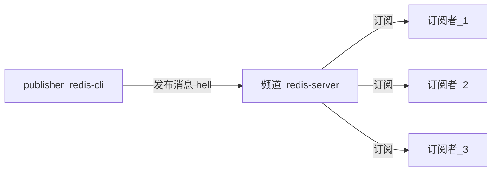
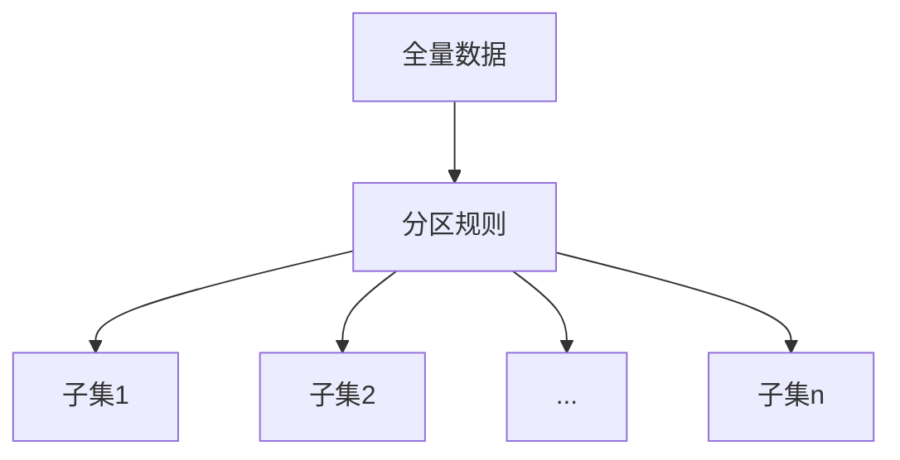
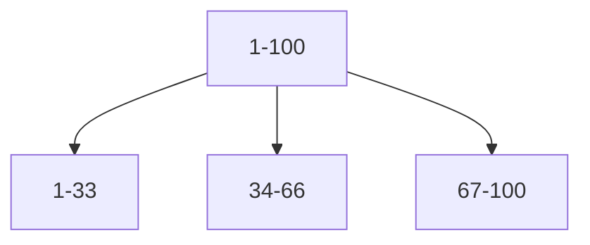

# Redis
涉及内容 : 布隆过滤器
## 1. 安装及启动
### 1.1. 安装
1. 下载,解压
2. 建立软连接 : ln -s xxx redis
3. 进入解压文件夹
4. 编译 : make
5. 安装 : make install

### 1.2. 启动
#### 1.2.1. 方式 1 -- 最简启动

```properties
启动服务器 : redis-server --port (如果不指定 port,默认是 6379 端口)
连接客户端 : redis-cli 
```

#### 1.2.2 方式 2 -- 动态参数启动

```properties
启动服务器 : redis-server --port (如果不指定 port,默认是 6379 端口)
连接客户端 : redis-cli --port : 指定连接哪个端口的服务器
```

#### 1.2.3 方式 3 -- 配置文件启动 (要用的方式)

```properties
启动方式 : redis-server xx/xx/redis.conf
配置文件配置方式 : 
    1 : 在 Redis 文件夹下创建 conf 文件夹用于存放配置文件
    2 : 复制 Redis 的默认配置文件 (redis.conf) 到 conf,并以端口进行区分,比如 redis-6380.conf
    3 : 进行配置
```


## 2. Redis 基本运用
### 2.1. Jedis 操作 Redis
==**代理模式**==

```java
@Test
public void run1(){
    //创建连接  设置连接的linux服务器IP和Redis端口
    Jedis jedis = new Jedis("10.211.55.10", 6379);
    //操作Redis
    jedis.set("password","123456");
    String username = jedis.get("username");
    System.out.println(username);
    //关闭资源
    jedis.close();
}
```

==**连接池连接**==

```java
@Test
public void run2(){
    //获取连接池配置对象
    JedisPoolConfig jedisPoolConfig = new JedisPoolConfig();
    //设置最大连接数
    jedisPoolConfig.setMaxTotal(30);
    //设置最大空闲连接数
    jedisPoolConfig.setMaxIdle(10);
    //获取连接池
    JedisPool jedisPool = new JedisPool(jedisPoolConfig, "10.211.55.10", 6379);
    Jedis jedis = null;
    try {
        //获取jedis对象
        jedis = jedisPool.getResource();
        //操作Redis
        String username = jedis.get("username");
        String password = jedis.get("password");
        System.out.println(username);
        System.out.println(password);
    }catch (Exception e){
        e.printStackTrace();
    }finally {
        if(jedis != null){
            jedis.close();
        }else if(jedisPool != null){
            jedisPool.close();
        }
    }
}
```
-----
## 3. 数据类型
### String
- 字符串类型的 value 的大小不能大于512M
- 本质上,value 都是二进制的
- 结构
    
```properties
key     value
hello   world        value 是一个真正的字符串
count     1            value也可以是一个整型,内部会做一个整型到字符串的转换
bits      101001     value还可以存二进制
Jsonstring         json字符串
```
#### 使用场景:
    缓存
    计数器
    分布式锁

### list
- Redis中,list类型是按照插入顺序排序的可重复的字符串链表
- 从头部(lift--左)和尾部(right--右)添加数据，如果插入是该key不存在，就创建。
- 如果链表所有的数据都被移除，那么链表也将从数据库中删除
- 可以包含的最大元素数量是4294967295

### hash
-每个key对应的都是一个或多个键值对

### set
- set时没有顺序的，中不能出现重复的元素。

#### 使用场景:
给用户添加标签
给标签添加用户
共同关注好友

-----
## 4. 功能
### 1. 慢查询
#### 1.1 概述
- Redis 是单线程的,所以他的命令是一个一个执行的.
- 经历三个阶段 : ==**发送命令, 排队, 执行命令**==
- 慢查询发生在 ==*执行命令阶段*==
- 慢查询是一个固定长度的,先进先出的队列,加入一条命令在 ==*执行命令阶段*==被纳入慢查询范围,那么它就会进入这个队列.
- 慢查询命令是保存在内存当中的,如果重启,会重置


#### 1.2 配置
- 配置方式 : 配置文件,需要重启

```properties
slowlog-max-len : 队列的固定长度,默认是 128.
slowlog-log-slower-than : 慢查询阀值.单位是毫秒,默认是 10000
    设置为 0 : 标识所有查询都纳入慢查询列表
    设置为 小于 0 : 所有命令都不纳入慢查询

配置说明 : 
    当命令时间查过阈值的时候,就会将这个命令纳入慢查询列表中.
```

####  1.3 命令

```properties
slowlog get n : 获取指定条数的慢查询队列数据,和设置的慢查询固定长度有关
slowlog len : 获取慢查询列表长度
slowlog reset : 清空慢查询列表
```

### 2. 流水线 pipeline
==**网络命令模型**==


- 传输命令 + 返回结果 = 1 次网络时间
- Redis 一次网络命令的时间 = 1 次网络时间 + 1 次命令时间
- 那么 n 次命令的时间 = n次网络时间 + n 次命令时间
- Redis 命令运行的时间是微秒级别的,所以网络时间是需要控制的.网络通信是非常耗时的,所以如果有 n 条命令,就会非常耗时间
- ==**流水线**== : 将一批命令进行打包,一次性发送到服务器,然后在服务器端进行批量处理,最后按顺序返回结果.
- pipeline 只能作用在 Redis 的一个节点上

==**代码演示**==

```java
public static void pipelineDemo(){
    long start = new Date().getTime();//开始时间
    // 获取 pipeline 对象
    Pipeline pipeline = jedis.pipeline();
    // 打包命令
    for(int i = 0; i < 1000 ; i ++){
        for(int j = i * 100; j < (i + 1) * 100 ;j ++){
            pipeling.set(key, value); //具体要打包的命令
        }
        pipeling.syncAndReturnAll();
    }
    long end = new Date().getTime();//结束时间
    sout(end - start);
}
```

### 3. 发布订阅
- 发布者 : publisher
- 订阅者 : subscriber
- 频道 : channel
- 发布者发布消息,将消息发布到一个频道,订阅者订阅这个频道,所有订阅这个频道的订阅者都可以收到消息
- 订阅者可以订阅多个频道
- 一个订阅者在发布者发布一个消息之前订阅这个频道,是收到不这个消息的

==*模型*==



==*命令*==

```properties
publish 频道 消息 : 发布一条消息到注定频道,返回的是订阅这个频道的订阅者个数
subscribe 频道_1  频道_2 : 订阅者订阅频道.返回订阅的频道以及决堤收到的消息
unsubscribe 频道 : 取消订阅
```


## 4. 持久化
- Redis 的所有数据都是保存在内存当中,如果系统崩掉或者其他原因,没有将数据保存到磁盘中,那么数据会丢失.
- 持久化是对数据的更新异步的保存到磁盘当中.
- 有两种方式 : ==**RDB(相当于快照)**== 和 ==**AOF(相当于日志模式)**==

### 4.1. 持久化方式 : RDB 
#### 4.1.1. RDB 概述
- RDB : 相当于==*快照*==相当于某时某点的数据的一个完整的备份. 
- 通过一条命令将内存中的 Redis 数据完成的生成一个快照文件.也就是一个 RDB 文件,保存在磁盘当中.如果需要恢复数据:比如重启.就可以加载这个文件,恢复某时某刻的数据

#### 4.1.2. RDB 触发方式 (三种)
1. ==*save 命令*==
    - ==**同步的命令**==,在这个命令执行完之前,其他的命令都会排队,执行完后返回 OK
    - 因为是同步的命令,如果数据非常多,那么save 命令就会执行的非常慢,在没有执行完之前,如果有其他命令,就会造成 Redis 阻塞.
    - 生成的 RDB 文件会覆盖旧的 RDB 文件

1. ==*bgsave*==
    - ==*异步的命令*==,会通过 ==*fork()*==函数生成主进程的一个子进程来完成 RDB 文件的生成工作.生成之后,会告诉主进程 RDB 文件生成成功,并返回成功或者失败.独立的线程执行此任务.
    - 一个客户端发送 bgsave 命令,Redis 通过 fork()函数创建主进程的子进程来执行 RDB 文件的生成工作,在文件生成的过程中,如果有其他客户端发送命令,会正常运行,不会造成阻塞.RDB 文件生成后,会返回成功或者失败.
    - 生成的RDB 文件会覆盖旧的 RDB 文件.

3. ==**自动**==
    - 在达到某些条件后,会自动生成 RDB 文件.
    - 通过配置,达到某些添加后,比如一定的时间内改变了多少条数据,就会自动生成 RDB 文件,
    - 内部其实执行的是 ==*bgsave*== 命令.
    - 缺点 : 自动生成 RDB 文件无法控制文件生成的频率,如果频率过高,肯定会对磁盘有一定的压力,所以不是很好的方式

#### 4.1.3. RDB 相关配置项

```properties
dbfilename : RDB 文件名称,默认是 dump.rdb, 一般使用端口区分: dump-6380.rdb
dir : RDB 文件,AOF 文件,日志文件等生成的位置
stop-writeson-bgsave-error : 如果 bgsave 发生错误,是否停止写入,默认是yes
rdbcompression : RDB 文件是否采用压缩的方式,默认是 yes
rdbchecksum : 是否对 RDB 文件进行校验,默认是 yes
```

#### 4.1.4. RDB 需要注意的点
- 除了 save,bgsave,和自动的配置策略,在全量复制的时候也会生成RDB 文件
- debug 级别的重启,不会清空数据,会生成 RDB 文件
- 执行 shutdown save, 会触发 RDB 文件的生成.

#### 4.1.5. RDB总结
- RDB是 Redis 数据从内存到磁盘的快照,用于持久化
- save 通常会阻塞 Redis
- bgsave 不会阻塞,但是后有 fork 进程
- 自动配置策略在满足一定的条件的情况下,会生成 RDB 文件
- 消耗性能

### 4.2. 持久化方式 : AOF
#### 4.2.1. AOF 概述
- AOF ,相当于日志的方式,只要发生更新,就写入日志,当需要恢复数据的时候就可以读文件来恢复数据
- Redis 没发生一次更新操作就会想 AOF 文件写入一条对应的数据,所以 AOF 是实时的,需要恢复数据就读取这个 AOF 文件
- Redis 的写操作并不是执行写入到磁盘当中,而是先写入到==**缓冲区**==当中,然后根据一定策略,将缓冲区当中的数据写入到 AOF 文件当中


#### 4.2.2. AOF 的三种策略
1. ==**always**==
    - 每次更新都会向 AOF 文件写一条数据.

2. ==**everysec**==
    - 每秒向 AOF 进行一个刷新.这样在数据多的时候,可以保护磁盘
    - 每隔多久向 AOF 文件刷新一次,这个时间可以配置,但是如果发生错误,会丢失这个时间段内的数据.

3. ==**no**==
    - 由操作系统决定什么时候想 AOF 文件刷新数据


#### 4.2.3. AOF 重写
- 随着并发量的变大,AOF 文件会逐步的无限制的变大,会对数据的恢复效率,磁盘等造成很大压力,所以通过 ==**AOF 重写**==来解决这个问题

- AOF 重写的两种实现方式:
    - bgrewriteaof 命令
    - 配置方式

        ```properties
        no-appendfsync-on-rewrite
        ```

#### 4.2.4. AOF 的相关配置

```properties
appendonly : 使用 AOF 的前提,需要设置为 yes
applenfilename : AOF 文件的名称,一般以端口区分
appendbsync : AOF策略

```

-----
## 5. 主从复制
### 5.1. 主从复制的作用
单机存在的问题 : 
    - 如果机器故障,应该怎么解决? 比如磁盘换了,不能短时间修复,改咋搞 (高可用问题)
    - 容量瓶颈 : 假如一台机器 16G 内存,如果一个需求需要 128G 内存,怎么借据(分布式问题)
    - QPS 瓶颈 : (分布式问题)
- 主从复制的基本作用
    - 为数据提供多个副本 (高可用,分布式的基础)
    - 扩展读性能. 假如有很多读写的操作,Redis可以将读写分流

- 总结 : 
    - 一个 master 可以有多个slave
    - 一个slave 只能有一个 master
    - 数据流向是单向的.必须是 master 流向 slave

### 5.2. 主从复制的配置
#### 5.2.1. 命令方式

```properties
<!--复制功能-->
slaveof ip:port  : 设置对应 ip 的主机成为 master

<!--取消复制-->
slaveof no one : 取消复制,但是这是 slave的数据并不会清空,而是之前的 master 同步的数据不会同步过来
```

#### 5.2.2. 配置
==**添加一下配置**==
```properties
slaveof IP port  : 设置要连接的主节点
slave-read-only : 从节点只做读的操作.设置为 yes.
```

-----
## 6. Redis Sentinel(哨兵)
- 主从复制
    - 从节点备份主节点
    - 对主节点读写分流 : 大部分读放在从节点执行
    - 存在的问题 :
        - 如果主出现问题,需要手动进行故障处理,比如重新选一个 master 等
        - 写能力只能写在一个节点,存储也只能在一点一点,因为其他起点只是和这个节点的一个副本
- 如果主挂掉了,手工进行故障转移的方式 :
    - 选中一个 slave,执行 slave no one ,就是让他成为一个主节点
    - 让其他 slave new master.成为刚刚那个节点的从节点,这样也就进行了一次主从复制

### 6.1 Redis Sentinel 基本架构概述
- Redis sentinel 对主节点和从节点进行实时的监控
- 有一个主节点和若干从节点,然后有若干个 sentinel 节点,这些sentinel 节点通过监控 Redis 节点,实现对 Redis 故障判断,故障转移,并通知客户端的功能.之所以有多个 sentinel 节点,是为了高可用,即使一个 sentinel 节点挂了,还可以保证 sentinel 的功能,并且保证判断节点失败的公平性
- 对于客户端来说,不再直接记录 Redis 的 IP,而是记 Redis sentinel 的 IP.通过 Redis sentinel 可以保存 Redis 的地址.由 Redis sentinel 告诉客户端哪个是主节点,然后客户端对主节点进行操作
- 主节点发生故障时
    - 多个 Redis sentinel 发现并确定 master 有问题
    - 选出一个 Redis sentinel 为领导
    - 选出一个 slave 作为 master
    - 通知其他 slave 成为新 master 的 slave
    - 通知客户端主从关系的变化
    - 出现故障的 master 重启后,会成为新的 master 的 slave

### 6.2 Redis sentinel 安装与配置
- 配置主节点
- 配置从节点(有 slave mater-ip master-port 的配置)
- 配置开启 sentinel 监控节点(就是特殊的 Redis 节点,这种节点不存储数据,只要是完成监控,故障转移和通知)

- ==**主节点配置**==

```properties
port 7000
daemonize yes
pidfile /usr/local/redis/data/redis-7000.pid
logfile "redis-7000.log"
dir "/usr/local/redis/data/"
```

- ==**两个从节点配置**==

```properties
可以使用下面两条命令进行快速配置 7001 和 7002,此命令不是 Redis 的命令,是 Linux 的命令
sed "s/7000/7001/g" redis-7000.conf > redis-7001.conf
sed "s/7000/7001/g" redis-7000.conf > redis-7002.conf
echo "slaveof 127.0.0.1 7000" >> redis-7001.conf
echo "slaveof 127.0.0.1 7000" >> redis-7002.conf

# 从节点 7001
port 7001
daemonize yes
pidfile /usr/local/redis/data/redis-7001.pid
logfile "redis-7001.log"
dir "/usr/local/redis/data/"
slaveof 127.0.0.1 7000

#从节点 7002
port 7002
daemonize yes
pidfile /usr/local/redis/data/redis-7002.pid
logfile "redis-7002.log"
dir "/usr/local/redis/data/"
slaveof 127.0.0.1 7000
```

- ==**3个sentinel节点配置  sentinel.conf**==

```properties
可以使用一下命令查看 sentinel 的所有配置
cat sentinel.conf | grep -v "#" |  grep -v "^$"

# 以下是 sentinel 的配置
port 26379
daemonize yes
pidfile /Users/cy/develop/opt/redis/pid/sentinel-26379.pid
logfile "sentinel-26379.log"
dir /Users/cy/develop/opt/redis/data/
# 最后的 2 是设置的<法定人数>,在做客观下线额时候,如果有2个 sentinel 认为 master 有问题就说明可以确定 master 有问题
sentinel mymaster 127.0.0.1 7000 2  
# 每秒 sentinel 都会去 ping Redis,这里设置的意思是说如果30 秒还没有 ping 通,就做下线操作
sentinel down-after-milliseconds mymaster 300000
# 选择新的 master 之后,slave 要对新的 master 进行复制.这个复制是并发的还是串行的,配置 1 就是说一次只能复制一个,可以减轻服务器压力
sentinel parallel-syncs mymaster 1 
sentinel failover-timeout mymaster 180000   //故障转移时间

分别配置另外两个 sentinel 26380  26381,只是端口名不一样,以及命名后缀不一样,其他都一样
# sentinel 节点的启动命令为 : redis-sentinel sentinel配置文件
sentinel 启动之后,sentinel 的配置文件会自动发生一些改变,会自动的发现监控的主节点的从节点

# 查看状态
redis-cli -p 26379 info sentinel
```

### 6.3 redis sentinel 分析
sentinel 高可用是服务端的高可用
客户端高可用:
- 获取所有 sentinel 节点集合以及 对应的mastername,
- 遍历 sentinel 集合,拿到可用的 sentinel 节点(就是可以 ping 通的节点)
- 执行命令,返回 master 的地址和 端口
- 获取到 master 节点后,验证是否是真的 master 节点(role 命令或者 role application)
- 如果 master 发生了变化,sentinel 是能感知到的
- 客户端和 sentinel 端 : 使用发布订阅模式,客户端订阅 sentinel的频道,当master 发生变化时,sentinel 会发送一条信息.订阅这个 sentinel 节点的客户端就可以收到这条消息.

### 6.4 基于 Jedis 的 sentinel
- JedisSentinelPool(mastername, sentinelSet, poolConfig, timeout) : 用于连接 Redis master 
- JedisSentinelPool.getResource() 返回一个 Jedis
- 使用完毕后需要归还资源 : jedis.close

```java
public static void main(String[] args) {
        String mastername = "mymaster";
        Set<String> sentinelSet = new HashSet<String>();
        sentinelSet.add("127.0.0.1:26379");
        sentinelSet.add("127.0.0.1:26380");
        sentinelSet.add("127.0.0.1:26381");

        JedisSentinelPool jedisSentinelPool = new JedisSentinelPool(mastername, sentinelSet);

        Jedis jedis  = null;

        int count = 0;
        while (true){
            count ++;
            try {
                jedis = jedisSentinelPool.getResource();
                int index = new Random().nextInt(1000);
                String key = "k-" +index;
                String value = "v-" +index;
                jedis.set(key, value);
                if(count % 100 == 0){
                    log.info("key : {} and value : {}", key, value);
                }
                TimeUnit.MILLISECONDS.sleep(10);
            }catch (Exception e){
                log.error(e.getMessage(), e);
            }finally {
                if (jedis != null){
                    jedis.close();
                }
            }
        }
    }
```
- 使用命令 redis-cli -p 26379 info sentinel 查看当前监控的 master
- 此时kill 掉 master
- 等待一段时间,再使用命令查看  redis-cli -p 26379 info sentinel 查看 sentinel 节点信息,可以看到 master 已被换掉.

### 6.5 故障转移原理 
#### 6.5.1 三个定时任务
- 为了实现 Redis sentinel 对 Redis 节点失败鉴定,故障转移的功能,在 sentinel 内部有三个定时任务来作为实现以上功能的基础
- 每 10 秒查看 master 和 Redis 的信息.每 2 秒获取其他 sentinel 节点的信息以及他们对节点的看法.每一秒查看对其他 sentinel 节点和 Redis 节点的连通性.info,chennel,ping
- ==*每 10 秒 每个 Sentinel 节点对master 和 slave 执行 info*==
    - 可以可以发现 slave 节点
    - 确定主从关系
- ==*每 2 秒每个 sentinel 通过 master 节点的 channel交换信息*==
    - 频道名称为 : ==*_sentinel_:hello*==
    - 每 2 秒钟,sentinel 都会通过master 节点的此频道发送信息,其他的 sentinel 可以收到此信息,发送消息的 sentinel 也可以收到其他 sentinel 节点发送的消息
    - ==*交换自身的信息和对 Redis 节点的看法*==

- ==*每 1 秒,每个sentinel 都会对其他的 sentinel 节点和 Redis 进行 ping 的操作*==


#### 6.5.2 ==*主观下线*==和==*客观下线*==
主观下线(+sdown) : 每个 sentinel 节点对 Redis 节点失败的偏见.
客观下线(+odown) : 所有 sentinel 节点对 Redis 节点失败达成共识超过设置的 quorum 个统一.
    - 每 2 秒 sentinel 会互通信息,这样达成共识.

#### 6.5.3 领导者选举
- 领导者选举就是==* 从 sentinel 集合中,选举出一个节点来做故障转移*==
- 为什么要选举 : 当所有 sentinel 节点对 master 发生故障达成意见统一之后,会选出一个 leader.因为==*只需要一个 sentinel 来完成故障转移*==.
- 命令 : sentinel is-master-down-by-addr 作用: 
    - 交换对master 的失败判定.
    - 用来完成领导者选举
- 每个做完主观下线的 sentinel 节点向其他 sentinel 节点发送命令,要求将它设置为领导者
- 收到命令的 sentinel 节点这时候如果还没有同意其他人,那么它就会同意该请求,否则就拒绝
- 如果该 sentinel 节点发现自己的票数已经超过 sentinel 集合半数或者超过 quorum,那么它就成为领导者


#### 6.5.4 故障转移
- kill master 后,sentinel 的日志

    ```properties
    4518:X 03 Apr 2019 14:24:58.516 # +sdown master mymaster 127.0.0.1 7001
    4518:X 03 Apr 2019 14:24:58.572 # +odown master mymaster 127.0.0.1 7001 #quorum 3/2
    4518:X 03 Apr 2019 14:24:58.573 # +new-epoch 4
    4518:X 03 Apr 2019 14:24:58.575 # +try-failover master mymaster 127.0.0.1 7001
    4518:X 03 Apr 2019 14:24:58.576 # +vote-for-leader 2839076ec7f4a64d8e37ddff03efc41414d0618a 4
    4518:X 03 Apr 2019 14:24:58.578 # d582a921a29e79a397c1d3a56b27bd61166ca2cf voted for 2839076ec7f4a64d8e37ddff03efc41414d0618a 4
    4518:X 03 Apr 2019 14:24:58.579 # 756c440ea32006a81a97d2e378b25cb8493cef73 voted for 2839076ec7f4a64d8e37ddff03efc41414d0618a 4
    4518:X 03 Apr 2019 14:24:58.632 # +elected-leader master mymaster 127.0.0.1 7001
    4518:X 03 Apr 2019 14:24:58.632 # +failover-state-select-slave master mymaster 127.0.0.1 7001
    4518:X 03 Apr 2019 14:24:58.717 # +selected-slave slave 127.0.0.1:7000 127.0.0.1 7000 @ mymaster 127.0.0.1 7001
    4518:X 03 Apr 2019 14:24:58.717 * +failover-state-send-slaveof-noone slave 127.0.0.1:7000 127.0.0.1 7000 @ mymaster 127.0.0.1 7001
    4518:X 03 Apr 2019 14:24:58.787 * +failover-state-wait-promotion slave 127.0.0.1:7000 127.0.0.1 7000 @ mymaster 127.0.0.1 7001
    4518:X 03 Apr 2019 14:24:59.402 # +promoted-slave slave 127.0.0.1:7000 127.0.0.1 7000 @ mymaster 127.0.0.1 7001
    4518:X 03 Apr 2019 14:24:59.402 # +failover-state-reconf-slaves master mymaster 127.0.0.1 7001
    4518:X 03 Apr 2019 14:24:59.478 * +slave-reconf-sent slave 127.0.0.1:7002 127.0.0.1 7002 @ mymaster 127.0.0.1 7001
    4518:X 03 Apr 2019 14:24:59.678 # -odown master mymaster 127.0.0.1 7001
    4518:X 03 Apr 2019 14:25:00.439 * +slave-reconf-inprog slave 127.0.0.1:7002 127.0.0.1 7002 @ mymaster 127.0.0.1 7001
    4518:X 03 Apr 2019 14:25:00.439 * +slave-reconf-done slave 127.0.0.1:7002 127.0.0.1 7002 @ mymaster 127.0.0.1 7001
    4518:X 03 Apr 2019 14:25:00.499 # +failover-end master mymaster 127.0.0.1 7001
    4518:X 03 Apr 2019 14:25:00.499 # +switch-master mymaster 127.0.0.1 7001 127.0.0.1 7000
    4518:X 03 Apr 2019 14:25:00.501 * +slave slave 127.0.0.1:7002 127.0.0.1 7002 @ mymaster 127.0.0.1 7000
    4518:X 03 Apr 2019 14:25:00.502 * +slave slave 127.0.0.1:7001 127.0.0.1 7001 @ mymaster 127.0.0.1 7000
    4518:X 03 Apr 2019 14:25:30.520 # +sdown slave 127.0.0.1:7001 127.0.0.1 7001 @ mymaster 127.0.0.1 7000
    ```
- +switch-master : 切换主节点(从节点晋升为主节点)
- +convert-to-slave : 切换从节点(主节点降为从节点)
    
- 会进行一个少数服从多数的判断,确定 master 出现了问题
- sentinel 节点如果有多台,他们自己会选举一台作为领导
- 选择一台合适的 slave ,执行 slave no one 命令.将这个 slave 作为新的 master

```properties
合适的 : 
    首先选择 slave-priority(slave 优先级别)最高的 slave 节点,如果存在则返回,如果不存在则继续(比如可以手动设置更高的级别,可以根据意愿去选择某个 slave 作为 master)
    选择复制偏移量最大的 slave 节点(复制的最完整),如果存在则返回.不存在则继续
    选择 runId 最小的 slave 节点
```
- 向剩余的 slave 节点发送命令.让他们成为新的 master 节点的 slave.==*复制规则和 parallel-sync 参数*==有关.
- 对原来的 master 节点设置为 slave,并保持对其的关注,当其恢复后命令它去复制新的 master 节点.

### 6.7 高可用读写分离
其中一种思想 : 
- 所有的 slave 节点都存在于一个 slave 节点资源池中
- 客户端连接这个 slave 节点资源池
- 池子里的节点发生了变化(slave 晋升为主节点或者主节点降为 slave)
- 客户端需要考虑到池子的变化


## 7. Redis Cluster
### 7.1 集群概述以及为什么要使用集群
- 并发量 : 特定业务场景下,单机的 QPS 满足不了需求.
- 数据量 : 特定场景下,单机机器内存满足不了场景需求.
- 网络流量 : 需求的流量查过了网卡的流量.

### 7.2 哈希分区
#### 7.2.1 数据分布概述
- 数据分布 : 全量数据,单机满足不了这个数据量需求,所以需要按照一定的规则,将全量数据分区到若干个分区



#### 7.2.2 分区规则
##### 7.2.2.1 顺序分区
- 顺序分区 : 将全量数据按照顺序, 均衡的分布到每一个子集中
- 顺序分区特点 :
    - 数据分布均匀,但是数据分散度易倾斜
    - 键值分布与业务相关
    - 支持顺序访问
    - 支持批量操作
- 假如现有 100 份数据



##### 7.2.2.2 哈希分区
- 哈希分区 : 对数据做一个 hash 函数,然后再分区
- 哈希分区可分为 : 
    - 节点取余分区
    - 一致性哈希分区
    - 虚拟槽分区
- 哈希分区特点 :
    - 数据分散度高
    - 键值分布与业务无关
    - 不支持顺序访问
    - 支持批量操作

#### 7.2.3 哈希分区之 : ==*节点取余分区*==
- 使用 key%数据节点数 ,取余,余数为几,就在第几个分区
-  hash(key)%nodes

- ==**3 个数据节点**==

    ```mermaid
    graph TB
    1-100 --> 1到100分别除以节点数3,并取余,得到的余数就是此数据被分区到的节点
    1到100分别除以节点数3,并取余,得到的余数就是此数据被分区到的节点 --> 3,6,9...99
    1到100分别除以节点数3,并取余,得到的余数就是此数据被分区到的节点 --> 1,4,7...100
    1到100分别除以节点数3,并取余,得到的余数就是此数据被分区到的节点 --> 2,5,8..98
    ```

- ==**4 个数据节点**==

 ```mermaid
    graph TB
    1-100 --> 1到100分别除以节点数4,并取余,得到的余数就是此数据被分区到的节点
    1到100分别除以节点数4,并取余,得到的余数就是此数据被分区到的节点 --> 4,8,12...100
    1到100分别除以节点数4,并取余,得到的余数就是此数据被分区到的节点 --> 1,5,9...97
    1到100分别除以节点数4,并取余,得到的余数就是此数据被分区到的节点 --> 2,6,10..98
    1到100分别除以节点数4,并取余,得到的余数就是此数据被分区到的节点 --> 3,7,11..99
    ```

- 节点取余分区扩容 :
    - 随着需求的增加,比如数据量增加等,需要对节点进行扩容(增加节点数)
    - 节点数增加了,那么节点内的数据就会发生变化,因为目前的分区是通过取余进行的分区
    - 如果增加一个节点,那么数据迁徙率达到 80%,这样对系统性能等会有影响,因为==*数据迁移后,第一次是无法从缓存中获取的,需要从数据库获取,所以大量的缓存重写是不正常的*==
    - 推荐==*翻倍扩容*==,每次扩容节点数增加一倍,数据迁徙率大概 50%左右

#### 7.3 哈希分区之 : 一致性哈希分区
- 一致性哈希分区 : 
    - 假如有一个 token 环(就是一个圆圈),代表一个数据范围,值是 0~2的 32 次方
    - 为每一个 node 分配一个token,这个 token 在token 环的范围内(就是圆圈的边上的一个点),此时相邻的两个节点之间就是一个数据范围
    - 此时有一个key,进行 hash 计算后得到一个哈希值,在token 环上找到对应值的点,这个点处于连个 node 之间,比如 node1 和 node2,然后会==*顺时针*==的被分配到相邻的 node 上,加入node2 是顺时针方向的那个节点,那么这个 key 就会被分配到 node2 节点上.
    - 所以==*一致性哈希分区*==在增加节点的时候只会影响相邻的两个节点


### 7.3 搭建集群
### 7.4 集群伸缩
### 7.5 客户端路由
### 7.6 集群原理


## 8. 缓存
- 使用缓存的收益 : 
    - 读写速度. 通过缓存加速读写速度
    - 降低后端负载. 通过缓存可以将大部分流量打到缓存上,而不是打到 MySQL 上.可以降低 MySQL 的负载

- 使用缓存的成本 :
    - 数据不一致. 缓存层和数据层有时间窗口不一样,和更新策略有关.
    - 代码维护成本变高. 因为多了一层缓存的读写
    - 运维成本. 比如需要增加一套 Redis cluster

- ==*使用缓存的场景*== : 
    - 降低后端负载. 比如 MySQL
    - 加速响应时间
    - 大量写合并为批量写. 比如计数器先 Redis累加再批量写 DB

### 8.1 缓存更新策略
缓存更新策略 : 缓存的数据通常都是有生命周期,需要定期做更新,删除等操作或者合理的时间进行更新,来保持数据的正确性以及保证存储空间.

1. ==**LRU/LFU/FIFO 算法剔除**==
        - 例如 : maxmemoory-policy 策略, 达到最大内存的时候,就淘汰一部分数据.
        - ==*数据一致性最差,但是维护成本最低*==
2. 超时剔除 : 
        - 例如 ==*expire*==, 就是设置一个过期时间,在这个时间内,操作这个数据都是去缓存中访问
        - ==*数据一致性较差,但是维护成本较低*==
3. 主动更新 : 开发控制声明周期
        - ==*数据一致性最高,但是维护成本最高*==

==**策略选择的建议**==
- 对数据一致性要求低 : 选择最大内存和淘汰策略
- 高一致性 : 超时剔除和主动更新结合, 最大内存和淘汰策略兜底

### 8.2 缓存粒度问题
- 通用性 : 全量属性最好
    - 比如以后要添加新的字段,
- 占用空间 : 部分属性更好
- 代码维护 : 表面上全量属性更好

### 8.3 ==**缓存穿透**==问题
缓存穿透 : 请求并不存在的数据,由于缓存中没有,这些请求都落到数据库上
==**解决**== :
- ==*缓存空对象*== : 
    - 假如数据不存在,从数据库返回的时候,向数据库缓存个空对象,并设置一个过期时间.  
- ==*[布隆过滤器](#bulong)*==

### 8.4 缓存雪崩
缓存雪崩 : 正常情况下缓存承载着大量的请求,如果缓存因为一些问题发生突然宕机等情况,这些大量的请求就都到了 DB,会对 DB 造成巨量的压力,甚至宕掉.

==**优化方案**==
- ==*保证Cache的高可用*== 
    - 比如: Redis cluster, Redis sentinel,VIP 等
- ==*依赖隔离组件为后端限流*==
    - Hystrix 提供的隔离功能
- ==*提前演练*==
    - 比如压力测试等

### 8.5 Cache 无底洞问题 
- 增加机器,性能反而下降
- 一台机器,执行一次 mget 需要一次网络通信时间,随着机器的增多,网络通信时间也会随之增多,网络时间多就会对性能造成影响
- 也就是说无底洞主要是==**IO**==

==*优化 IO 的几种方法*==
- 命令本身优化
- 减少网络通信次数
- 降低客户端接入成本

| 方案 | 优点 | 缺点 | 网络 IO |
| --- | --- | --- | --- |
| 串行 mget | 编程简单,少量 keys 满足需求 | 大量 keys请求延迟严重 | O(keys) |
| 串行 IO | 编程简单,少量 keys 满足需求 | 大量 node延迟严重 | O(nodes) |
| 并行 IO | 利用并行特性,延迟取决于最慢的节点 | 编程复杂,超市问题定位困难 | O(max_low(node)) |
| hash_tag | 性能最高 | 读写增加tag 维护成本,tag 数据分布易出现数据倾斜 | O(1) |

### 8.6 热点 key 的重建优化
- 请求一个热门数据数据,首先从缓存获取,如果缓存中没有,就从 DB 中获取,然后存入缓存中
- 在高并发场景中,有大量线程都访问这个数据,第一个线程访问时,发现Cache 中没有这个数据,就去 DB 查找, 然后进行 Cache 重建,然后输出.
- 第二个线程在 Cache 重建之前也到了查找 Cache 的过程,这时发现没有,他就也走Cache 重建的过程
- 然后好多线程都在第一个线程重建完之前查找 Cache,这样就会出现问题
- 以上就是热点 key 重建问题
| 方案 | 优点 | 缺点 |
| --- | --- | --- |
| 互斥锁 | 思路简单,保证数据一致性 | 代码复杂性增加. 存在死锁的风险 |
| 永不过期 | 基本杜绝热点 key 重建问题 | 不保证数据一致性. 逻辑时间增加维护成本和内存成本 |


==**上述过程优化方案**==
1. 做到三个目标
    - 减少重建缓存次数
    - 数据尽可能一直
    - 减少潜在危险
2. 两种解决方案
- ==**互斥锁**==
    - 当第一个线程运行到获取 Cache 时,开始重建 Cache 时,添加一个锁 lock,重建完毕后释放锁 unlock,并输出结果
    - 这样其他线程运行到获取 Cache 的时候,必须要等待第一个线程执释放锁之后才能继续执行
    - 第一线程释放锁之后,这是缓存中已经有这个数据了,其他线程就可以直接输出.
    - 互斥锁会出现一些问题,比如这个等待的过程

- ==**key 永不过期**==
    - 缓存层面 : 不设置过期时间(没有使用 expire)
    - 功能层面 : 为每个 value 设置 ==*逻辑过期时间*==, 当发现超过逻辑过期时间后,使用单独的线程去重建缓存.
    - 相较于 ==*互斥锁*== 的方案,不会有等待的时间,但是会存在数据不一致的情况.就是超过逻辑时间后,在重建缓存完成之前,得到的还是老的值


## 9. Redis 布隆过滤器<span id="bulong"/>
- 看个问题: 有 50 亿个电话号码,现有 10 万个电话号码,快速判断出这10 万个电话号是否在 50 亿个电话号码中
    - 
### 9.1 布隆过滤器原理
- 布隆过滤器可用很小的空间,在可控的误差范围内解决上述问题.
- 本质上布隆过滤器是一种数据结构，比较巧妙的概率型数据结构（probabilistic data structure），特点是高效地插入和查询，可以用来告诉你 “某样东西一定不存在或者可能存在”。
- 原理 : 
    - 一个很长的二进制向量(这个二进制很长,可能有几亿位,都是 0)和若干个哈希函数
    - 将要查询的值,例如"baidu",通过若干个hash 函数(假如 3 个)计算出哈希值,假如计算出的哈希值为 3, 5, 7
    - 那么就分别将二进制向量的第 3 位,第 5 位,第 7 位设置成 1,然后这个三个位置都为 1,就标识"baidu"存在

### 9.2 布隆过滤器构建
- 参数 : m 个二进制向量, n 个预备数据(就是要查询是否存在其中的数据,比如上边的 50 亿个电话号码), k 个哈希函数
- 构建布隆过滤器 : n 个数组走一边上边的流程,将数据都存入到过滤器中.


### 作用 : 
- 解决缓存穿透问题


## 使用场景

## 用户手册
### Linux 命令

```properties
String 基本命令 : 
    set key value : 无论 key 存不存在,都会设置值,如果存在,则会覆盖之前的值
    Setnx key value : 只有当 key 不存在的时候才会设置值,如果存在,虽然不会报错,但是值并不会设置进去,这个 key 的 value 还是之前的值,相当于增加一个 key 的操作
    Set key value xx : 只有当 key 存在的时候才设置值,如果不存在,也不会报错,但是这个 key不会设置进去,就是说没有这个 key,相当于 update 操作
    get key : 获取 key
    del key : 删除 key
    mset key1 value1 key2 value2 key3 value3…:批量设置 key
    mget key1 key2 key3…:批量获取 key
        多次 get的时间消耗为多次命令时间+多次网络时间,但是 mget 得时间消耗为1次网络时间+1次命令时间,所以效率要比多次 get 高.
    getset key newvalue : 设置新的 value,并返回旧的 value.如果 key 不存在,则返回空
    append key value1 : 在 value 后追加 value1
    strlen key : 返回value 长度
    incrbyfloat key 3.5 : 增加指定浮点值
    setrange key index value : 给字符串指定下标设置指定的值
    getrange key start end : 获取字符串指定下标的所有值,包含 start 和 end
对于整型的操作
    incr key : 指定key 的 value 自增1,如果key 不存在,则创建一个 key,value 为0,然后自增1
    decr key : 指定 key 的 value 自减 1,如果key 不存在,则创建一个 key,value 为0,然后自减1
    incrby key k : 指定 key 的 value 自增 k,如果key 不存在,则创建一个 key,value 为0,然后自增k
    decrby key k : 指定 key 的value 自减 k.如果key 不存在,则创建一个 key,value 为0,然后自减 k


List 命令:
添加 : 
    首部添加(从左边添加):
        lpush key values[value1 value2…]；
        先插入 value1,然后在 value1 的左边插入 value2,以此类推
        在指定的key关联的链表首部添加元素，如果不存在，就先创建一个和该key关联的链表,然后再插入.插入成功后返回链表中所有的元素的个数
        lpushx key value;只有在key关联的list存在是才在首部插入数据，并返回链表中所有元素的个数，否则不插入，并返回0
    尾部添加
        rpush key value1 value2...；
            在该list的尾部插入数据。
        rpushx key value;
            只有在key关联的list存在的情况下才在尾部插入数据。
    指定插入
        insert key after/before pivot value;
            在第一个pivot元素前面或者后面添加元素
查看 : 
    lrange key start end;
        查看链表中从start到end的元素,包含 end。start和end可以从0开始，也可以为负数，-1-倒数第一个， -2--倒数第二个   0--第一个   1--第二个
        lrange key 0 -1:查看所有元素
    lindex key index;
        查看指定下标的元素
    llen key;
        返回key关联的list的元素的个数
删除 : 
    lpop key;
        返回并弹出key的首部元素，链表元素将减少1个。如果key不存在，就返回nil,若果存在就返回并弹出首部元素.
        blpop key timeout : lpop的阻塞版本,timeout 是阻塞超时时间,timeout=0则永不阻塞
     
    rpop key;
        返回并弹出key的尾部元素。链表元素将减少
        brpop key timeout : rpop的阻塞版本,timeout 是阻塞超时时间,timeout=0则永不阻塞
    lrem key count value;
        遍历list,根据 count,删除所有与 value 相等的元素,删除count个value
        count>0时，从首部向尾部遍历删除count个value;lrem list 2 3:从首部开始遍历,删除2个3
        count<0时，从尾部向首部遍历删除count个value;lrem list -2 3;从尾部开始遍历,删除2个3
        count=0时，删除全部的value;;lrem list 0 3;删除list中所有的3
修剪 : 
    ltrim key start end :
        保存指定坐标范围内的元素,包含开始和结束
        Ltrim list 1 4,保留坐标0到4的元素,其他的元素去掉
修改
    lset key index value;
        设置list中指定坐标的元素。0—第一个，-1—最后一个。操作链表的角标不存在抛异常  
        lset list 1 5; 设置list中坐标为1的元素的Value为5 
    rpoplpush list1 list2;
        将list1的右边(尾部)元素弹出并添加到list2的左边(首部)
        也可以将同一个list的尾部的元素弹出并添加到首部:rpoplpush list list

hash 命令 : 
    每个key对应的都是一个或多个键值对
添加键值对 : 
    hset key field value;为制定的key设置一对field/value对(键值对)，添加成功就返回1，当field重复的时候添加失败失败返回0
    hmset key field value;为指定的key设置多个field/value对（键值对),添加成功返回OK，如field重复，就覆盖
获取键值对 : 
    hget key field;获取指定的一个field的value值（就是一个键的value）
    hmget key field1 field2…;获取指定的多个field的value值（多个键的value值）
    hgetall key;获取所有的键值对
 删除 : 
    hdel key fidle1 field2….;删除一个或多个字段，返回值是删除的字段的个数。当要删除的字段不存在时，返回0
    del key;删除整个list.
 增加数字 : 
    hincrby key field increment;将指定的field的value值增加increment。
    hexists key filed；判断指定的key中是否有field的存在，存在返回1，不存在返回0
    hlen key;获取指定的key中包含的filed的个数,就是key中的键值对的个数
    hkeys key;获取key中所有的filed
    hvals key;获取key中所有的value值
    
    
set 命令 : 
 set时没有顺序的，中不能出现重复的元素。
添加 : 
    sadd key value1 value2…；向set中添加数据，如果该value已经存在，则不会重复添加,返回值是成功添加的元素的个数
删除 : 
    srem key member1 member2…;删除set中指定的成员。返回值是成功删除的成员的个数，返回0就是删除失败--成员不存在或者set不存在
    spop key count : 从集合中随机弹出 count 个元素,如果没有指定 count,则弹出1个
查看 : 
    smembers key;获取指定的集合中的所有成员。返回结果无序的,如果元素很多,则会阻塞,因为 Redis 是单线程的
    sismember key element;判断成员是否存在在集合中,返回1表示存在，返回0表示不存在或者集合本上不存在
    scard key;  返回集合中成员的个数。
    srandmember key;随机返回集合中的一个成员
集合间操作 : 
    stiff key1   key2…; 差集! 返回key1 key2中相差的成员，与key的顺序有关。就是除去两个集合中都有的元素。只留下key1中与jey2不同的成员,如果集合都相同，则放回(empty list or set)
    sinter key1 key2…;交集! 返回存在于key1并且同时存在于key2中的元素。就是返回两个集合中相同的部分。如果没有相同的部分，则放回(empty list or set)
    sunion key1 key2…;并集! 返回集合两个集合的所有成员，重复的只返回一次


客户端相关 : 
    redis-cli -h ip -p 端口 : 可连接到执行服务器的执行端口的 Redis 服务器
    ping : 可判断是否连接成功,如果返回 pong,则说明连接成功
```


    
## 涉及到的其他技术
- Hystrix : 隔离
- VIP