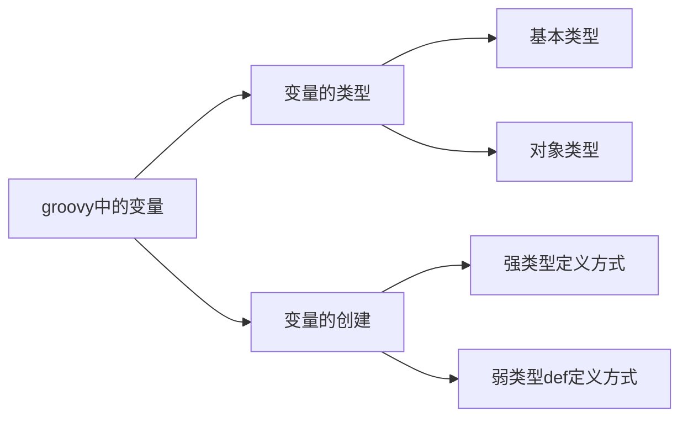

# Gradle 3.0 自动构建
- 全平台,全语言的构建工具,使用程序代理 XML 进行构建.

## 1. Groovy
### 1.1 领域特定语言 DSL 介绍(了解)
- 全称 domain specific language,专用于某个特定领域的语言.
- 比如 UML 建模语言等.
- Groovy 是 DSL 的一个分支.
- DSL 的核心思想 : 求专不求全,解决特定领域内的问题.

### 1.2.Groovy 初探(了解)
- Groovy 是 ==**基于 JVM**== 的敏捷开发语言.相当于 java 的扩展,和 java 的语法比较相似
    - Groovy 的源文件可以直接解释执行
- 结合了 Python, Ruby, smalltalk 脚本语言的许多强大特性.
- Groovy 可以与 Java 完美结合,==**可以使用 Java 所有的库**==.
- Groovy 特性
    - 语法上支持动态类型,[闭包](#info_1)等新一代特性
    - 无缝集成所有==**已经存在的 Java 类库**==.但是也做了很多修改
    - 即支持面向对象编程(作为==*编程语言*==)也支持面向过程编程(作为==*脚本语言*==).

## 2. Groovy环境搭建
### 2.1 Mac/Linux 环境搭建
[管网地址](http://www.groovy-lang.org/)
- 安装 JDK
- 下载 Groovy 并解压
    - - Groovy目录结构

    ```properties
    bin : 存放 Groovy 命令文件
        groovyc : 将 Groovy 源文件编译为字节码文件.
        groovy : 执行编译后的 Groovy 字节码文件
        groovysh : 解释执行 Groovy 脚本
    doc : 存放 Groovy API 等文档
        api : 存放文档
        document : 存放 Groovy 官方教程文档
    ```

- 创建软连接 : ln -s xxx xxx
- 配置环境变量 : 

    ```properties
    export GROOVY_HOME=/usr/local/groovy
    export PATH=$PATH:$GROOVY_HOME/bin
    ```
- 验证

    ```shell
    cydeMacBook-Pro:~ cy$ groovy -version
    Groovy Version: 2.5.6 JVM: 1.8.0_201 Vendor: Oracle Corporation OS: Mac OS X
    ```
    
### 2.2 IDEA之 Groovy 环境搭建
- 创建新工程时选择 Groovy
- 并选择本地安装的 Groovy
- 完事

### 2.3 Groovy 工程 demo
- 创建新工程时选择 Groovy
- 并选择本地安装的 Groovy
- 创建 Groovy class 文件
- ==*HelloGroovy*==

    ```groovy
    class HelloGroovy {
        public static void main(String[] args) {
            println("hello groovy!");
        }
    }
    ```
- 可以将上面代码修改为下面的代码:

```groovy
//只有一个输出语句,没有 class,没有方法,没有分号结尾.一样可以达到上面代码的效果.
println("hello groovy!")
```

### 2.4 window自理

-----
## 3. Gradle 核心语法
### 3.1 Groovy 变量


- 变量的类型
    - 基本类型
        - 变量的定义和 java 中一样.
        - 从代码结果中可以看出,基本类型会被编译器自动推断对象的类型.
    - 对象类型


- 变量的定义
    - ==**强类型定义**==方式
        - 直接定义
    - ==**弱类型 def**== 定义方式
        - ==*不需要指定变量类型,通过 def 关键字来告诉编译器这是定义一个变量.通过后边的值,让编译器自动给他设置对应的类型*==.并且可以通过重复的赋不同类型的值.就像一个 Object,可以接收任何类型的值,编译器会自动去推断此对象的类型.
    - 两种定义方式的选择
        - 如果变量只是用于自己的模块,而不会被其他开发人员或者模块引用,就自己用,就可以使用 def 类型
        - 如果其他模块或者类会使用这个变量,则需要使用强类型定义

==**代码演示**==
```groovy
println("强类型定义变量")
int a = 1
double d = 1.23
String str = "adb"
println(a.class)
println(d.class)
println(str.class)
println("会自动将基本类型转化为对象类型")

println()
println("弱类型 def 方式定义变量")
def x = 1;
def y = 1.23
def z = "abc"
println(x.class)
println(y.class)
println(z.class)

println()
println("弱类型创建对象时,重新赋另一种类型的值,编译器会自动判断类型")
x = "xxx"
println(x.class)
```


### 3.2 Groovy String 类型
### 3.3 Groovy
### 3.4 Groovy 面向对象


## gradle 之 project

## gradle 之 task


## 名词解释

- <span id="info_1"/> 闭包
 