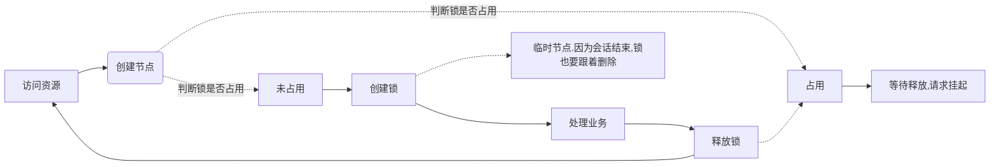

# zookeeper


## 分布式锁
###  1. 分布式锁的概念
- 分布式锁概念
    - 场景 : 分布式场景下,多个项目,多个进程,访问一个共享的资源的时候,就会发生数据不一致的情况.
    - 假如一个库存是 10,一个进程要对库存进行减的操作,这个操作需要 3 秒钟,假如在这 3 秒有其他进程进来查询,那么得到的数据就是不对的.

- 分布式锁的目的
    - 保证分布式,多进程操作同一资源,结果正确的结果.




### 2. 分布式锁的实现
- curator 和 spring 整合

spring-zookeeper.xml

```xml
<!--zookeeper 重试策略-->
<bean id="retrypolicy" class ="RetryNTimes"
    <!--构造参数列表:第一个 重试次数-->
    <constructor-arg index="0" value="10"/>
    <!--构造参数列表:第二个 每次间隔-->
    <constructor-arg index="1" value="5000"/>
</bean>

<!--zookeeper 客户端-->
<bean id="client" class="CuratorFrameworkFactory"
    <!--
        newClient : 创建一个新的客户端
        start : 在新客户端创建完成后,需要用 start进行启动
    -->
    factory-method="newClient" init-method="start"
     <!---构造参数列表:第1个 zk 服务地址,如果是集群的话,就用逗号隔开-->
    <constructor-arg index="0" value="10.211.55.10,xxxxxx"/>
    <!---构造参数列表:第2个 session timeout 会话超时时间-->
    <constructor-arg index="1" value="10000"/>
     <!---构造参数列表:第3个 connectionTimeoutMs 创建连接超时时间-->
    <constructor-arg index="2" value="5000"/>
    <!---构造参数列表:第4个 重试策略-->
    <constructor-arg index="3" value="10000"/>
    <!--
        设置重置策略需要设定重试次数和间隔时间,然后配置 zookeeper,需要设置服务器地址,超时时间,创建连接超时时间,还有上边设置的超时时间,然后通过 newClient 创建新客户端,再使用 start 进行启动,这样 zookeeper 就和 spring 进行了整合,并且 zookeeper 服务器进行了关联
    -->
</bean>

<!--注入zk客户端-->
<bean id="zkCurator" class="自己编写的 zkCurator 类全路径" init="初始化方法">
    <contructor-arg index="0" ref="client就是上边配置的 client"
</bean>
```

==**zkCurator**==
```java
public class ZkCurator{
    private CuratorFramework client = null; //设置属性
    //通过构造器注入,将配置文件中配置的zkCurator注入
    public ZkCurator(CuratorFramework client){
        this.client = client
    }
    
    //配置文件中指定的初始化方法,可以做一些操作
    public void init(){
        //设置命名空间
        client = client.usingNamespace("zk-curator-connector");
    }
    
    //判断 zk 是否启动
    public boolean isZkAlive(){
        return client.isStarted();
    }
}
```

- 在另一个类中

```java
@Controller
public class PayController{
    //在配置文件中已经配置了这个类,所以可以注入
    @Autowired
    pricvate ZkCurator zkCurator;
    
    @RequestMapping("/isZkAlive")
    //在这个类中调用zkCurator的方法isZkAlive,判断 zk是否连接
    public xxx isZkAlive(){
        boolean isAlive = zkCurator.isZkAlive();
        Stirng result = isAlive ? "连接" : "断开"; 
    }
}
```

- 在页面访问这个 controller, isZkAlive

- 创建工具类 : DistributedLock 分布式锁的实现工具类

- 在配置文件中配置,将 client(就是之前配置的) 注入工具类中

```xml
<bean id="distributedLock" class="distributedLock全路径" init="初始化方法"
    <contractor-arg index="0" ref="client"/>
</bean>
``` 

- 工具类中实现分布式锁

```java
public class DistributedLock{
    private CuratorFramework client = null; //设置属性,用于通过构造器注入
    
    // 用于挂起当前请求,并等待上一个分布式锁释放
    private static CountDownLatch zkLockLatch = new CountDownLatch(1);
    
    //分布式锁的总节点名,总结点是永久性节点
    private static final String ZK_LOCK_PROJECT = "zk_locks"; 
    
    //分布式锁节点名称,所有分布式锁节点都是总结点的子节点,所有的锁都创建在总节点之下.
    private static final String DISTRIBUTED_LOCK = "lock";
    
    //构造器,构造注入CuratorFramework
    public DistributedLock(CuratorFramework client){
        this.client  = client;
    }
    
    //配置文件中配置的初始化方法,用于初始化锁
    public void init(){
         //设置命名空间
        client = client.usingNamespace("zk-namespace");
        //根据上边定义的总节点名称和分布式锁名称,zk 的目录结构是这样的
        //  zk-namespace
                    |
                 zk_locks
                        |
                       lock
                       
        try{
            //因为要创建分布式锁节点,所以要先判断[总节点]是否存在,如果不存在就创建,总节点是永久性节点
            //路径根据实际情况
            if( client.checkExists().forPath("/" + ZK_LOCK_PROJECT) == null ){
                client.create()
                    .creatingParentsIfNeeded()
                    .withMode(CreateMode.PERSISTENT)    //永久节点
                    .withACL(Ids.OPEN_ACL_UNSAFE)
                    .forPath( "/" + ZK_LOCK_PROJECT);
            }
            // 针对 zk 分布式锁节点,创建响应的 watcher 事件监听
            //为什么要给总节点添加监听,是因为 Curator 框架,如果是原生的 zk,可以给锁节点添加
            addWatcherToLock("/" + ZK_LOCK_PROJECT);
        }catch (){
        
        }
    }
    
    //获取分布式锁,然后处理完毕等后,释放锁
    //释放锁是删除 zk 节点,所以需要添加 wacther 事件
    public void getLock(){
        //使用死循环的原因是 : 当且仅当上一个锁释放并且当前请求获得锁成功后才会跳出循环
        while(true){
            try{
                //创建锁节点
                client.create()
                    .creatingParentsIfNeeded()
                    .withMode(CreateMode.EPHEMERAL) //临时节点,如果这个请求挂掉了,这个锁不应该继续存在,应该跟着会话的消失而删除
                    .withACL(Ids.OPEN_ACL_UNSAFE)
                    .forPath( "/" + ZK_LOCK_PROJECT + "/" + DISTRIBUTED_LOCK);
                    //如果锁的节点创建成功,则锁没有被占用.如果已经存在,会抛出一个异常,说节点已存在,就意味着有其他的线程持有分布式锁,就需要挂起
                 //创建成功后,就是获取锁成功
                 log.info("获取分布式锁成功");  
                 return; 
            }catch(){
                 log.info("获取分布式锁失败");  
                 try{
                    //如果没有获取到锁,需要重新设置同步资源,就阻塞当前线程,直到释放
                    if(zkLockLatch,getCount() <= 0){
                        zkLockLatch = new CountDownLatch(1);
                    }
                    //阻塞线程
                    zkLockLatch.await();
                 }catch(){
                 
                 }
            }
        }
    } 
    
    //添加监听事件
    public void addWatcherToLock(String path){
        //
        final PathChildrenCache cache = new PathchildrenCache(client, path, true);
        // 启动
        cache.start(StartMode.POST_INITIALIZED_EVENT);
        //添加监听
        cache.getListenable().addListener(new PathChildrenCachaeListener(){
            public void ChildEvent(CuratorFramework client, PathChildrenCachaEvent event){
        //判断事件类型是否是 节点删除 监听    
        if(event.getType.equals(PathChildrenCacheEvent.Type.CHILD_REMOVED)){
                //获取锁路径
                String path = event.getData().getPath();
                log.info("上一个会话 已释放或该会话已断开,节点路径为 : "+path);
                //判断是否为当前业务的锁被释放
                if(path.contains(DISTRIBUTED_LOCK)){
                    log.info("释放计时器,让当前请求来获得分布式锁...");
                    //如果是,则 countDown
                    zkLockLatch.countDown();
                }
            }
            }
        });
    }
    
    //释放分布式锁
    public boolean releaseLock(){
        try{
            //判断路径是否存在,如果存在就删除,如果不存在,就说明已删除或者没有这个节点
            if(client.checkExiste().forPath( "/" + ZK_LOCK_PROJECT + "/" + DISTRIBUTED_LOCK) != null){
                //删除节点
                client.delete().forPath( "/" + ZK_LOCK_PROJECT + "/" + DISTRIBUTED_LOCK);
            }
        }cathc(){
            //删除失败
            return false;
        }
    }
    //删除成功
    return true;
}
```

==**运用**==
在业务中,调用获取锁
- 注入 DistributedLock 工具类
- 然后获取锁 DistributedLock.getLock();
- 然后处理业务
- 业务处理完毕后,释放锁
- 出现异常等也要释放锁

